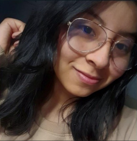
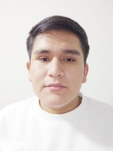
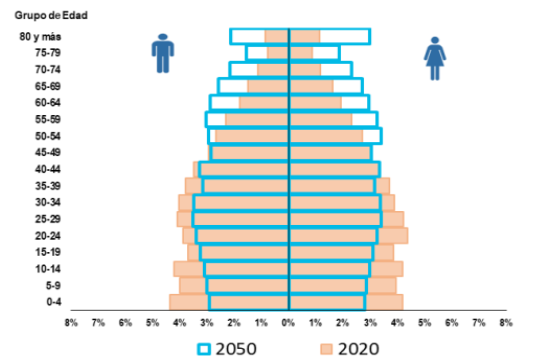
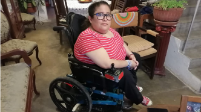
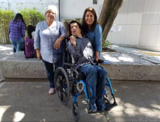

# **UNIT I**

---

# Introducción

## 1.1. Startup Profile

### 1.1.1. Descripción de la Startup

En la actualidad existe un número exorbitante de personas que necesitan ayuda para poder mantener o mejorar su calidad de vida. Específicamente en Lima, Perú. Se ha identificado que realizar un buen cuidado de personas discapacitadas, vulnerables o con una enfermedad grave, es una labor demasiado difícil. Asimismo, los familiares de estos individuos son directamente afectados por las condiciones en las que se encuentran, pues su cuidado requiere demasiado tiempo y, del mismo modo, un gran esfuerzo físico. Además, después de la aparición del COVID-19 en el país, las personas se han acostumbrado a tener una solución a sus problemas de forma remota sin tener que salir de casa.

Por esta razón, hemos decidido crear un startup llamado “E-Solutions”. Somos una empresa emergente con grandes posibilidades de crecimiento. A una primera instancia, no contamos con una gran cantidad de clientes, pero con el transcurso del tiempo estamos enfocados en crecer en el mercado aplicando el potencial de las tecnologías móviles.

Nuestra misión actual es encontrar la forma más viable e innovadora de ayudar a las personas que tienen familiares que padecen de enfermedades graves o alguna limitación física. Para lograr este objetivo, desarrollaremos un sistema que se encargará de medir los signos vitales de los pacientes y alertará a sus familiares y doctores cuando estos signos presenten niveles que pueden significar una emergencia.

### 1.1.1. Perfiles de integrantes del equipo

- Kendall Ramiro Contreras Salazar

Soy Kendall Ramiro Contreras Salazar y estudio la carrera de Ingeniería de Software. Tengo experiencia en desarrollo web en la rama de Front-end. además, de experiencia en el lenguaje C++, C#, Python, JavaScript y el framework Vue. Soy una persona alegre que siempre trata de apoyar a sus amigos, dedicado a dar lo mejor de sí, y dispuesto a esforzarse al máximo en sus estudios. 

- Gonzalo Barrazueta Vilcachagua

Mi nombre es Gonzalo Barrazueta Vilcachagua con código u20191a972 y soy estudiante de la carrera de Ingeniería de Software. Algo que puedo aportar al equipo es de mantenernos enfocados y seguir un proceso de trabajo ordenado para cumplir con los plazos y fechas límites. Algunos de los conocimientos que tengo es el trabajo en equipo con las metodologías ágiles y programación frontend, haciendo uso de HTML, CSS y Javascript. Mis expectativas para el curso son entender cómo funcionan las aplicaciones y aprender a crear una aplicando buenas prácticas de diseño y código limpio. Al finalizar el curso, quiero tener una buena base del lenguaje de programación C# para poder realizar proyectos personales.

- Jasmin Gianella Pomasoncco Oropeza

Mi nombre Jasmin Gianella Pomasoncco Oropeza, tengo 20 años, nací en Lima. Actualmente estoy en la carrera de Ingeniería de Software. Me considero una persona responsable y puntual. Tengo conocimiento en los lenguajes de programación c + +, c#, sql, python, javascript, typescript, html y css  que será útil para el desarrollo del software que se trabajará. Me gusta leer, ver series y documentales y adquirir nuevos conocimientos a través de cursos de internet.

- Diego Alonso De La Flor Armas

Mi nombre es Diego Alonso De La Flor Armas, tengo 20 años. Actualmente, estoy cursando la carrera de Ingeniería de Software, elegí la carrera puesto que va relacionado tanto a las aplicaciones de computadora como a los sistemas. Además, es un sector muy diverso porque con ello podemos crear programas y mejorar la seguridad de las empresas. En cuanto a mis habilidades, una de ellas es armar el cubo de Rubik, además me considero buen dibujante. Con respecto a mis hobbies, me gusta hacer ejercicios diarios para mantener una vida saludable acompañado de una buena alimentación. En mi tiempo libre suelo jugar videojuegos con amigos en línea.

- Ludwin Roy Reyes Suarez

Me llamo Ludwin Roy Reyes Suarez y tengo 20 años. En este momento, me encuentro estudiando Ingeniería de Software. Opté por esta carrera debido a su estrecha relación con el desarrollo de aplicaciones informáticas y sistemas, además de su versatilidad para crear programas y fortalecer la seguridad empresarial. Fuera de mis compromisos académicos, disfruto de jugar videojuegos en línea con amigos como pasatiempo. Considero, que este curso me permitirá comprender el funcionamiento de las aplicaciones y adquirir las habilidades necesarias para desarrollarlas de manera efectiva, siguiendo principios de diseño y código limpio.

## 1.2. Solution Profile

En este punto del informe, pasaremos a la explicación detallada de nuestro producto software, tanto su factor innovador y la forma en la cual será monetizada.

Product Name

Se decidió llamar a nuestro producto “DocSeeker”, ya que, en el lenguaje inglés, ‘Doc’ es una abreviación de doctor y ‘Seeker’, buscador; por lo que el nombre completo se traduce como “Buscador de Doctores”. Del mismo modo, se eligió este idioma porque, además de generar más atractivo hacia el público, es el idioma más hablado del mundo, lo cual vuelve más comercial a nuestra aplicación.

### Product Description

Este software es innovador porque permitiremos que los familiares de una persona delicada de salud puedan obtener notificaciones sobre el estado de salud del paciente cuando este se encuentre en un estado de gravedad.

Para lograr este objetivo, brindaremos un smartwatch con sensores de presión y temperatura incorporados a los pacientes con alguna enfermedad. Para complementar este gadget, desarrollaremos una aplicación móvil donde se podrán visualizar los datos vitales del paciente.

Durante el registro, los usuarios podrán visualizar una larga lista de personal de salud altamente calificado. Ellos podrán elegir un profesional de la salud que se encargue de atenderlos. Asimismo, se presentará la tarifa estándar del médico por consulta.

Con el registro del usuario y la elección del médico o enfermero se podrá dar seguimiento continuo al beneficiario. La aplicación móvil contará con un historial médico para visualizar todos sus datos y mediciones que se efectuaron en cada visita o atención.

Además, como parte de las características innovadoras de nuestro producto, la aplicación móvil estará equipada con un medidor de temperatura IoT. Este dispositivo permitirá a los profesionales de la salud monitorear la temperatura del paciente de manera remota y en tiempo real, lo que facilitará la detección temprana de posibles problemas de salud.

Finalmente, como el presente producto tendrá un sistema donde el profesional de la salud puede colocar las observaciones, también podrá colocar o recetar el medicamento acorde a la situación del paciente. Esta medicina podrá ser adquirida en nuestras farmacias aliadas, es decir, se le presentarán 2 o 3 opciones de farmacias cercanas a su ubicación donde podrá adquirir los medicamentos dispuestos por el profesional para su tratamiento.

### Monetización

Nuestro servicio podrá ser adquirido de manera gratuita. Sin embargo, los profesionales de la salud registrados tendrán una retención entre el 5% y 10% de sus ingresos mensuales por conceptos de captación de pacientes a través de nuestra plataforma. Posteriormente cuando nuestra aplicación tenga más popularidad contará con convenios con instituciones públicas y privadas ante la derivación del adulto mayor o persona con limitación para un chequeo más inmersivo. Así, al llegar a estas instituciones podrán acceder sin necesidad de crear un nuevo historial médico. Ya que podrán visualizar todos sus datos y mediciones que se efectuaron en cada visita. De la misma manera, con las farmacias aliadas para la obtención de medicamentos. Estas farmacias aliadas nos pagaran un % fijo por medicamento vendido.

### 1.2.1. Antecedentes y problemática

### Descripción de la problemática:

Este software se enfoca en el sector de salud, ya que se ha evidenciado que hay leve incremento en pacientes insatisfechos con las citas brindadas por las clínicas.  Es por esta razón que “DocSeeker” busca cubrir las necesidades de la comunicación, seguridad y eficacia a la mayor cantidad de personas posibles en su domicilio.

### Objetivos:

Este software tiene el principal objetivo de cubrir las necesidades básicas de atención médica a domicilio de las personas con limitaciones físicas o mentales que no puedan acudir a un centro médico. Por otro lado, lograr ser una empresa reconocida y contar con un producto sostenible económicamente es un objetivo general de E-Solutions con su producto DocSeeker para resaltar en el mercado de aplicaciones destinadas para el sector salud.

### Restricciones:

Una principal restricción que delimita el alcance del proyecto es que el equipo desarrollador es nuevo en estas tendencias o técnicas a aplicar para lanzar nuestra aplicación. Por ello, es que puede ser una restricción de alcanzar el mejor escenario. Sin embargo, el equipo pondrá de su parte para lograr alcanzar el nivel deseable de cada entregable.

### Antecedentes:

Como se mencionó anteriormente, nuestro producto software “DocSeeker” tiene la capacidad de contratar profesionales de salud que se encarguen de cuidar a personas con limitaciones físicas o de otra índole y además dar seguimiento continuo al beneficiario, el cual será similar a un historial médico virtual que se adecue a la frecuencia de visita elegida por el contratante. Es por ello por lo que, teniendo en cuenta el funcionamiento de nuestro producto, realizamos la búsqueda de posibles competidores, obteniendo como resultado dos productos software:

#### MedicApp:

Es una aplicación en la cual una persona puede agendar por medio de llamada o WhatsApp, una cita a domicilio de Médico o Enfermero. Cuenta con un horario limitado de lunes a sábados de 8 am a 8 pm. Cuenta con una alianza con una institución dedicada al transporte de pacientes con situaciones graves, ambulancias.

Sin embargo, la principal diferencia que separa a DocSeeker de MedicApp es que, en nuestra aplicación, es posible contactar con un doctor específico que le brinde confianza al usuario. Por otro lado, en la aplicación MedicApp, los doctores son brindados según la disponibilidad que tiene la aplicación y el usuario no interactúa de manera constante en el proceso de selección. Asimismo, no mantienen, en la aplicación, un registro virtual de todas las citas que ha tenido el paciente ni de las recomendaciones brindadas.

#### MediQuo:

Es una aplicación donde se puede realizar consultas, gestionar citas mediante el chat que está disponible en su web, además que tiene seguimiento registrado en la aplicación móvil.

Sin embargo, una de las diferencias que existe entre DocSeeker y MediQuo es que, mientras en MediQuo solo se hacen consultas digitales, en DocSeeker se tiene contacto directo y presencial con el personal de salud. Además, al contrario que la aplicación MediQuo, DocSeeker puede generar un historial médico virtual que varía dependiendo de cada contratante.

#### - **What?**

El problema identificado es la cantidad exorbitante de personas de edad avanzada y/o que sufren de limitaciones físicas o de otra índole. Es decir, que no pueden mantener un cuidado autónomo y requieren de la asistencia de otro individuo para mantener una salud estable.

#### - **Who?**

Los principales afectados son las personas de la tercera edad y aquellas que presentan enfermedades que precisan de atención inmediata.

#### - **Why?**

La causa del problema es principalmente la falta de tiempo por parte de los familiares de personas de edad avanzada y/o personas que necesiten ser atendidas o de otra índole para cuidarlos y mantenerlos con un estado de salud estable.

#### - **Where?**

El problema surge en los distintos hogares de la capital, pues día a día las personas deben salir a ejercer sus obligaciones laborales y no cuentan con el tiempo suficiente y la ayuda necesaria para mantener la calidad de vida y cuidado de sus familiares con limitaciones físicas o mentales.

#### - **When?**

Cuando es necesaria la supervisión o tratamiento de un médico para individuos con capacidades limitadas, o simplemente cuando se requiere de personas extras para el cuidado de los pacientes y los familiares que carecen de tiempo o son incapaces de atenderlos sin ayuda.

#### - **How?**

Cuando una familia cuenta con un integrante que requiere de supervisión constante, los demás miembros tienen que brindar gran parte de su tiempo para su cuidado. Además, el encontrar personas de confianza y que estén capacitadas para la atención del individuo es complicado, lo cual solo genera que la situación sea más difícil, y esto empeora si el paciente requiere de uso de medicina o dispositivos médicos. Por eso, es necesaria una forma fácil y sencilla de contactar con la ayuda necesaria para la atención de los familiares vulnerables.

#### - **How Much?**

Según el INEI (2018), se recopiló a nivel de Lima metropolitana que el 84,9% de los adultos mayores femeninas y 67,3% de los adultos mayores masculinos presentan enfermedades crónicas como artritis, hipertensión, diabetes, etc. De esta manera, se identifica que existe un gran porcentaje de adultos mayores con necesidad de un cuidado médico. Cabe resaltar que en el presente informe del INEI (2018), se menciona que esta población mayor de 60 años con limitaciones o discapacidades físicas o mentales, no asistieron a un establecimiento para atenderse (72,7%) y un poco más de la cuarta parte (25,6%) no acudió a un establecimiento de salud porque le queda lejos, no le genera confianza o se demoran en la atención. Así, se identifica que hay una necesidad de atención médica a domicilio, pues es el lugar donde estas personas se sienten más cómodos y seguros. 

### 1.2.2. Lean UX Process

#### 1.2.2.1 Lean UX Problem Statements

En relación con la atención médica en centros médicos públicos y privados, se evidencia el incremento de insatisfacción por el servicio brindado para los pacientes, ya sea por la mala atención, complicaciones para generar citas, incomodidad en las instalaciones y/o complicaciones de movilidad para desplazar al paciente a estos centros médicos. Hemos identificado una problemática en este proceso: los pacientes y sus familiares optan por no acudir a los centros de salud, pues el tiempo y el esfuerzo que les genera es mayor al tiempo que dura su consulta. En consecuencia, los profesionales de la salud se vieron obligados a recurrir a las teleconsultas para registrar la condición del paciente. Sin embargo, no todos emplean este medio de atención porque no se ofrece un chequeo inmersivo. De esta manera, el número de pacientes ha disminuido, y personas mayores con alguna discapacidad prefieren mantener el cuidado en casa con el apoyo de algún familiar.

Para abordar esta problemática y garantizar que los pacientes reciban una atención íntegra, eficaz y beneficiosa para su salud en un ambiente en el que se sientan cómodos, como su domicilio, sin la necesidad de realizar un gran traslado que tome demasiado tiempo, proponemos la implementación de una solución innovadora. Podría ser una aplicación móvil que permita a los pacientes medir su temperatura de manera sencilla y precisa. Esta función facilitaría el monitoreo de su salud de forma remota y efectiva, asegurando una atención médica de calidad sin que los médicos se vean perjudicados en sus ingresos económicos.

¿Cuál sería una estrategia efectiva para asegurar que los pacientes reciban una atención integral, eficaz y beneficiosa para su salud en la comodidad de su domicilio, eliminando la necesidad de desplazamientos largos, al mismo tiempo que permite a los médicos atender a un mayor número de pacientes sin que sus ingresos económicos se vean perjudicados?

#### 1.2.2.2 Lean UX Assumptions

### Business Outcomes

- Crear una plataforma intuitiva y eficaz para contratar profesionales de la salud que atiendan a usuarios con limitaciones físicas o mentales y generar ingresos a través de esta plataforma.

- Establecer una sólida presencia en el mercado, basada en resultados efectivos para los pacientes, calidad del servicio y una aplicación móvil práctica.

- Atraer el interés de empresas audiovisuales afiliadas para aumentar los ingresos publicitarios y el alcance de la plataforma.

- Garantizar la rentabilidad económica para los profesionales de la salud, con precios flexibles según las necesidades del usuario y los ingresos de la publicidad.

- Establecer una tasa de retención de usuarios a través de campañas de marketing y la satisfacción de las necesidades de los usuarios, y analizar las razones del abandono del servicio.

- Integrar la funcionalidad de un medidor de temperatura para el monitoreo de la salud de los usuarios y profesionales de la salud.

### Users

- Personas que necesiten atención médica.

- Profesionales de la Salud.

### User Outcomes

Identificar y aplicar un proceso de mejora de la limitación física o mental del paciente a través de la atención adecuada de un profesional de la salud.

Generar confianza en los familiares al demostrar un progreso constante en la salud del paciente, permitiéndoles tener la seguridad de delegar el cuidado al profesional y enfocarse en otras responsabilidades.

Responder a las preguntas y dudas de los familiares sobre cómo se puede mejorar la salud del paciente a través de las consultas médicas disponibles en la plataforma.

Facilitar la mejora de la situación económica de los profesionales de la salud al ofrecer la posibilidad de establecer un grupo de pacientes con especialidades específicas, acordando tarifas mutuas y ofreciendo oportunidades de desarrollo profesional.

Integrar la funcionalidad del medidor de temperatura para monitorear y registrar la temperatura del paciente, lo que puede ser una herramienta valiosa para profesionales de la salud y usuarios en la evaluación de la salud del paciente y la toma de decisiones médicas.

### Features

- Información del paciente y registro de su condición actual para que el profesional de la salud pueda identificar el mejor tratamiento.

- Sección para visualizar a los profesionales de la salud con sus reseñas y sus precios definidos por los conceptos de atención a domicilio.

- Plan de atención por parte del médico.

- Lista que integre a los pacientes que cada personal médico atiende de manera frecuente.

- Sistema de atención inmediata ante emergencias o citas de carácter urgente.

- Integración de un medidor de temperatura digital en la aplicación, con notificaciones de alerta en caso de anomalías.

1. Creo que mis usuarios necesitan, empezando por los pacientes, recibir rápidamente una atención médica a su domicilio y tener la información de sus resultados al alcance de sus manos, incluyendo mediciones de temperatura si es necesario. Por otro lado, los profesionales de la salud necesitan realizar una revisión médica más íntegra e inmersiva para los pacientes que son atendidos desde su domicilio, lo que puede incluir el seguimiento de la temperatura corporal.

2. Estas necesidades se pueden resolver con una plataforma que permita contactar a un profesional de la salud para que realice los análisis necesarios, incluyendo la medición de la temperatura, y publique los resultados en nuestra plataforma de manera rápida y eficaz. Por otro lado, que le permita al profesional a cargo acceder a la información del cuadro clínico, actualizado por un profesional anterior, del paciente, incluyendo registros de temperatura.

3. Mis clientes iniciales son (o serán) los pacientes que desean o necesitan ser atendidos por un profesional de la salud y presentan alguna dificultad de movimiento, y los profesionales de la salud que trabajan en el servicio a domicilio, utilizando mediciones de temperatura como parte de su evaluación.

4. El valor #1 que un cliente quiere de mi servicio es, empezando por los pacientes, recibir atención médica de un profesional de la salud a su domicilio de manera cómoda, rápida y personalizada, lo que puede incluir la medición de la temperatura cuando sea relevante. Por otro lado, los profesionales de la salud desean mejorar la calidad de atención/servicio que se le puede ofrecer a un paciente que no cuenta con la facilidad de transportarse a un centro de salud, utilizando mediciones de temperatura como una herramienta diagnóstica.

5. El cliente también puede obtener beneficios adicionales, empezando por los pacientes, como la visualización del avance en su tratamiento, los resultados de sus análisis, incluyendo las mediciones de temperatura, y las recomendaciones del profesional de salud. Asimismo, los profesionales de la salud podrán colocar su propia tarifa de pago, generar su horario médico virtual y que su servicio pueda ser calificado y recomendado por los usuarios, teniendo en cuenta las mediciones de temperatura si son relevantes.

6. Voy a adquirir la mayoría de mis clientes a través de marketing en los medios de comunicación más frecuentados como Facebook, Instagram o entre otros; con la publicación de casos de éxito con los pacientes que utilizan nuestra plataforma, incluyendo historias donde la medición de temperatura fue fundamental en el diagnóstico.

7. Haremos dinero a través de la retención del 5% - 10% de los ingresos mensuales de los profesionales de la salud inscritos en nuestra plataforma por conceptos de captación de pacientes y publicidad de nuestros auspiciadores, incluyendo los servicios relacionados con la medición de temperatura. De la misma manera, con las farmacias aliadas para la obtención de medicamentos, donde las mediciones de temperatura pueden ser cruciales en la prescripción médica. Estas farmacias aliadas nos pagarán un % fijo por medicamento vendido, considerando la información de temperatura si es relevante.

8. Mi competencia principal en el mercado serán las aplicaciones que brindan funciones similares al público objetivo o programas propios de un centro de salud, pero nuestra ventaja será la inclusión de mediciones de temperatura como parte integral de nuestra plataforma.

9. Los venceremos debido a la diferenciación de nuestros beneficios para los pacientes, como seguimiento de los análisis, contacto casi inmediato con un profesional de la salud y visualización de las recomendaciones de este mismo, incluyendo mediciones de temperatura si son necesarias. Asimismo, del lado de los profesionales de la salud, por la personalización de nuestras funcionalidades como registrar una tarifa propia, registrar/consultar el cuadro clínico de un paciente para acceder rápidamente a la información, recibir valoraciones de los usuarios para retroalimentarse y/u obtener más citas médicas, incluyendo el uso de mediciones de temperatura como parte de su evaluación.

10. Mi mayor riesgo de producto son las fallas en el sistema de la plataforma, ya que los bugs o huecos de información, incluyendo problemas con las mediciones de temperatura, podrían impedir al paciente revisar su progreso/tratamiento y, al profesional de la salud, realizar su servicio de manera efectiva.

11. Resolveremos esto a través de una inversión constante en nuestra plataforma: formar un equipo profesional dedicado al mantenimiento de la plataforma y la solución de sus posibles fallos a través de las actualizaciones, incluyendo la mejora continua de las funcionalidades relacionadas con las mediciones de temperatura.

12. ¿Quién es el usuario?

Nuestros usuarios son aquellas personas que tienen algún impedimento para movilizarse y necesitan atención médica profesional, o familiares preocupados por ellos. Asimismo, también lo son los profesionales de la salud que brindan atención médica a los pacientes a través de tele consultas o de forma a domicilio, utilizando mediciones de temperatura cuando sea relevante.

2. ¿Dónde encaja nuestro producto en su trabajo o vida?

En el caso de los pacientes, en los días que necesiten tratar alguna enfermedad, seguir una terapia o simplemente un monitoreo de rutina que puede incluir mediciones de temperatura. En el caso de los profesionales de la salud, encaja dentro de su ámbito laboral, específicamente durante el proceso de registro de pacientes, consulta médica y prescripción del tratamiento a seguir, donde las mediciones de temperatura pueden ser una parte crucial de la evaluación.

3. ¿Cómo y cuándo es usado nuestro producto?

Para los pacientes, será usado a través de una aplicación móvil como un apoyo de interconexión médico-paciente, con la previa inscripción a nuestra plataforma, cuando el usuario requiera de un análisis a su estado de salud actual, que puede incluir mediciones de temperatura, o quiera darle seguimiento a su tratamiento. Para los profesionales de la salud, será usado como una plataforma de apoyo para la recopilación de información médica relevante del paciente, incluyendo mediciones de temperatura, cuando la cita agendada se realice de forma a domicilio.

4. ¿Qué problema tendría nuestro producto y cómo se pueden resolver?

Nuestro producto está desarrollado en plataformas digitales para dispositivos móviles, por lo que, al ser personas de tercera edad la mayoría de los pacientes, se pueden generar complicaciones al momento de entender el correcto funcionamiento de ella, incluyendo la forma de tomar mediciones de temperatura. Asimismo, al ser desarrollado también para un entorno sanitario, debe cumplir con las especificaciones reglamentarias necesarias para su uso, en otras palabras, las acciones realizadas por un profesional de la salud deben seguir un orden y proceso adecuado permitido por la ley, lo que incluye el manejo de las mediciones de temperatura. Esto se puede resolver con profesionales de diseño que hagan más intuitiva nuestra aplicación móvil y con capacitación para el uso de dispositivos de medición de temperatura.

5. ¿Qué características son importantes?

Debe ser intuitiva, las opciones que tendrá la aplicación móvil deben ser específicas y prácticas para que el usuario no tenga complicaciones en su uso, incluyendo la incorporación de mediciones de temperatura. A su vez, el tiempo de respuesta en cuanto a la atención al cliente u recomendaciones para su tratamiento, que pueden incluir ajustes en base a las mediciones de temperatura, deben ser atendidas con prontitud. Asimismo, la organización y distribución de las funcionalidades deben estar avaladas por la ley, lo que incluye el manejo adecuado de las mediciones de temperatura. Finalmente, la seguridad también será un factor importante porque estaremos trabajando con información confidencial del paciente, incluyendo datos de las mediciones de temperatura.

6. ¿Cómo debe verse nuestro servicio y cómo debe comportarse?

Nuestro producto debe verse práctico, moderno y con contrastes de colores suaves, incluyendo gráficos relacionados con las mediciones de temperatura si es relevante; todo esto con la finalidad de hacer más satisfactoria la experiencia de usuario. Asimismo, debe comportarse como una interfaz fluida y con un manejo eficaz de la información, incluyendo la presentación clara de las mediciones de temperatura en caso de ser necesario.

#### 1.2.2.3 Lean UX Hypothesis Statements

#### 1st Hypothesis Statement

Creemos que el uso de nuestra aplicación móvil facilitará la comunicación entre el usuario y el profesional de salud; y así desarrollar una interacción práctica.

Sabremos que hemos tenido éxito,

Cuando veamos que el 70% de los usuarios están satisfechos con la prontitud que se contacta a un profesional médico a través de sus reseñas positivas en nuestra aplicación móvil.

#### 2nd Hypothesis Statement

Creemos que publicar los resultados de sus análisis en la aplicación móvil permitirá a los usuarios hacer un seguimiento de su progreso con el tratamiento y su estado de salud actual.

Sabremos que hemos tenido éxito,

Cuando veamos que un 60% de los usuarios mantienen un progreso constante con cada análisis.

#### 3rd Hypothesis Statement

Creemos que publicar las recomendaciones del profesional de la salud para el tratamiento de los pacientes ayudará a estos últimos a conseguir mejores resultados en su tratamiento.

Sabremos que hemos tenido éxito,

Cuando veamos que un 50% de nuestros usuarios utilizan las recomendaciones del profesional de la salud y obtengan resultados óptimos.

#### 4th Hypothesis Statement

Creemos que el uso de nuestra aplicación móvil aumentará el número de personas atendidas por el personal de la salud.

Sabremos que, hemos tenido exito

Cuando veamos que el número de pacientes atendidos por el personal médico aumente en un 30% en el uso de nuestro aplicativo.

#### 5th Hypothesis Statement

Creemos que publicar un feedback para el personal médico que atendió al paciente incrementara el reconocimiento del personal médico.

Sabremos que, hemos tenido éxito

Cuando veamos que el número de paciente del personal méédico al que se realizó el feedback aumente en un 20%.

#### 6th Hypothesis Statement

Creemos que nuestra aplicación movil aumentara los ingresos económicos del personal médico.

Sabremos que, hemos tenido éxito

Cuando veamos que en la aplicación se registren los pagos al personal médico y estos aumenten en un 10

#### 7th Hypothesis Statement

Creemos que publicar las recomendaciones del profesional de la salud, que incluyen el uso de mediciones de temperatura, para el tratamiento de los pacientes ayudará a estos últimos a conseguir mejores resultados en su tratamiento.

Sabremos que, hemos tenido éxito,

Cuando veamos que un 50% de nuestros usuarios utilizan las recomendaciones del profesional de la salud, incluyendo las indicaciones de medición de temperatura, y obtengan resultados óptimos en su tratamiento.

#### 1.2.2.4 Lean UX Canvas

<table>
   <tr>
      <td align="center"><b>Business Problem</b></td>
      <td align="center"><b>Solution Ideas</b></td>
      <td colspan="3" align="center"><b>Business Outcomes</b></td>
   </tr>
   <tr>
      <td align="justify">Existe una creciente demanda de atención médica especializada, especialmente para personas con limitaciones físicas u otras necesidades específicas de atención médica. Sin embargo, la búsqueda y la conexión con profesionales de la salud altamente calificados y de confianza es un proceso complicado y a menudo ineficiente para los pacientes  
      </td>
      <td rowspan="2">
         <ul>
            <li align="justify">Nuestra propuesta consiste en la creación una aplicación móvil y una plataforma web llamada "DocSeeker" que permita a los pacientes buscar y conectarse con profesionales de la salud altamente calificados que se especialicen en sus necesidades médicas específicas. Esto simplificará el proceso de encontrar y contratar profesionales de la salud para atención médica especializada. Además, de proporcionar a los usuarios la capacidad de mantener un historial médico virtual que registre todas las consultas médicas, historial de pulso cardiaco, observaciones y recetas médicas proporcionadas por los profesionales de la salud en la plataforma. Esto garantiza un seguimiento continuo y una gestión efectiva de la atención médica. </li>
         </ul>
      </td>
      <td colspan="3">
         <ul>
            <li align="justify">Mejora de la Atención Médica Personalizada: Al incluir un sensor de ritmo cardíaco en la aplicación, "DocSeeker" puede ofrecer una atención médica más personalizada y precisa. Esto permitirá un seguimiento más detallado de la salud de los pacientes y una adaptación más efectiva de los planes de tratamiento. 

Mayor Confianza del Paciente: La incorporación del sensor de ritmo cardíaco aumentará la confianza de los pacientes en la plataforma, ya que les proporcionará información en tiempo real sobre su salud. Esto puede resultar en una mayor retención de usuarios y lealtad a la plataforma.

Reducción de Complicaciones Médicas: Al monitorear constantemente el ritmo cardíaco de los pacientes, "DocSeeker" puede identificar y notificar a los profesionales de la salud sobre cualquier anomalía o riesgo potencial. Esto puede ayudar a prevenir complicaciones médicas graves y mejorar la seguridad de los pacientes.

Eficiencia en el Tratamiento: El sensor de ritmo cardíaco permitirá un seguimiento más eficiente de la respuesta del paciente al tratamiento. Los médicos podrán ajustar los planes de atención de manera más efectiva, lo que podría acelerar la recuperación de los pacientes.

Diferenciación en el Mercado: La inclusión del sensor de ritmo cardíaco puede diferenciar a "DocSeeker" de otras plataformas de atención médica en línea, lo que podría atraer a más usuarios y profesionales de la salud a la plataforma.

Generación de Ingresos Adicionales: "DocSeeker" podría considerar la posibilidad de ofrecer el sensor de ritmo cardíaco como un accesorio o dispositivo adicional para los usuarios interesados. Esto podría generar ingresos adicionales a través de la venta de hardware y accesorios relacionados.

</li>
</ul>
</td>

   </tr>
   <tr>
      <td>
         <b>User & Customers</b>
         
Pacientes en Búsqueda de Atención Médica Especializada: Estos son individuos que necesitan atención médica especializada debido a limitaciones físicas, condiciones médicas crónicas u otras necesidades específicas. Utilizan "DocSeeker" para buscar y conectarse con profesionales de la salud calificados que puedan satisfacer sus necesidades médicas.  
Profesionales de la Salud Registrados: Estos son médicos, enfermeros, terapeutas y otros profesionales de la salud que están dispuestos a brindar atención médica especializada a los pacientes a través de la plataforma. Se registran en "DocSeeker" para atraer pacientes y administrar sus servicios de atención médica.

      </td>
      <td colspan="3">
         <b>User Outcomes & Benefits</b>
         <ul>
            <li align="justify">El proyecto en cuestión tiene como objetivo principal facilitar la contratación de conductores profesionales por parte de empresas del sector transporte. Dentro de este contexto, se espera que tanto los conductores como las empresas obtengan una serie de beneficios. 

En primer lugar, se espera que los conductores que se encuentran en la búsqueda de empleo puedan acceder a un salario de forma rápida y efectiva. Esto les permitirá mejorar su calidad de vida y alcanzar una estabilidad laboral deseada.

Por otro lado, se espera que las empresas puedan mejorar su economía a través de la contratación de personal altamente capacitado. De esta forma, podrán aumentar la eficiencia en la gestión de sus servicios de transporte y obtener mayores ganancias.

Finalmente, se espera que ambas partes se beneficien de un sistema de fácil manejo en el que puedan comunicarse y llegar a acuerdos laborales de forma efectiva y sin mayores complicaciones. Esto permitirá agilizar los procesos de contratación y mejorar la satisfacción de los usuarios de la plataforma.  </li>

</ul>
</td>

   </tr>
   <tr>
      <td>
         <b>Hypothesis</b>
         
1er Hypothesis Statement  
Creemos que el uso de nuestra aplicación móvil facilitará la comunicación entre el usuario y el profesional de salud; y así desarrollar una interacción práctica. 

Sabremos que hemos tenido éxito,

Cuando veamos que el 70% de los usuarios están satisfechos con la prontitud que se contacta a un profesional médico a través de sus reseñas positivas en nuestra aplicación móvil.

2nd Hypothesis Statement

Creemos que publicar los resultados de sus análisis en la aplicación móvil permitirá a los usuarios hacer un seguimiento de su progreso con el tratamiento y su estado de salud actual.

Sabremos que hemos tenido éxito,

Cuando veamos que un 60% de los usuarios mantienen un progreso constante con cada análisis.

3rd Hypothesis Statement

Creemos que publicar las recomendaciones del profesional de la salud para el tratamiento de los pacientes ayudará a estos últimos a conseguir mejores resultados en su tratamiento.

Sabremos que hemos tenido éxito,

Cuando veamos que un 50% de nuestros usuarios utilizan las recomendaciones del profesional de la salud y obtengan resultados óptimos.

4th Hypothesis Statement

Creemos que el uso de nuestra aplicación móvil aumentará el número de personas atendidas por el personal de la salud.

Sabremos que, hemos tenido exito

Cuando veamos que el número de pacientes atendidos por el personal médico aumente en un 30% en el uso de nuestro aplicativo.

5th Hypothesis Statement

Creemos que publicar un feedback para el personal médico que atendió al paciente incrementara el reconocimiento del personal médico.

Sabremos que, hemos tenido éxito

Cuando veamos que el número de paciente del personal méédico al que se realizó el feedback aumente en un 20%.

6th Hypothesis Statement

Creemos que nuestra aplicación movil aumentara los ingresos económicos del personal médico.

Sabremos que, hemos tenido éxito

Cuando veamos que en la aplicación se registren los pagos al personal médico y estos aumenten en un 10%  

</td>
<td>
<b>What’s the most important thing we need to learn first?</b>

Tecnología IOT: Comprender los fundamentos del Internet de las cosas (IoT). Esto incluye cómo funcionan los sensores, cómo se comunican con otros dispositivos y cómo se integran en aplicaciones móviles y plataformas en línea.

Desarrollo de Hardware: Como incorporamos un sensor de ritmo cardíaco, debemos aprender sobre el hardware necesario para su implementación. Esto podría incluir la elección de sensores adecuados, circuitos electrónicos y la forma de conectarlos físicamente al dispositivo móvil o plataforma.  

</td>
<td colspan="3">
<b>What’s the least amount of work we need to do to learn the next most important thing?</b>
<ul>
<li>Fundamentos de IoT (Internet de las cosas): 

Estamos investigando en línea y buscando recursos introductorios sobre IoT. Esto incluye artículos, tutoriales y cursos en línea gratuitos.  </li>

<li>Desarrollo de Hardware: 

Estamos investigando las opciones de sensores de ritmo cardíaco disponibles en el mercado y cómo se pueden conectar a dispositivos móviles.

Estamos investigando placas de desarrollo como Arduino o Raspberry Pi para comprender cómo funcionan y cómo se pueden usar en proyectos IoT.  </li>

<li>
Regulaciones de Salud y Privacidad: 

Estamos investigando y comprendiendo las regulaciones específicas de salud y privacidad que se aplican a las aplicaciones médicas y de salud.

</li>

</ul>
</td>

   </tr>
</table>

## 1.3 Segmentos objetivo

De acuerdo con el INEI (2020), en el Perú se encuentran más de 3.3 millones de personas con alguna discapacidad, de los cuales el 31.2% están ubicados en la capital del país, lo que convierte a Lima en el departamento con más personas que tienen alguna limitación física o mental en nuestra nación.  Por eso, se escogió a Lima Metropolitana como la provincia en la cual nuestra aplicación comenzará a funcionar. De la misma manera, los adultos mayores son los que forman la mayor parte de este grupo de individuos con alguna discapacidad y, además, ellos necesitan de ayuda de terceros en su día a día, ya que no pueden valerse por sí mismos. Igualmente, el último reporte del INEI también menciona que el 52.2% del sector de personas limitadas se encontraron o se encuentran con la necesidad de acudir a centros de salud, tales como el MINSA, Essalud, entre otros. Esto evidencia que hay un menester de médicos o enfermeros para apoyar al cuidado de personas con discapacidad y no es posible que solo uno de los familiares se encargue de estos, pues en palabras de Pérez (2016), el cuidado informal de personas limitadas genera problemas de salud y alteraciones emocionales en los cuidadores principales y también en los que los rodean (p. 12). En otras palabras, todos los miembros de una familia son afectados directamente cuando uno de ellos presenta algún tipo de limitación. En el siguiente gráfico se muestra un aproximado del porcentaje de aumento de personas con discapacidad según sexo y edad. 

Fuente: Instituto Nacional de Estadística e Informática 

Tal como se puede apreciar en el gráfico, se estima que hasta el 2050 habrá un aumento en el porcentaje de adultos mayores, lo que conlleva a que crezca este sector de la población que necesita constante apoyo y atención. Por ello, la demanda de enfermeros o médicos para su supervisión también se elevará en los próximos años. Además, en los mismos datos se evidencia que disminuirá la población de entre 20 a 45 años, lo que implica que los cuidados informales de personas discapacitadas se reducirán de igual manera. Por todo esto, llegamos a la conclusión de que los segmentos objetivos de nuestra aplicación son los siguientes. 

- Personas mayores que requieran supervisión o Personas discapacitadas o con alguna otra dificultad para movilizarse

- Familiares de personas discapacitadas

- Profesionales de la salud

