# **UNIT II**

---

## 2.1. Competidores

### 2.1.1. Análisis competitivo

<table>
    <tr>
        <td colspan=8 align="center">Competitive Analysis Landscape</td>
    <tr>
    <tr>
        <td rowspan=2 colspan=4 align="justify">¿Por qué llevar a cabo este análisis?</td>
        <td colspan=6 align="justify">¿Cómo identificar a nuestros principales competidores? </td>
    </tr>
    <tr>
        <td colspan=6 align="justify">Con este análisis, podemos identificar el FODA, es decir, las fortalezas, oportunidades, debilidades y amenazas de nuestros competidores. Asimismo, se evalúa su participación en el mercado y qué estrategias se pueden desarrollar para que nuestra aplicación surja en el mercado laboral. Pero ¿Cómo identificamos a nuestros principales competidores?, Debemos estudiar el mercado e identificar las aplicaciones más usadas por los contratantes del servicio de los profesionales de la salud. Así se concluyó que los principales competidores son: </td>
    </tr>
    <tr>
        <td></td>
        <td></td>
        <td align="center" colspan=3>DocSeeker  </td>
        <td align="center">MedicaApp  </td>
        <td align="center">MediQuo  </td>
        <td align="center">Heal  </td>
    </tr>
    <tr>
        <td>Perfil</td>
        <td>Overview</td>
        <td colspan=3 align="justify">Ofrecer una lista de profesionales de la salud por medio de una aplicación móvil que integra a doctores, enfermeros o fisioterapeutas que acuden a los domicilios de sus pacientes para realizar un chequeo continuo a su salud, registrando sus avances médicos en la base de datos de la aplicación para que los familiares a cargo del adulto mayor o persona con discapacidad física o mental, pueda visualizar el seguimiento del paciente, desde cualquier lugar de Lima, Perú. </td>
        <td align="justify">Ofrecer consultas médicas a domicilio u online para aquellas personas que se contacten con ellos por medio de llamada, correo o por medio de su página web. Se encargan de brindar apoyo a los pacientes por medio de un diagnóstico que se almacena en su sistema, el cual solo puede visualizar el doctor. Asimismo, ofrece servicios de traslado de su domicilio a un hospital o clínica. </td>
        <td align="justify">Ofrece un chat de atención médica a las personas que se contacten con ellos por medio de su aplicación y de su página web. En este chat, se resuelven dudas sobre dolencias, malestares y dan un breve diagnóstico ante la situación que el paciente relata. Es una tele consulta escrita con un profesional de la salud aleatorio.</td>
        <td align="justify">Ofrece atención primaria a personas que requieran el servicio de un profesional de la salud específicamente en el lugar donde se sientan más cómodos. Es una aplicación conectada con Medicare que es la aplicación de salud del Gobierno de los Estados Unidos y permite acceder a médicos o enfermeros practicantes o graduados certificados. Estableciendo una relación solida entre el paciente y el proveedor para aumentar el nivel de confianza.</td>
    </tr>
    <tr>
        <td>Perfil de Marketing</td>
        <td>Mercado objetivo</td>
        <td colspan=3 align="justify">Personas que tengan un familiar adulto mayor o con alguna limitación física o mental y que no cuenten con el tiempo necesario para encargarse del cuidado de su familiar y que requiera de tratamiento y de un control remoto de la salud. </td>
        <td align="justify">Personas que requieran el apoyo de un profesional para un diagnóstico rápido y seguro. </td>
        <td align="justify">Personas con dudas o consultas médicas donde no sea necesario la revisión presencial del paciente. </td>
        <td align="justify">Personas mayores en todas las etapas de su proceso de salud, y aquellas que precisen de algún tratamiento. </td>
    </tr>
    <tr>
        <td>Perfil de Producto</td>
        <td>Productos & Servicios</td>
        <td colspan=3 align="justify">Servicio de búsqueda de un profesional de la salud.

Servicio de seguimiento continuo, íntegro y seguro al paciente desde su domicilio.

Servicio de almacenamiento de la información en un historial médico virtual con acceso desde la aplicación. </td>

<td align="justify">Servicio de médicos a domicilio para un chequeo integral. </td>
<td align="justify">Servicio de preguntas y respuestas de manera inmediata para cualquier disyuntiva médica por medio de su aplicación.

Servicio de grupos focalizados relacionados a temas de salud. </td>

<td align="justify">Servicio de médicos, enfermeros o practicantes médicos certificados a domicilio.

Servicio de exámenes físicos mensuales y anuales.

Servicio de vacunación integrado. </td>

</tr>
<tr>
<td>Análisis SWOT</td>
<td>Fortalezas Oportunidades Debilidades Amenazas</td>
<td colspan=3 align="justify">
➱Fortalezas:
- Confianza.

-Reseñas y elección del contratante.
-Rápida respuesta.
-Atención las 24 horas.

-Asociación con farmacias para la compra y envío de medicamentos

➱Oportunidades:
Tomar las funcionalidades deficientes de los aplicativos existentes e implementarlo para su beneficio.

Mercado actual en crecimiento.

➱Debilidades:
Nuevo en el mercado de aplicaciones móviles de búsqueda de profesionales de la salud.

➱Amenazas:
Mucha Competencia

</td>
<td align="justify">
➱Fortalezas: -Gran participación en el mercado 
➱Oportunidades: Aumento de público en interacción con aplicaciones relacionadas al tema de salud por la coyuntura actual y nuevos convenios con instituciones médicas privadas. 
➱Debilidades: Horario de atención establecido de 8 am a 8 pm.

El contratante no selecciona el profesional.
➱Amenazas: Software e interfaz de interacción desactualizados. </td>

<td align="justify">
➱Fortalezas: -Atención efectiva y al instante. 
➱Oportunidades: Aumento de la tele consultas y de los medios de comunicación tecnológicos integrados con sistemas de chat. 
➱Debilidades: Su idea de negocio puede ser fácilmente imitada, pues es solo un chat de respuesta inmediata. 
➱Amenazas: Falta de actualización de la máquina virtual integrada para respuestas aleatorias ante problemas de salud comunes. 
</td>
<td align="justify">
➱Fortalezas: -Gran participación en el mercado y con aumento constante

-Vínculo con Medicare
➱Oportunidades: Ampliar su zona de atención a nivel nacional en los Estados Unidos.

Expansión de su atención a México y América del Sur.
➱Debilidades: -Horario de atención de 8:00 am a 6:00 pm

-Sistema de atención y reserva de citas deficiente e irregular.
➱Amenazas: Sistema de atención, reserva de citas y facturación con deficiencias que perjudican su imagen con los contratantes.

</td>
</tr>

</table>

### 2.1.2. Estrategias y tácticas frente a competidores

a. Aplicaremos una estrategia de supervisión de los indicadores de desempeño para evaluar el porcentaje de éxito en cada contratación del profesional de salud para medir las métricas de rendimiento de nuestra aplicación y sugerir cambios para el beneficio del usuario.

b. La segunda estrategia es desarrollar un ataque en cadena, como estamos inmersos en un ámbito tecnológico, no puedes atacar directamente al competidor más potente, pues cuenta con más medios que nosotros y podría ser contraproducente. Entonces debemos ir obteniendo mayor participación en el mercado atacando los mercados más pequeños y posicionándonos directamente en ellos.

c. La tercera estrategia por desarrollar es la maniobra envolvente, nosotros debemos evidenciar las debilidades de cada competidor y tomarlas en cuenta para mejorar nuestro producto.

d. La cuarta estrategia consiste en implementar una interfaz de búsqueda y envío de medicamentos a domicilio, para esto realizaremos asociaciones con las farmacias más conocidas en Perú (Mifarma, Inkafarma, etc.). De esta manera le permitimos al usuario obtener la medicación de forma más cómoda y rápida. Como la información de la receta médica y la dirección del usuario está registrada en nuestro sistema, dicha información será compartida con la farmacia, la cual a través de su servicio de delivery propio se hará cargo del envío. Esto nos permite tener ventaja adicional sobre nuestra competencia.

e. Finalmente, emplearemos la estrategia competitiva de diferenciación, consta en ofrecer un producto diferente con una interfaz única y con mejoras totalmente pensadas en la satisfacción del usuario.

## 2.2. Entrevistas
En este punto presentaremos los resultados de las entrevistas realizadas a los usuarios objetivos.
### 2.2.1.	Diseño de entrevistas.
En esta sección, mostraremos las preguntas que hemos generado para realizar las entrevistas a los dos tipos de usuarios objetivos. Cabe destacar, que las preguntas realizadas son de tipo abierto, con el objetivo de recolectar información relevante que nos ayude a tener una idea más precisa de cómo solucionar problemas de nuestros usuarios objetivos.

#### Preguntas principales y complementarias para la entrevista

#### 1.	Pacientes:
##### 1.1.	Preguntas principales:

##### 1.2.	Preguntas complementarias:

•	¿Cuántos años tiene?

•	¿En qué distrito reside?

•	¿Cuál es su estado civil?

•	¿Cuál es su ocupación?

•	Mencione algunas de sus habilidades, por favor.

•	¿Cuáles son sus dispositivos de preferencia?

•	¿Cuáles son sus principales frustraciones?

#### 2.	Personal de la salud:
##### 2.1.	Preguntas principales:

•	¿Cuál es el factor principal por el cual los adultos mayores o pacientes en general optan por no acudir a los centros médicos? 

•	¿Cuánta experiencia tiene usted como cuidador de personas mayores y/o personas con limitaciones físicas o mentales?

•	¿Con cuánta frecuencia atiende a personas con alguna discapacidad física, mental o de otra índole? 

•	¿Cuál es el problema más frecuente que se da cuando familiares no capacitados se encargan de administrar el tratamiento médico de algún paciente con limitaciones físicas, mentales o con presencia de enfermedades crónicas?

•	¿Qué tan importante considera el monitoreo a tiempo real de los pacientes? 

•	¿Qué características/opciones le gustaría que tuviera nuestra plataforma?

•	¿Cuál sería el porcentaje apropiado que estaría dispuesto a descontar de sus ingresos mensuales por conceptos de captación de pacientes a través de una aplicación? 

##### 2.2.	Preguntas complementarias:

•	¿Cuántos años tiene?

•	¿En qué distrito reside?

•	¿Cuál es su estado civil?

•	¿Cuál es su ocupación?

•	¿Cuáles son sus dispositivos de preferencia?

•	¿Cuáles son sus principales frustraciones?

•	¿Cómo reacciona ante situaciones de gran estrés o cómo maneja eficazmente el estrés personal en su trabajo como profesional de la salud? 

•	¿Cómo le han ayudado sus habilidades de escucha a entender y diagnosticar correctamente las necesidades de sus pacientes? 

#### Respuestas a las preguntas complementarias por cada entrevistado:
#### 1.	Segmento

##### 1: Pacientes

a.	Entrevistado 1 – Adrián Yarlequr Castro:

i.	Edad: 25 años

ii.	Residencia: Puente Piedra

iii.	Estado civil: Soltero

iv.	Ocupación: técnico en telecomunicaciones

v.	Dispositivos de preferencia: Celular, Laptop

vi.	Habilidades:  Responsable y Empático. 

vii.	Frustraciones: Estrés por el tiempo que cuida a su familiar 

b.	Entrevistado 2 – Analy Mejia Huanca:

i.	Edad: 49 años

ii.	Residencia: San Juan de Lurigancho

iii.	Estado civil: Soltera

iv.	Ocupación: Administradora

v.	Dispositivos de preferencia: Celular, laptop.

vi.	Habilidades: Creativa, organizadora y puntual.

vii.	Frustraciones: El poco tiempo que tiene para realizar el cuidado de su familiar discapacitado.

 

##### 2.	Segmento 2: Profesionales de la salud
a.	Entrevistado 2 – Zaira Salazar:

i.	Edad: 51 años

ii.	Residencia: Lima

iii.	Estado civil: Casada

iv.	Ocupación: Enfermera de Hospital del niño

v.	Dispositivos de preferencia: Celular.

vi.	Habilidades: Manejo adecuado de estrés.

vii.	Frustraciones: Tiempo, insumos insuficientes para muchos pacientes.

b.	Entrevistado 2 – Elizabeth Vilcachagua:

i.	Edad: 50 años  

ii.	Residencia: Lima  

iii.	Estado civil: Casada  

iv.	Ocupación: Enfermera 

v.	Dispositivos de preferencia: Celular.  

vi.	Habilidades: Comunicación asertiva, escucha activa 

vii.	Frustraciones: Poca flexibilidad en cuanto su disponibilidad/horario laboral

### 2.2.2.	Registro de entrevistas.
Segmento 1: Personas con dificultad para movilizarse o sus familiares

##### Entrevistado 1:
•	Nombres y Apellidos: Illian Davisa Aquino

•	Edad: 26 años

•	Distrito: Rimac

•	Evidencia de la reunión: 
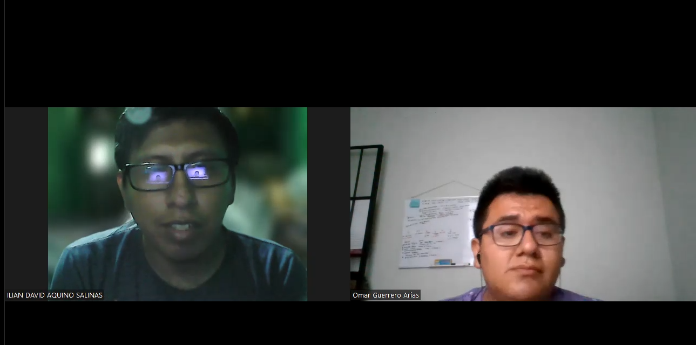

•	URL de stream: https://youtu.be/tB2grVGkoMQ

•	Timing y duración: 0:00 – 3:24	

•	Resumen sobre la entrevista:

La entrevista fue realizada a Illian David Aquino, tiene 26 años y reside Puente Piedra. Es un técnico en telecomunicaciones, soltero y sus dispositivos de preferencia son su celular y su laptop. Además, cuenta con ciertas frustraciones como el estrés por el tiempo que cuida a su familiar y no poder concentrarse en su trabajo. Como se mencionó, él es una de las personas que se encargan del cuidado de su mamá, quien debido a que se enferma constantemente. Por ello, Illian menciona que la ayuda o atención de un profesional de la salud en su domicilio le facilita el cuidado de su mama, ya que ella requiere de constantes chequeos y no puede visitar centros clínicos por sus problemas de salud. De igual forma, Illian asegura que él es quien se encargan de aplicar los medicamentos que son necesarios en el cuidado de su mamá. Por otro lado, con respecto a las plataformas de salud virtuales, él menciona que el principal factor de confianza en un doctor es que este sea recomendado y calificado con la capacidad necesaria para realizar su trabajo sin errores; por lo que piensa que es muy importante el ser capaz de elegir exactamente a quién contratar. Finalmente, el entrevistado considera fundamental monitorear y controlar los análisis médicos hechos a su mamá.

#####	Entrevistado 2:
•	Nombres y Apellidos: Analy Mejia Huanca

•	Edad: 22 años

•	Distrito: San Juan de Lurigancho

•	Evidencia de la reunión: 

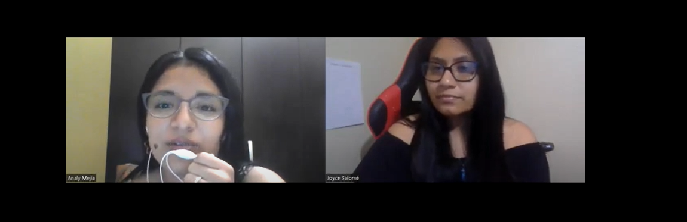

•	URL de stream: https://youtu.be/PMXbxqeRnwE

•	Timing y duración: 0:00 – 4:10	

•	Resumen sobre la entrevista:

La entrevista se realizó a una joven llamada Analy Mejia Huanca de 22 años de edad, ella nos comenta que el principal factor frustrante para ella al momento de atender a su familiar con discapacidad es el tiempo, ya que ella trabaja a tiempo completo. Por otro lado, también nos comentó que el factor de los precios de las clínicas para el cuidado a diario de su familiar es muy elevado así que prefiere hacerlo mayormente por su cuenta.
Después de comentarle cuáles son sus preocupaciones al momento de confiar en una aplicación, nos dijo que algunos factores que le brindarían confianza seria el prestigio, y la recomendación de este aplicativo.
Finalmente, nos dijo que, si confiaría en un aplicativo para ayudarla con el cuidado de su familiar, ya que ella necesita tener más tiempo para dedicarle a su trabajo. 

#### Segmento 2: Profesionales de la salud
1.	Entrevistado 1:

•	Nombres y Apellidos:  Ruth Zaira Salazar Elliott

•	Edad: 51 años

•	Distrito: Lima

•	Evidencia de la reunión: 

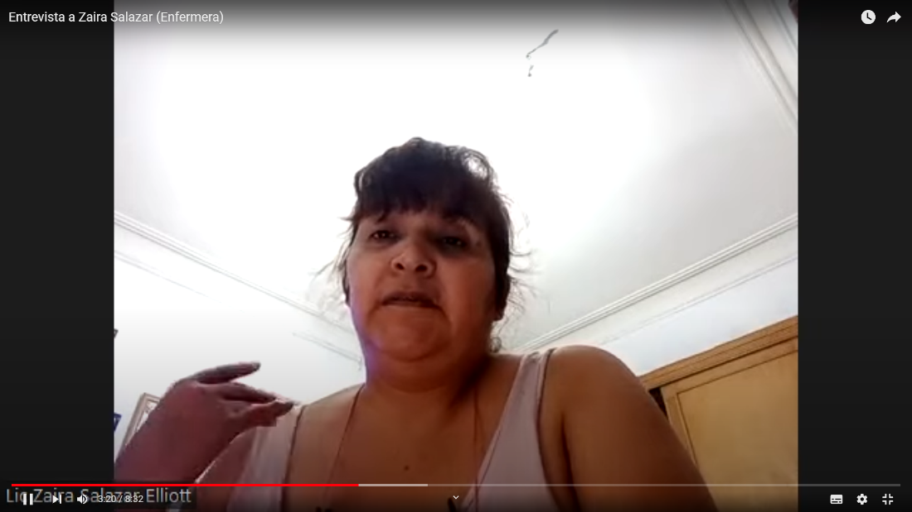
•	URL de stream: https://youtu.be/p755LpTQaWU

•	Timing y duración: 00:00 – 08:32 

•	Resumen sobre la entrevista:  

La entrevistada Ruth Zaira Salazar Elliott labora actualmente en el Hospital del Niño. Reside en Lima, se encuentra casada y tiene 51 años, sus dispositivos de preferencia son los dispositivos móviles. La entrevistada nos cuenta que tiene habilidad del manejo de estrés y empatía en los horarios de trabajo. La señora Ruth comenta que una de las razones principales por la que los adultos mayores y pacientes en general optan por no ir a los centros médicos se debe a la pérdida de tiempo que estos requieren en el proceso de trasladar al paciente al hospital o falta de dinero para este mismo. Además, sus años de experiencia laboral le han permitido estar familiarizada a conocer más a fondo a sus pacientes, debido a que en todos los días de trabajo tiene que cuidar a pacientes con limitaciones físicas y/o mentales. Según la enfermera Ruth, ella considera que el problema más frecuente cuando los familiares se encargan del cuidado de los pacientes es que estos no tienen dinero para contratar a alguien para brindar el cuidado adecuado, además, no cualquiera puede hacer estos cuidados ya que es mucho trabajo y tiempo que consume para una persona. Así también, la entrevistada considera que la mayor diferencia entre un médico de casa a uno de clínica es que al ser uno de casa, el profesional de salud es el que irá al domicilio del paciente para atenderlo, y no viceversa siendo el paciente el que va a la sala de atención.
En cuanto a la idea de que pueda colocar su propia tarifa por sus servicios médicos, se encuentra de acuerdo, porque considera que cada profesional ve en sus pacientes el proceso que debe realizar para cada uno de estos por lo que le parece justo que cada profesional pueda poner su propia tarifa para los servicios que realizará. En cuanto a la idea de la posibilidad de dejar una puntuación y reseña del servicio realizado considera que está bien. Además, la señora Ruth estaría dispuesta a dar un 1% o hasta 5% de sus ganancias mensuales a dicha aplicación móvil que la ayude en la captación de pacientes.

##### 2.	Entrevistado 2:

•	Nombres y Apellidos:  Elizabeth Vilcachagua Silva

•	Edad: 50 años

•	Distrito: Lima

•	Evidencia de la reunión:

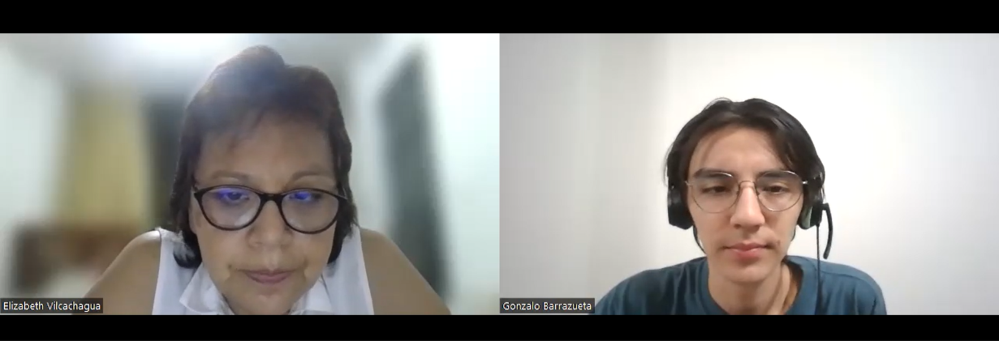
•	URL de stream: https://youtu.be/5HrHp77ntS4

•	Timing y duración: 00:00 -- 05:19

•	Resumen sobre la entrevista:  

La persona entrevistada es Elizabeth Vilcachagua Silva. Ella es una enfermera y, actualmente, trabaja como cuidadora de adultos mayores. Reside en la ciudad de Lima y tiene 50 años de edad. Debido a que la mayor parte del tiempo se encuentra movilizándose, el dispositivo que más utiliza es su celular. Además, ella nos comentó que, personalmente, destaca su capacidad de escucha atenta y tiene la habilidad de poder comunicarse efectivamente con sus pacientes y compañeros de trabajo. Estas habilidades son muy importantes en su campo laboral.
Sobre las preguntas realizadas sobre su experiencia trabajando con adultos mayores, ella nos comenta que la mayor dificultad para que muchos pacientes no acudan a centros médicos es que movilizarse les resulta caro o inconveniente. Debido a que los pacientes son adultos de la tercera edad, movilizarse les resulta más cansado. Además, nos comenta que ella tiene 10 años de experiencia cuidando a personas con discapacidades físicas. Actualmente, sigue desempeñando esta labor los días de lunes a viernes. Un problema que los familiares de los pacientes constantemente realizan es que ellos tratan de administrar la forma cómo dar medicamentos. Ella piensa que este es un gran error, ya que a veces pueden equivocarse en cuanto a la cantidad de la dosis o no seguir el orden correcto del tratamiento lo cual puede ralentizar el proceso de recuperación. Asimismo, ella menciona que, para la aplicación, le gustaría que tenga un servicio de mensajería integrado, para que este sea el principal medio por donde se comunique con sus pacientes. Además, le gustaría que haya una vista de cada paciente desde donde pueda ver el historial médico de cada uno rápidamente y que sea fácilmente editable.

### 2.2.3.	Análisis de entrevistas.

A continuación, se desarrolla una estrategia en conjunto con el equipo para identificar los puntos en común en base a las respuestas de cada entrevistado a cada pregunta. Esto nos ayuda a realizar un análisis más conciso y seguro para desarrollar nuestra aplicación móvil en base a la información recolectada.

##### Puntos en común:

##### Segmento 1: Pacientes

¿Cuáles son los principales motivos por el cual usted contrataría el servicio de un profesional de la salud a domicilio? 

•	El 100% de los entrevistados concuerdan en que el principal motivo por el cual contratan el servicio de un profesional de la salud a domicilio es para que se ocupen de todas las necesidades médicas de su familiar ya que por algunos factores como, por ejemplo, el tiempo no les es posible hacerse cargo completamente.
¿Cuáles son las dificultades que ha encontrado en el servicio de clínica en la atención al cliente?

•	El 50% de los entrevistados afirma que el tiempo de espera es muy lento, lo cual no satisface las necesidades del enfermo. Además, de la saturación de los sistemas.
¿Cuáles serían los factores que determinan su confianza en un sistema web de atención a domicilio? 

•	El 50% de entrevistados considera que es importante la recomendación de esta misma aplicación móvil por parte de conocidos o gente que la hayan utilizado. 

¿Qué tan importante es para usted tener el control de elegir (personalizar) a su profesional de la salud? 

•	El 50% considera que con que el personal mostrado en la aplicación sea un profesional en su área es suficiente, mientras que el otro 50% de los entrevistados coinciden en que es de suma importancia poder elegir al profesional de la salud que acudirá a su domicilio, pues debe asegurarse de que sea un médico o enfermero confiable y capaz de generar mejoras en la salud del paciente. 

¿Considera una ventaja tener un registro actualizado de cada análisis que se le realiza a su familiar con limitación para un monitoreo más íntegro? 

•	El 100% de los entrevistados mantiene que el registro actualizado de cada análisis que se le realiza a su familiar es de suma importancia, pues permite acceder a la información sobre la condición actual del paciente.

##### Análisis General de las entrevistas del Segmento objetivo Pacientes:

Haciendo un análisis general de las entrevistas se puede evidenciar lo siguiente. La totalidad de los entrevistados coincide en que la mayor dificultad que se presenta durante el cuidado de algún familiar es el tiempo (100%), lo cual les consume mucho tiempo, por lo que varios aspectos de su vida se ven afectados debido a esto (labores diarias). Asimismo, consideran que es un aspecto muy importante poder elegir al personal médico y llevar un registro de los análisis de su familiar (100%). Sin embargo, para que esto sea viable es necesario que la seguridad de la aplicación móvil sea alta ya que se estaría trabajando con los datos personales de los clientes. Por otro lado, se identificó que, de los entrevistados, 1 era hombre y 1 mujer, y el margen de edades iba desde los 22 hasta los 26 años. 

##### Segmento 2: Profesionales de la salud

¿Cuál es el factor principal por el cual los adultos mayores optan por no acudir a los centros médicos? 

•	Un 50% de los entrevistados asegura que los adultos mayores no tienen a un familiar que los acompañe. Otro 50% menciona que los gastos de atención son costosos. 
¿Cuánta experiencia tiene usted como cuidador de personas mayores y/o personas con limitaciones físicas o mentales? 

•	El 100% de los entrevistados tiene mucha experiencia médica sobre el cuidado de personas con limitaciones físicas y/o mentales. 

¿Con cuánta frecuencia atiende a personas con alguna discapacidad física, mental o de otra índole? 

•	El 100% de los entrevistados mencionan que atienden con frecuencia a personas con alguna discapacidad, que en su mayoría presentan limitaciones físicas.

¿Cuál es el problema más frecuente que se da cuando familiares no capacitados se encargan de administrar el tratamiento médico de algún paciente con limitaciones físicas, mentales o con presencia de enfermedades crónicas? 

•	El 100% de los entrevistados asegura que el desconocimiento del familiar, a cargo del cuidado del paciente, perjudica su condición. En otras palabras, no controlar o tratar la enfermedad de forma incorrecta puede agravar la condición del paciente.

•	Además, el 100% de los entrevistados mencionan que los familiares desconocen cómo llevar un tratamiento. Por ejemplo, tienen dificultades cuando necesitan medir la cantidad de las dosis de los medicamentos y tampoco saben cómo dárselo al paciente cuando este se rehúsa a tomarlo.

¿Qué tan importante considera el monitoreo a tiempo real de los pacientes? 

•	El 100% de entrevistados coincide en que, el monitoreo a tiempo real es de vital importancia para saber el estado actual de sus pacientes, y poder prevenir accidentes.

•	Además, los entrevistados afirman que otra diferencia ventajosa para el paciente, es que lo permite sentirse seguro sabiendo que su estado actual podrá ser visto por el doctor sin necesidad que este se encuentre en su hogar acompañándolo.

¿Cómo reacciona ante situaciones de gran estrés o cómo maneja eficazmente el estrés personal en su trabajo como profesional de la salud?

•	El 100% considera que tienen buen manejo de estrés y aplican técnicas de relajamiento para mantenerse siempre profesional en su ámbito laboral.

¿Cómo le han ayudado sus habilidades de escucha, a entender y diagnosticar correctamente las necesidades de sus pacientes? 

•	El 100% de los entrevistados considera que las habilidades de escuchar les ayudan a comprender mejor a sus pacientes y diagnosticarlos de manera eficaz.

¿Cuál sería el porcentaje apropiado que estaría dispuesto a descontar de sus ingresos mensuales por conceptos de captación de pacientes a través de una aplicación? 

•	El 100% está dispuesto a dar un 5% de sus ganancias en la aplicación móvil por movimiento de pacientes y gestión del mismo

##### Análisis General de las entrevistas del Segmento objetivo Profesionales de la salud:

Haciendo un análisis general de las entrevistas se puede evidenciar lo siguiente. La totalidad de los entrevistados cuenta con bastante experiencia respecto al cuidado de personas con limitaciones físicas y/o mentales. Asimismo, consideran que es peligroso que una persona no experimentada, familiar del paciente en este contexto, aplique los tratamientos o medicamentos al paciente ya que no tienen el conocimiento adecuado. Por otro lado, están de acuerdo en que nuestra plataforma les permita colocar su propia tarifa por concepto de atentación ya que de esta forma los usuarios podrán elegir al profesional de la salud que mejor le convenga y, después de realizado el tratamiento se le pueda calificar a través de reseñas o puntuaciones, esto no solo les permitiría obtener una retroalimentación de su servicio sino también una oportunidad de que los demás usuarios lo conozcan y elijan para tratar a sus familiares. Además, consideran que un monto justo de cobro por la aplicación móvil no debería pasar del 5% de sus ingresos mensuales. Por otro lado, los 2 entrevistados fueron mujeres, el margen de edades iba desde los 50 hasta los 51 años, las 2 vivían en Lima, aunque en distintos distritos, las 2 trabajan en alguna rama de la medicina, las 2 ya se encontraban casados, las 2 saben actuar en momentos de estrés y, para terminar, las 2 tienen distintas frustraciones.

## 2.3.	Needfinding
### 2.3.1.	User Personas.

A continuación, se construirán los User Persona de cada segmento objetivo de nuestra aplicación móvil. Para ello, se utilizarán los datos recolectados de las entrevistas realizadas; principalmente, los que muestran los objetivos, motivaciones y frustraciones con las que cuentan cada uno de los sectores que conforman al público al que va dirigida la aplicación. Es decir, se presentará tanto un estereotipo de un familiar de una persona discapacitada, como uno de un profesional de la salud.

#### User Persona – Paciente
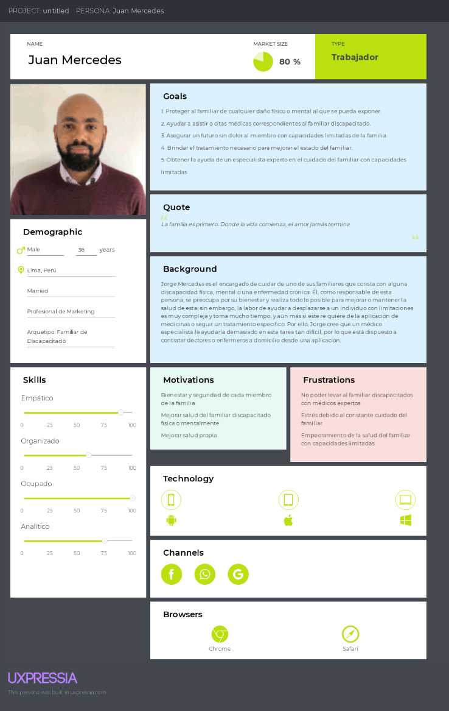

#### User Persona – Profesional de la salud
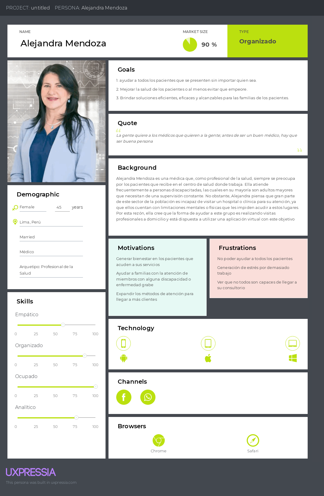

### 2.3.2.	User Task Matrix.

En esta etapa nos enfocaremos en las tareas que los User Personas familiares de adultos mayores o personas con limitación física o mental, representados por Juan Mercedes. Asimismo, el segundo User Persona que son los profesionales de la salud, representados por Alejandra Mendoza, realizan para alcanzar su propósito, teniendo como segmentos objetivos a los pacientes con dificultades para movilizarse o sus familiares y, los profesionales de la salud. 

<table>
  <tr>
    <th rowspan="2">Task Matrix</th>
    <th colspan="2">Paciente</th>
    <th colspan="2">Doctor</th>
  </tr>
  <tr>
    <td >Frecuencia</td>
    <td >Importancia</td>
    <td >Frecuencia</td>
    <td >Importancia</td>
  </tr>
  <tr>
    <td>Supervisar el comportamiento del paciente durante el día</td>
    <td>Always</td>
    <td>High</td>
    <td>Always</td>
    <td>High</td>
  </tr>
  <tr>
    <td>Ayudar a movilizar a los pacientes  </td>
    <td>Always</td>
    <td>Medium</td>
    <td>Always</td>
    <td>High</td>
  </tr>
  <tr>
    <td>Realizar exámenes médicos</td>
    <td>Rarely</td>
    <td>High</td>
    <td>Always</td>
    <td>High</td>
  </tr>
  <tr>
    <td>Buscar al personal de la salud más adecuado</td>
    <td>Often			</td>
    <td>High</td>
    <td>Rarely</td>
    <td>Low</td>
  </tr>
  <tr>
    <td>Registrar reclamos en el transcurso de la cotización.</td>
    <td>Siempre</td>
    <td>Alta</td>
    <td>Siempre</td>
    <td>Alta</td>
  </tr>
   <tr>
    <td>Registrar condición del paciente</td>
    <td>Rarely</td>
    <td>Low</td>
    <td>Always</td>
    <td>High</td>
  </tr>
</table>

##### Tareas con mayor frecuencia e importancia:

1.	Frecuencia: 

Las tareas con mayor frecuencia son aquellas relacionadas con la rutina diaria del paciente: supervisión de las acciones que realiza, ayuda para movilizarse y aplicar sus medicamentos. La primera, implica estar en constante supervisión del paciente ya que a menudo intenta realizar movimientos o desplazamientos que comprometen su condición. La segunda, corresponde a una ayuda continua para movilizarnos y, de esta forma, evitar que se lastimen. La tercera, es de suma importancia durante el proceso de recuperación del paciente porque se deben utilizar las dosis y los procedimientos adecuados en los horarios correspondientes.

2.	Importancia:

 Como tareas de mayor importancia tenemos que supervisar el comportamiento del paciente, realizar los exámenes médicos correspondientes, buscar y contratar al personal médico adecuado y, obtener una unidad médica para el transporte. La primera, es considerada de gran importancia porque cualquier descuido hacia el paciente puede acabar en una complicación mayor. La segunda, implica conocer el estado actual y la evolución del cuadro clínico del paciente para realizar el siguiente paso en su tratamiento. La tercera, está relacionada con la calidad del trato que un personal médico puede otorgar ya que algunos de ellos son bruscos o carecen del conocimiento necesario. La cuarta, si bien no es muy frecuente ya que se utiliza cuando el cuadro clínico del paciente es grave, es vital que se pueda conseguir prontamente para que el paciente reciba una atención oportuna. Finalmente, una tarea de suma importancia es registrar la condición del paciente, ya que de esta manera se podrá saber el progreso de la enfermedad o la mejoría del paciente. 

##### Diferencias y Similitudes:

La principal diferencia identificadas entre los User persona es que Juan Mercedes, representante de los familiares contratantes, no puede realizar exámenes médicos pues no cuenta con la instrucción necesaria para ejercer esa función. En cambio, Alejandra Mendoza si lo puede realizar pues es una doctora o enfermera certificada con experiencia en técnicas inmersivas. Otra diferencia, es que Juan Mercedes contrata a un profesional, y Alejandra mercedes es la contratada para brindar sus servicios de atención médica a domicilio. Finalmente, Juan Mercedes no registra la condición de su familiar con limitación por motivos de ignorancia en el tema, pues solo se encarga de las necesidades básicas de su familiar como alimentación o aseo. En cambio, Alejandra Mendoza se encarga de registrar toda la información necesaria para establecer la condición actual del paciente para tomar acciones de prevención y solución. 
Algunas de las similitudes identificadas son que ambos User personas supervisan el comportamiento del paciente durante el tiempo que estén con él. Asimismo, ambos ayudan a movilizar al paciente con fines de aplicar un tratamiento o terapia. 
 
### 2.3.3.	User Journey Mapping.

El User Journey Mapping es una herramienta de Design Thinking que nos ayuda a graficar un mapa con las etapas, canales, elementos e interacciones por las que pasa nuestro usuario durante el ciclo de uso del servicio.

#### User Journey Mapping - Paciente

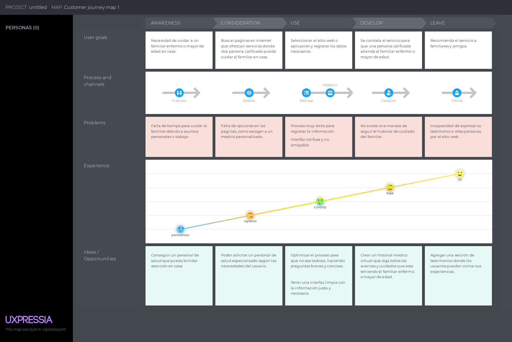

#### User Journey Mapping - Profesional de la salud

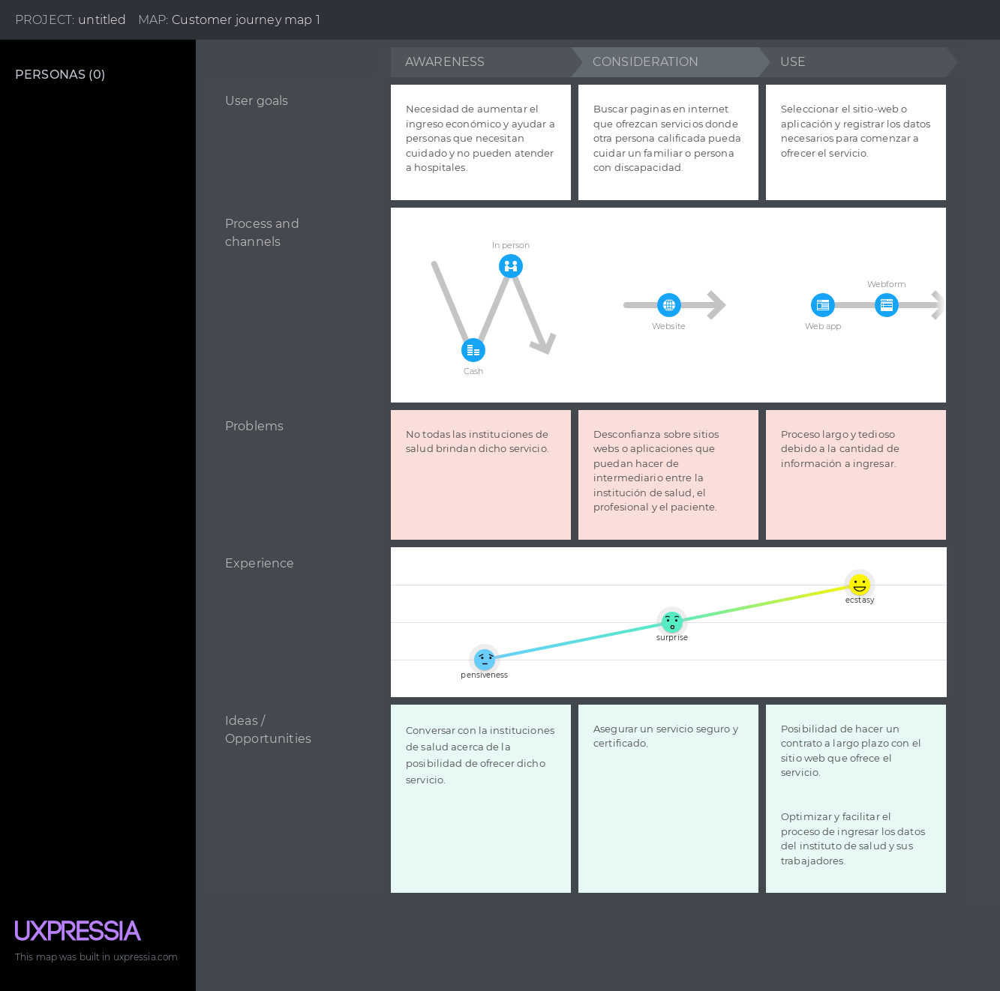

### 2.3.4.	Empathy Mapping.

En esta sección se presenta el Empathy Mapping de nuestros 2 segmentos objetivos. Esta herramienta se utilizó porque permite identificar nuestro público objetivo, conocer su entorno y sus necesidades, lo cual nos permite ver el mundo a través de su perspectiva.

#### Empathy Mapping - Paciente

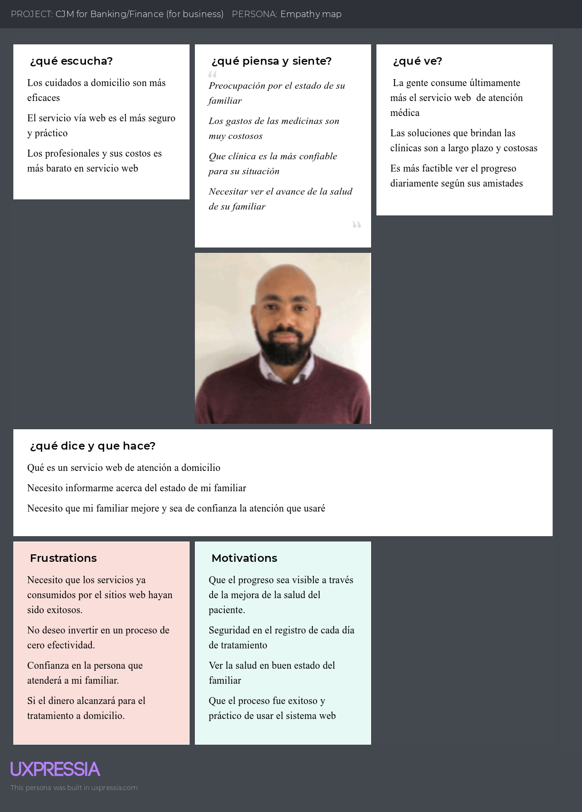

#### Empathy Mapping - Profesional de la salud

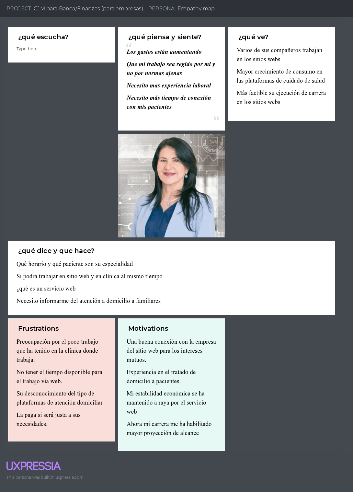

### 2.3.5.	As-is Scenario Mapping.

En esta sección, se identificó las fases que podría presentar a nuestros User persona, del cómo se afrontó, sus pensamientos, sus sentimientos para identificar qué soluciones son las más adecuadas para satisfacer sus inquietudes.

#### As-is Scenario Mapping - Paciente

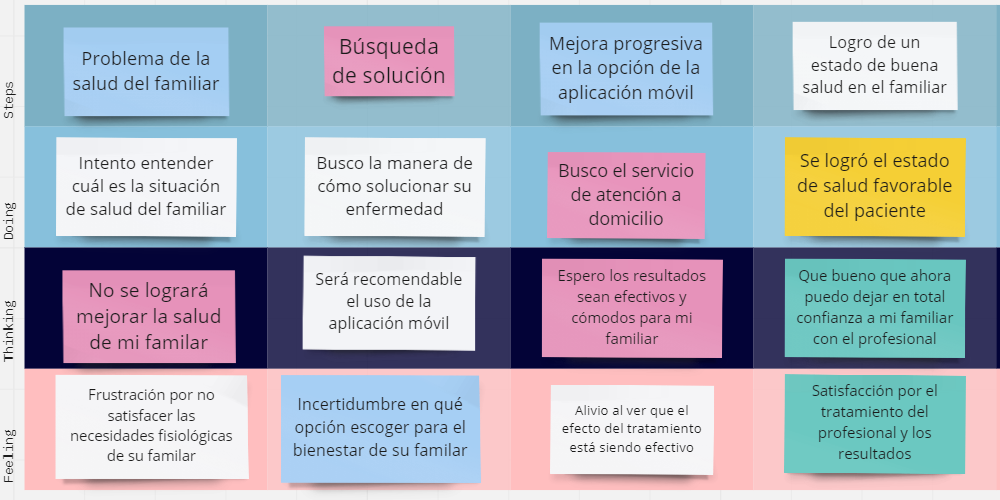

#### As-is Scenario Mapping - Profesional de la salud

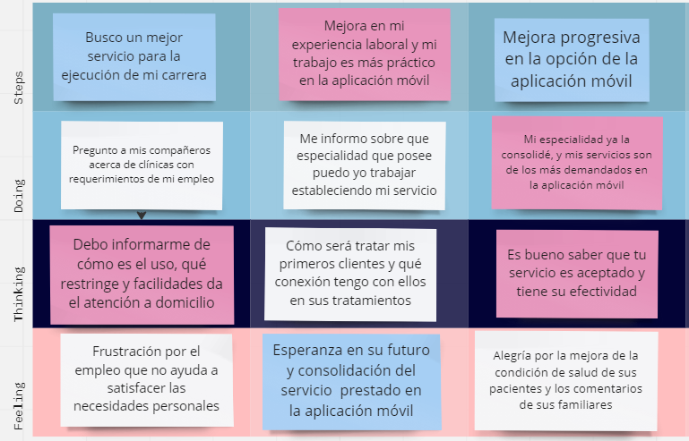
