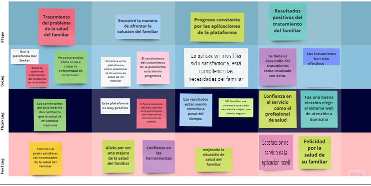
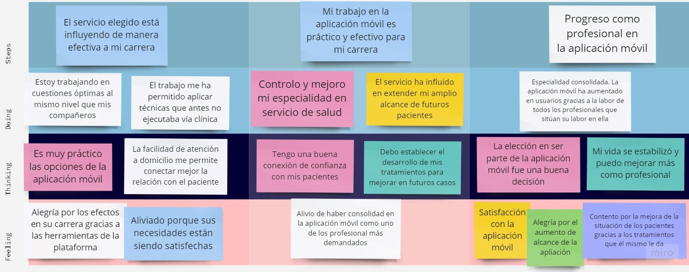
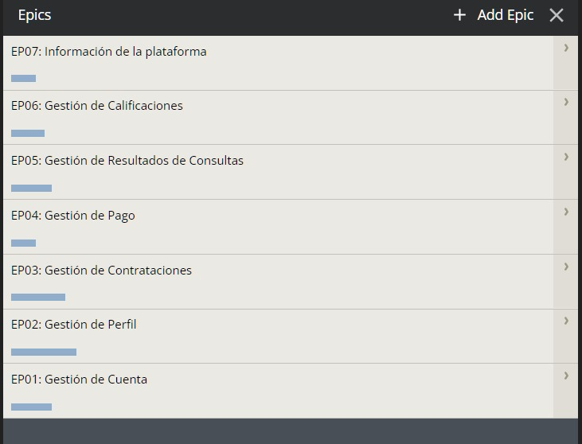
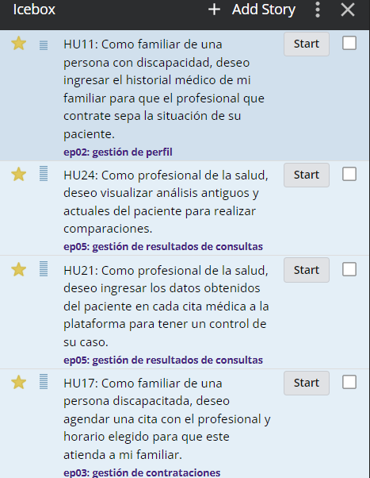
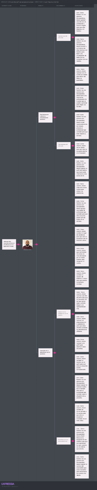
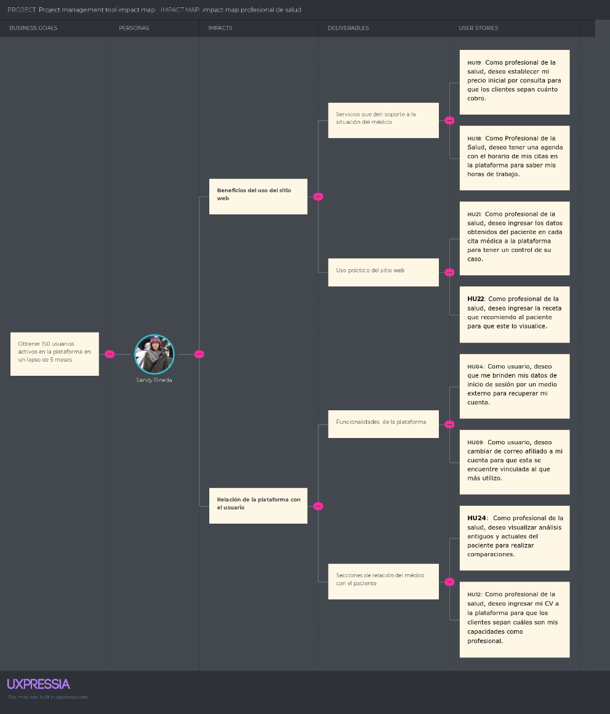
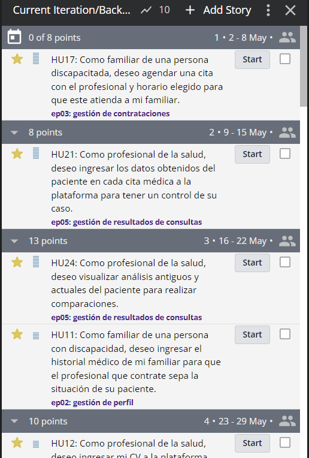

# REQUIREMENTS SPECIFICATION
## 3.1.	To-Be Scenario Mapping.

To be Scenary map nos permite establecer las ideas, pensamientos y necesidades del usuario. Por ello, se decidió usar esta herramienta para tener un concepto de primera persona de nuestros usuarios, y así en nuestra aplicación móvil tener las soluciones a sus problemas y ser su principal opción en el mercado.

#### To-Be Scenario Mapping - Paciente

Se presenta la versión del usuario, familiar de la persona con limitación, en la cual se estableció ya sus necesidades satisfechas a través de nuestra aplicación móvil.

#### To-Be Scenario Mapping - Profesional de la salud

Se presenta la versión del usuario, profesional de salud, en la cual se ve el avance en la satisfacción de sus necesidades, gracias al afiliarse con nuestra aplicación móvil

## 3.2.	User Stories.
#### Epics
<table border ="1">
    <tr>
        <th>ID</th>
        <th>Título</th>
        <th>Descripción</th>
        <th>Relacionado con (Epics ID)</th>
    </tr>
    <tr>
        <td>EP01</td>
        <td>Gestión de Cuenta</td>
        <td>Como usuario deseo acceder a mi cuenta privada para entrar a la plataforma.</td>
        <td>EP01</td>
    </tr>
    <tr>
        <td>EP02</td>
        <td>Gestión de Perfil</td>
        <td>Como usuario, deseo realizar cambios en mi perfil para que este se encuentre actualizado.</td>
        <td>EP02</td>
    </tr>
    <tr>
        <td>EP03</td>
        <td>Gestión de Contrataciones</td>
        <td>Como familiar de una persona con discapacidad, deseo contratar a un profesional para que atienda a mi familiar.</td>
        <td>EP03</td>
    </tr>
    <tr>
        <td>EP04</td>
        <td>Gestión de Pago</td>
        <td>Como profesional de la salud, deseo controlar los pagos de mis servicios para que estos sean recompensados de manera justa.</td>
        <td>EP04</td>
    </tr>
    <tr>
        <td>EP05</td>
        <td>Gestión de Resultados de Consultas</td>
        <td>Como usuario, deseo que todos los chequeos que se realicen en el paciente sean archivados en la plataforma para tener un buen control.</td>
        <td>EP05</td>
    </tr>
    <tr>
        <td>EP06</td>
        <td>Gestión de Calificaciones</td>
        <td>Como familiar de una persona con discapacidad, deseo calificar la atención del médico de casa para que los demás clientes tengan referencias de él.</td>
        <td>EP06</td>
    </tr>
    <tr>
        <td>EP07</td>
        <td>Información de la plataforma</td>
        <td>Como administrador, deseo ofrecer información de la empresa para que los clientes sepan más de ella.</td>
        <td>EP07</td>
    </tr>
    <tr>
        <td>EP09</td>
        <td>Gestión de sistemas de temperatura</td>
        <td>Como usuario, deseo que me manden una notificación para medir la temperatura en el sistema.</td>
        <td>EP09</td>
    </tr>
    <tr>
        <td>EP10</td>
        <td>Gestión de mensajería</td>
        <td>Como administrador, deseo tener un apartado de mensajería donde pueda ver fecha y hora de envío, para que los clientes puedan tener mejor gestión de ella.</td>
        <td>EP10</td>
    </tr>
</table>

#### Imagen de Epics en Pivotal Tracker:
 
Link: https://www.pivotaltracker.com/n/projects/2603049 

#### User Stories

A continuación, se redactarán las historias de usuario de nuestra aplicación. Estas manifestarán las necesidades que tiene cada uno de los involucrados en la Plataforma. Es decir, se representarán los requisitos que tiene la app. Además, se mostrarán los criterios de aceptación que contendrán cada uno de los posibles escenarios que involucran a cada US. Finalmente, se mostrarán las Epics con las que están relacionados.

<table border="1">
  <tr>
    <th>Story ID</th>
    <th>Título</th>
    <th>Descripción</th>
    <th>Criterios de Aceptación</th>
    <th>Relacionado con (Epics ID)</th>
  </tr>
  <tr>
    <td>HU01</td>
    <td>Registrar Cuenta</td>
    <td>Como usuario, deseo crear una nueva cuenta para entrar a la plataforma.</td>
    <td>
      <strong>E01: Ingreso correcto de datos</strong>
      <ul>
        <li>CA01: Dado que el usuario se encuentra en el formulario de registro, cuando ingresa su nombre, correo, ubicación, edad, número de celular, contraseña y apellidos correctos, y elige su rol, entonces se registra su nueva cuenta.</li>
      </ul>
      <strong>E02: Ingreso incorrecto de datos</strong>
      <ul>
        <li>CA02: Dado que el usuario se encuentra en el formulario de registro, cuando ingresa su ubicación, correo, edad, número de celular, contraseña y apellidos correctos, y elige su rol, pero su nombre está con caracteres no permitidos, entonces sale una equis roja al lado de la casilla con el mensaje de nombre incorrecto.</li>
        <li>CA03: Dado que el usuario se encuentra en el formulario de registro, cuando ingresa su nombre, correo, edad, número de celular, contraseña y apellidos correctos, y elige su rol, pero su ubicación está con caracteres no permitidos, entonces sale una equis roja al lado de la casilla con el mensaje de ubicación incorrecta.</li>
        <li>CA04: Dado que el usuario se encuentra en el formulario de registro, cuando ingresa su nombre, correo, ubicación, número de celular, contraseña y apellidos correctos, y elige su rol, pero su edad está con caracteres no permitidos, entonces sale una equis roja al lado de la casilla con el mensaje de edad incorrecta.</li>
        <li>CA05: Dado que el usuario se encuentra en el formulario de registro, cuando ingresa su nombre, correo, edad, número de celular, contraseña y ubicación correctas, y elige su rol, pero sus apellidos están con caracteres no permitidos, entonces sale una equis roja al lado de la casilla con el mensaje de apellido incorrecto.</li>
        <li>CA06: Dado que el usuario se encuentra en el formulario de registro, cuando ingresa su nombre, apellidos, edad, número de celular, contraseña y ubicación correctas, y elige su rol, pero su correo está con caracteres no permitidos, entonces sale una equis roja al lado de la casilla con el mensaje de correo incorrecto.</li>
        <li>CA07: Dado que el usuario se encuentra en el formulario de registro, cuando ingresa su nombre, correo, edad, número de celular, ubicación, contraseña y apellidos correctos, pero no elige su rol, entonces sale un mensaje que advierte que no se ha seleccionado rol en la plataforma.</li>
      </ul>
    </td>
    <td>EP01</td>
  </tr>
  <tr>
    <td>HU02</td>
    <td>Iniciar Sesión</td>
    <td>Como usuario, deseo ingresar con mi cuenta ya creada para tener mis datos ya guardados.</td>
    <td>
      <strong>E01: Ingreso correcto de datos</strong>
      <ul>
        <li>CA01:
Dado que el usuario se encuentra en el formulario de inicio de sesión
Cuando ingresa su correo y contraseña de manera correcta
Entonces ingresa a la plataforma con la sesión iniciada
</li>
      </ul>
      <strong>E02: Ingreso incorrecto de datos</strong>
      <ul>
       <li> CA02:
Dado que el usuario se encuentra en el formulario de inicio de sesión
Cuando ingresa mi correo correcto, pero su contraseña incorrecta
Entonces Sale un mensaje que advierte que se ingresó el correo o la contraseña de manera incorrecta.
</li>
<li>
CA03:
Dado que el usuario se encuentra en el formulario de inicio de sesión
Cuando ingresa su contraseña correcta, pero su correo incorrecto
Entonces Sale un mensaje que advierte que se ingresó el correo o la contraseña de manera incorrecta.
</li>
      </ul>
    </td>
    <td>EP01</td>
  </tr>
  <tr>
    <td>HU03</td>
    <td>Cerrar Sesión</td>
    <td>Como usuario, deseo cerrar sesión para que esta no se quede abierta en el buscador.</td>
    <td>
      <strong>E01: No hay acciones en proceso</strong>
      <ul>
        <li>CA01: Dado que el usuario se encuentra dentro de la plataforma, cuando presiona la opción de cerrar sesión y no tiene una contratación ni una reseña en proceso, entonces se cierra sesión correctamente.</li>
      </ul>
      <strong>E02: Hay acciones en proceso</strong>
      <ul>
        <li>CA02: Dado que el usuario se encuentra dentro de la plataforma, cuando presiona la opción de cerrar sesión y no tiene una contratación en proceso, pero sí una reseña, entonces sale un mensaje que advierte que aún hay acciones en proceso.</li>
        <li>CA03: Dado que el usuario se encuentra dentro de la plataforma, cuando presiona la opción de cerrar sesión y no tiene una reseña en proceso, pero sí una contratación, entonces sale un mensaje que advierte que aún hay acciones en proceso.</li>
      </ul>
    </td>
    <td>EP01</td>
  </tr>
  <tr>
    <td>HU04</td>
    <td>Recuperar Cuenta</td>
    <td>Como usuario, deseo que me brinden mis datos de inicio de sesión por un medio externo para recuperar mi cuenta.</td>
    <td>
      <strong>E01: Ingreso correcto de datos</strong>
      <ul>
        <li>CA01: Dado que el usuario se encuentra en el formulario de recuperar cuenta por correo electrónico, cuando ingresa un correo válido, entonces se envía la contraseña en un email.</li>
      </ul>
      <strong>E02: Ingreso incorrecto de datos</strong>
      <ul>
        <li>CA02: Dado que el usuario se encuentra en el formulario de recuperar cuenta por correo electrónico, cuando ingresa un correo no afiliado, entonces sale un mensaje que advierte que el correo no es válido.</li>
      </ul>
    </td>
    <td>EP01</td>
  </tr>
  <tr>
    <td>HU05</td>
    <td>Visualización de Perfil</td>
    <td>Como usuario, deseo ingresar a mi perfil para observar todos mis datos.</td>
    <td>
      <strong>E01: Sesión ya iniciada</strong>
      <ul>
        <li>CA01: Dado que el usuario se encuentra dentro de la plataforma, cuando inicia sesión y presiona la opción de ver perfil, entonces se le concede acceso a su perfil.</li>
      </ul>
    </td>
    <td>EP02</td>
  </tr>
  <tr>
    <td>HU06</td>
    <td>Cambio de Foto</td>
    <td>Como usuario, deseo ingresar una foto de perfil para que las personas con las que realizo algún contrato tengan una representación mía.</td>
    <td>
      <strong>E01: Ingreso de una foto con un tamaño menor al límite</strong>
      <ul>
        <li>CA01: Dado que el usuario se encuentra en su perfil de usuario, cuando presiona subir foto e ingresa una imagen correcta, entonces se cambia la foto de perfil.</li>
      </ul>
      <strong>E02: Ingreso de una foto con un tamaño mayor al límite</strong>
      <ul>
        <li>CA02: Dado que el usuario se encuentra en su perfil de usuario, cuando presiona subir foto e ingresa una imagen que excede el tamaño permitido, entonces se cambia la foto de perfil por un recorte de la imagen ingresada.</li>
      </ul>
    </td>
    <td>EP02</td>
  </tr>
  <tr>
    <td>HU07</td>
    <td>Cambio de Ubicación</td>
    <td>Como usuario, deseo cambiar mi lugar de residencia para que este se encuentre con mi dirección actual.</td>
    <td>
      <strong>E01: Ingreso correcto de datos</strong>
      <ul>
        <li>CA01: Dado que el usuario se encuentra en su perfil de usuario, cuando presiona la opción de modificar ubicación e ingresa una correcta, entonces se cambia la ubicación del usuario.</li>
      </ul>
      <strong>E02: Ingreso incorrecto de datos</strong>
      <ul>
        <li>CA02: Dado que el usuario se encuentra en su perfil de usuario, cuando presiona la opción de modificar ubicación e ingresa caracteres no permitidos, entonces sale un mensaje que advierta que se ingresó una ubicación incorrecta.</li>
      </ul>
    </td>
    <td>EP02</td>
  </tr>
  <tr>
    <td>HU08</td>
    <td>Cambio de Número Telefónico</td>
    <td>Como usuario, deseo cambiar mi número de teléfono o celular para que puedan contactarse conmigo.</td>
    <td>
      <strong>E01: Ingreso correcto de datos</strong>
      <ul>
        <li>CA01: Dado que el usuario se encuentra en su perfil de usuario, cuando presiona la opción de modificar número telefónico e ingresa uno correcto, entonces se cambia el número del usuario.</li>
      </ul>
      <strong>E02: Ingreso incorrecto de datos</strong>
      <ul>
        <li>CA02: Dado que el usuario se encuentra en su perfil de usuario, cuando presiona la opción de modificar número telefónico e ingresa caracteres no permitidos, entonces sale un mensaje que advierta que se ingresó un número incorrecto.</li>
        <li>CA03: Dado que el usuario se encuentra en su perfil de usuario, cuando presiona la opción de modificar número telefónico e ingresa uno inexistente, entonces sale un mensaje que advierta que se ingresó un número incorrecto.</li>
      </ul>
    </td>
    <td>EP02</td>
  </tr>
  <tr>
    <td>HU09</td>
    <td>Cambio de Correo Afiliado</td>
    <td>Como usuario, deseo cambiar de correo afiliado a mi cuenta para que esta se encuentre vinculada al que más utilizo.</td>
    <td>
      <strong>E01: Ingreso correcto de datos</strong>
      <ul>
        <li>CA01: Dado que el usuario se encuentra en su perfil de usuario, cuando presiona la opción de modificar correo e ingresa uno correcto, entonces se cambia el correo del usuario.</li>
      </ul>
      <strong>E02: Ingreso incorrecto de datos</strong>
      <ul>
        <li>CA02: Dado que el usuario se encuentra en su perfil de usuario, cuando presiona la opción de modificar número correo e ingresa caracteres no permitidos, entonces sale un mensaje que advierta que se ingresó un correo incorrecto.</li>
        <li>CA03: Dado que el usuario se encuentra en su perfil de usuario, cuando presiona la opción de modificar correo e ingresa uno inexistente, entonces sale un mensaje que advierta que se ingresó un correo incorrecto.</li>
      </ul>
    </td>
    <td>EP02</td>
  </tr>
  <tr>
    <td>HU10</td>
    <td>Cambio de Nombre</td>
    <td>Como usuario, deseo cambiar mi nombre en mi perfil para que este se encuentre escrito correctamente.</td>
    <td>
      <strong>E01: Ingreso correcto de datos</strong>
      <ul>
        <li>CA01: Dado que el usuario se encuentra en su perfil de usuario, cuando presiona la opción de modificar nombre e ingresa uno correcto, entonces se cambia el nombre del usuario.</li>
      </ul>
      <strong>E02: Ingreso incorrecto de datos</strong>
      <ul>
        <li>CA02: Dado que el usuario se encuentra en su perfil de usuario, cuando presiona la opción de modificar nombre e ingresa caracteres no permitidos, entonces sale un mensaje que advierta que se ingresó un nombre incorrecto.</li>
      </ul>
    </td>
    <td>EP02</td>
  </tr>
  <tr>
    <td>HU11</td>
    <td>Ingreso de Historial Médico</td>
    <td>Como familiar de una persona con discapacidad, deseo ingresar el historial médico de mi familiar para que el profesional que contrate sepa la situación de su paciente.</td>
    <td>
      <strong>E01: Ingreso correcto de datos</strong>
      <ul>
        <li>CA01: Dado que el usuario se encuentra en el formulario de adjuntar historial médico, cuando ingresa un archivo pdf, entonces se ingresan los datos generales y el historial médico del familiar discapacitado.</li>
      </ul>
      <strong>E02: Ingreso incorrecto de datos</strong>
      <ul>
        <li>CA02: Dado que el usuario se encuentra en el formulario de adjuntar historial médico, cuando ingresa datos generales y un archivo que no es pdf, entonces saldrá un mensaje que advierte que no se admiten archivos que no sean pdf.</li>
      </ul>
    </td>
    <td>EP02</td>
  </tr>
  <tr>
    <td>HU12</td>
    <td>Ingreso de Curriculum Vitae</td>
    <td>Como profesional de la salud, deseo ingresar mi CV a la plataforma para que los clientes sepan cuáles son mis capacidades como profesional.</td>
    <td>
      <strong>E01: Ingreso correcto de datos</strong>
      <ul>
        <li>CA01: Dado que el usuario se encuentra en el formulario de adjuntar CV, cuando ingresa un archivo pdf, entonces se ingresa el historial médico del familiar discapacitado.</li>
      </ul>
      <strong>E02: Ingreso incorrecto de datos</strong>
      <ul>
        <li>CA02: Dado que el usuario se encuentra en el formulario de adjuntar CV, cuando ingresa un archivo que no es pdf, entonces sale un mensaje que advierte que no se admiten archivos que no sean pdf.</li>
      </ul>
    </td>
    <td>EP02</td>
  </tr>
  <tr>
    <td>HU13</td>
    <td>Búsqueda por Nombre</td>
    <td>Como familiar de una persona con discapacidad, deseo ingresar el nombre del especialista que estoy buscando para encontrarlo de manera más rápida.</td>
    <td>
      <strong>E01: Hay Coincidencias</strong>
      <ul>
        <li>CA01: Dado que el usuario se encuentra en el menú principal de la plataforma, cuando ingresa un nombre correcto en la barra de búsqueda y sí existen especialistas con ese nombre, entonces se muestran los profesionales de la salud que coincidan con el nombre.</li>
      </ul>
      <strong>E02: No hay coincidencias</strong>
      <ul>
        <li>CA02: Dado que el usuario se encuentra en el menú principal de la plataforma, cuando ingresa un nombre en la barra de búsqueda y no existen especialistas con ese nombre, entonces se muestra un mensaje que dice que no existen profesionales con el nombre ingresado.</li>
      </ul>
    </td>
    <td>EP03</td>
  </tr>
    <tr>
    <td>HU14</td>
    <td>Agregación de Filtros</td>
    <td>Como usuario de una persona con discapacidad, deseo añadir filtros en la búsqueda de los médicos para que solo aparezcan los que cumplen con el criterio que solicito.</td>
    <td>
      <strong>E01: Hay resultados</strong>
      <ul>
        <li>CA01: Dado que el usuario se encuentra en el menú de filtros de búsqueda, cuando selecciona las opciones que quiero que cumpla el especialista y sí existen médicos con esas características, entonces se muestran los profesionales de la salud que cumplan con lo solicitado.</li>
      </ul>
      <strong>E02: No hay resultados</strong>
      <ul>
        <li>CA02: Dado que el usuario se encuentra en el menú de filtros de búsqueda, cuando selecciona las opciones que quiero que cumpla el especialista y no existen médicos con esas características, entonces se muestra un mensaje que dice que no existen especialistas que cumplan los datos ingresados.</li>
      </ul>
    </td>
    <td>EP03</td>
  </tr>
  <tr>
    <td>HU15</td>
    <td>Visualización de Perfiles de Profesionales de la Salud</td>
    <td>Como familiar de una persona con discapacidad, deseo ingresar al perfil del médico que busco para informarme más acerca de él.</td>
    <td>
      <strong>E01: Selección de especialista</strong>
      <ul>
        <li>CA01: Dado que el usuario se encuentra en la lista de profesionales de la salud, cuando presiona el nombre de un especialista, entonces se muestra su perfil.</li>
      </ul>
      <strong>E02: Selección de especialista</strong>
      <ul>
        <li>CA02: Dado que el usuario se encuentra en la lista de profesionales de la salud, cuando presiona la foto de un especialista, entonces se muestra su perfil.</li>
      </ul>
    </td>
    <td>EP03</td>
  </tr>
  <tr>
    <td>HU16</td>
    <td>Separación de Cita Médica</td>
    <td>Como familiar de una persona discapacitada, deseo agendar una cita con el profesional y horario elegido para que este atienda a mi familiar.</td>
    <td>
      <strong>E01: El horario está disponible</strong>
      <ul>
        <li>CA01: Dado que el usuario se encuentra en el formulario de contratación, cuando selecciona una fecha en la que el médico está disponible, entonces se agenda esa cita tanto en la cuenta del profesional como la del cliente.</li>
      </ul>
      <strong>E02: El horario no está disponible</strong>
      <ul>
        <li>CA02: Dado que el usuario se encuentra en el formulario de contratación, cuando selecciona una fecha en la que el médico tiene agendada otra cita, entonces sale un mensaje que advierte que el horario seleccionado no se encuentra disponible.</li>
      </ul>
    </td>
    <td>EP03</td>
  </tr>
  <tr>
    <td>HU17</td>
    <td>Visualización de Calendario de Citas</td>
    <td>Como Profesional de la Salud, deseo tener una agenda con el horario de mis citas en la plataforma para saber mis horas de trabajo.</td>
    <td>
      <strong>E01: Hay citas agendadas</strong>
      <ul>
        <li>CA01: Dado que el usuario se encuentra en el menú principal de la plataforma, cuando selecciona la opción de agenda y sí lo han contratado para citas médicas, entonces aparece una lista con las fechas agendadas desde la más pronta hasta la más lejana.</li>
      </ul>
      <strong>E02: No hay citas agendadas</strong>
      <ul>
        <li>CA02: Dado que el usuario se encuentra en el menú principal de la plataforma, cuando selecciona la opción de agenda y no lo han contratado para citas médicas, entonces aparece un mensaje que advierte que no existen citas médicas agendadas.</li>
      </ul>
    </td>
    <td>EP03</td>
  </tr>
   <tr>
    <td>HU19</td>
    <td>Elección de Método de Pago</td>
    <td>Como familiar profesional de la salud, deseo elegir los métodos de pago que utilizo para obtener mis remuneraciones de la mejor manera.</td>
    <td>
      <strong>E01: Ingreso correcto de datos</strong>
      <ul>
        <li>CA01: Dado que el usuario se encuentra en el formulario de métodos de pago, cuando agrega un número de tarjeta, fecha de vencimiento y CVV correctos, entonces sale un mensaje que confirme que se agregó correctamente el método de pago.</li>
      </ul>
      <strong>E02: Ingreso incorrecto de datos</strong>
      <ul>
        <li>CA02: Dado que el usuario se encuentra en el formulario de métodos de pago, cuando agrega un número de tarjeta y fecha de vencimiento correctos, pero CVV incorrecto, entonces sale un mensaje que advierte que hubo un error al agregar tarjeta.</li>
        <li>CA03: Dado que el usuario se encuentra en el formulario de métodos de pago, cuando agrega un número de tarjeta y CVV correctos, pero fecha de vencimiento incorrecta, entonces sale un mensaje que advierte que hubo un error al agregar tarjeta.</li>
        <li>CA04: Dado que el usuario se encuentra en el formulario de métodos de pago, cuando agrega un CVV y fecha de vencimiento correctos, pero un número de tarjeta incorrecto, entonces sale un mensaje que advierte que hubo un error al agregar tarjeta.</li>
      </ul>
    </td>
    <td>EP04</td>
  </tr>
  <tr>
    <td>HU20</td>
    <td>Registro de Chequeo</td>
    <td>Como profesional de la salud, deseo ingresar los datos obtenidos del paciente en cada cita médica a la plataforma para tener un control de su caso.</td>
    <td>
      <strong>E01: Ingreso correcto de datos</strong>
      <ul>
        <li>CA01: Dado que el usuario se encuentra en la lista de pacientes, cuando presiona archivar consulta, ingresa el nombre de uno de sus pacientes y sube los análisis realizados en pdf, entonces sale un mensaje que confirma que se archivaron los datos correctamente.</li>
      </ul>
      <strong>E02: Ingreso incorrecto de datos</strong>
      <ul>
        <li>CA02: Dado que el usuario se encuentra en la lista de pacientes, cuando presiona archivar consulta, ingresa el nombre de alguien que no es su paciente y sube los análisis realizados en pdf, entonces sale un mensaje que advierte que no se encontró el paciente.</li>
        <li>CA03: Dado que el usuario se encuentra en la lista de pacientes, cuando presiona archivar consulta, ingresa el nombre de alguien que es su paciente y sube los análisis realizados en un formato que no es pdf, entonces sale un mensaje que advierte que el formato del archivo subido no es correcto.</li>
      </ul>
    </td>
    <td>EP05</td>
  </tr>
  <tr>
    <td>HU22</td>
    <td>Visualización de Consultas Realizadas</td>
    <td>Como familiar de una persona discapacitada, deseo acceder a un historial de citas hechas a mi familiar para tener una visualización de todas de sus consultas con sus recetas.</td>
    <td>
      <strong>E01: Ya se han realizado citas médicas</strong>
      <ul>
        <li>CA01: Dado que el usuario se encuentra en el historial de citas médicas, cuando ya ha contratado consultas anteriormente, entonces se muestran los chequeos que he realizado en orden de fecha de más reciente a más antiguo.</li>
      </ul>
      <strong>E02: No se han realizado citas médicas</strong>
      <ul>
        <li>CA02: Dado que el usuario se encuentra en el historial de citas médicas, cuando no ha separado consultas anteriormente, entonces sale un mensaje que indica que el usuario no ha contratado un especialista anteriormente.</li>
      </ul>
    </td>
    <td>EP05</td>
  </tr>
   <tr>
    <td>HU23</td>
    <td>Monitoreo de Paciente</td>
    <td>Como profesional de la salud, deseo visualizar análisis antiguos y actuales del paciente para realizar comparaciones.</td>
    <td>
      <strong>E01: Selecciona más de un análisis</strong>
      <ul>
        <li>CA01: Dado que el usuario se encuentra en el historial médico de un paciente, cuando selecciona dos o más análisis que contengan datos medibles y del mismo tipo, entonces se genera y muestra automáticamente una comparación entre ambos registros.</li>
      </ul>
      <strong>E02: Selecciona menos de dos análisis</strong>
      <ul>
        <li>CA02: Dado que el usuario se encuentra en el historial médico de un paciente, cuando no selecciona ningún análisis realizado, entonces solo se muestra el historial médico con una lista de análisis realizados por especialistas de la plataforma.</li>
        <li>CA03: Dado que el usuario se encuentra en el historial médico de un paciente, cuando selecciona un análisis realizado, entonces solo se muestra los resultados de ese análisis.</li>
      </ul>
    </td>
    <td>EP05</td>
  </tr>
  <tr>
    <td>HU24</td>
    <td>Ingreso de Experiencias</td>
    <td>Como usuario, deseo ingresar mi experiencia con la plataforma para que otros clientes conozcan los beneficios de utilizarla.</td>
    <td>
      <strong>E01: Ingreso de datos correcto</strong>
      <ul>
        <li>CA01: Dado que el usuario se encuentra en el formulario de ingreso de experiencias, cuando ingresa mi experiencia de manera correcta, entonces se muestra esta anécdota con mi nombre en el apartado de experiencias.</li>
      </ul>
      <strong>E02: Ingreso de datos incorrecto</strong>
      <ul>
        <li>CA02: Dado que el usuario se encuentra en el formulario de ingreso de experiencias, cuando ingresa mi experiencia con caracteres no permitidos, entonces sale un mensaje que advierte que se utilizaron caracteres no permitidos.</li>
      </ul>
    </td>
    <td>EP06</td>
  </tr>
  <tr>
    <td>HU25</td>
    <td>Añadido de Reseñas</td>
    <td>Como familiar de una persona con discapacidad, deseo agregar una reseña al profesional que contraté para que otros usuarios sepan qué tan bueno es su servicio.</td>
    <td>
      <strong>E01: Ingreso de datos correcto</strong>
      <ul>
        <li>CA01: Dado que el usuario se encuentra en el formulario de ingreso de reseñas, cuando selecciona la cantidad de estrellas e ingresa un texto correcto, entonces se muestra esta reseña con mi nombre en el apartado de calificaciones del profesional.</li>
      </ul>
      <strong>E02: Ingreso de datos incorrecto</strong>
      <ul>
        <li>CA02: Dado que el usuario se encuentra en el formulario de ingreso de reseñas, cuando selecciona la cantidad de estrellas correcto, pero ingresa un texto con caracteres no permitidos, entonces sale un mensaje que advierte que la reseña contiene caracteres no permitidos.</li>
        <li>CA03: Dado que el usuario se encuentra en el formulario de ingreso de reseñas, cuando ingresa un texto correcto, pero no selecciona la cantidad de estrellas, entonces sale un mensaje que advierte que no se ha agregado una calificación.</li>
      </ul>
    </td>
    <td>EP06</td>
  </tr>
  <tr>
    <td>HU26</td>
    <td>Añadido de Recomendaciones</td>
    <td>Como familiar de una persona con discapacidad, deseo enviar recomendaciones de manera privada al profesional que contraté para que este mejore su servicio.</td>
    <td>
      <strong>E01: Ingreso de datos correcto</strong>
      <ul>
        <li>CA01: Dado que el usuario se encuentra en el formulario de ingreso de recomendaciones luego de concluir una cita médica, cuando ingresa su recomendación de manera correcta, entonces sale un mensaje que confirme que se envió la recomendación al profesional.</li>
      </ul>
      <strong>E02: Ingreso de datos correcto</strong>
      <ul>
        <li>CA02: Dado que el usuario se encuentra en el formulario de ingreso de recomendaciones luego de concluir una cita médica, cuando ingreso su recomendación con caracteres especiales, entonces saldrá un mensaje que advierte que se ha ingresado caracteres especiales.</li>
      </ul>
    </td>
    <td>EP06</td>
  </tr>
 <tr>
    <td>HU30</td>
    <td>Visualización de Landing Page</td>
    <td>Como administrador, deseo que se visualice lo que ofrece la plataforma al momento de ingresar a ella para que las personas la utilicen.</td>
    <td>
      <strong>E01: Ingreso desde el buscador</strong>
      <ul>
        <li>CA01: Dado que el usuario se encuentra en un buscador, cuando ingresa al dominio de DocSeeker, entonces aparece el LandingPage de la plataforma.</li>
      </ul>
      <strong>E02: Ingreso desde el Menú de Inicio</strong>
      <ul>
        <li>CA02: Dado que el usuario se encuentra en el menú principal de DocSeeker, cuando presiona selecciona la opción de más información, entonces aparece el LandingPage de la plataforma.</li>
      </ul>
    </td>
    <td>EP07</td>
  </tr>
  <tr>
    <td>HU31</td>
    <td>Contacto con la Empresa</td>
    <td>Como administrador, deseo ofrecer distintos canales de comunicación para ayudar a usuarios con problemas que presenten al momento de utilizar el sitio web.</td>
    <td>
      <strong>E01: Ingreso de datos correcto</strong>
      <ul>
        <li>CA01: Dado que el usuario se encuentra en el formulario de mensaje a DocSeeker, cuando ingresa un asunto y mensaje correctos, entonces se envía el mensaje a la plataforma.</li>
      </ul>
      <strong>E02: Ingreso de datos incorrecto</strong>
      <ul>
        <li>CA02: Dado que el usuario se encuentra en el formulario de mensaje a DocSeeker, cuando ingresa un asunto correcto, pero un mensaje con caracteres no permitidos, entonces sale un mensaje que advierte que se ingresaron caracteres no permitidos en el mensaje.</li>
        <li>CA03: Dado que el usuario se encuentra en el formulario de mensaje a DocSeeker, cuando ingresa un mensaje correcto, pero un asunto con caracteres no permitidos, entonces sale un mensaje que advierte que se ingresaron caracteres no permitidos en el asunto.</li>
      </ul>
    </td>
    <td>EP07</td>
  </tr>
  <tr>
    <td>HU32</td>
    <td>Traslación en el Landing Page</td>
    <td>Como usuario, deseo contar con opciones para trasladarme rápidamente al sector del Landing Page que deseo.</td>
    <td>
      <strong>E01: Selección de opciones del menú de traslación</strong>
      <ul>
        <li>CA01: Dado que el usuario se encuentra en el Landing Page, cuando selecciona la opción de inicio, entonces se traslada al inicio de la página.</li>
        <li>CA02: Dado que el usuario se encuentra en el Landing Page, cuando selecciona la opción de conócenos, entonces se traslada al sector de información de la empresa.</li>
        <li>CA03: Dado que el usuario se encuentra en el Landing Page, cuando selecciona la opción de servicios, entonces se traslada al sector que muestra los servicios brindados en la plataforma.</li>
        <li>CA04: Dado que el usuario se encuentra en el Landing Page, cuando selecciona la opción de contáctanos, entonces se traslada al final de la página y muestra los canales de contacto.</li>
      </ul>
    </td>
    <td>EP07</td>
  </tr>
   <tr>
    <td>HU33</td>
    <td>Acceso a redes sociales</td>
    <td>Como usuario, deseo contar con accesos rápidos a las redes de la plataforma para entrar en contacto con ella.</td>
    <td>
      <strong>E01: Selección una de las redes sociales</strong>
      <ul>
        <li>CA01: Dado que el usuario se encuentra en el apartado de contacto del Landing Page, cuando selecciona la opción de Facebook, entonces se le redirige a la página de Facebook de la empresa.</li>
        <li>CA02: Dado que el usuario se encuentra en el apartado de contacto del Landing Page, cuando selecciona la opción de Twitter, entonces se le redirige a la página de Twitter de la empresa.</li>
        <li>CA03: Dado que el usuario se encuentra en el apartado de contacto del Landing Page, cuando selecciona la opción de Instagram, entonces se le redirige a la página de Instagram de la empresa.</li>
        <li>CA04: Dado que el usuario se encuentra en el apartado de contacto del Landing Page, cuando selecciona la opción de LinkedIn, entonces se le redirige a la página de LinkedIn de la empresa.</li>
      </ul>
    </td>
    <td>EP07</td>
  </tr>
  <tr>
    <td>HU34</td>
    <td>Obtención de las credenciales del usuario</td>
    <td>Como developer, deseo poder recuperar las credenciales del usuario desde la base de datos para autenticar el inicio de sesión.</td>
    <td>
      <strong>E01: Recuperación de datos correcta</strong>
      <ul>
        <li>CA01: Dado que el servicio que almacena credenciales para el inicio de sesión está disponible, cuando recupero correctamente los datos de inicio de sesión del usuario, entonces se envían los datos solicitados a través del protocolo HTTP y se presenta el mensaje que indica “200(OK)”.</li>
      </ul>
      <strong>E02: Recuperación de datos incorrecta</strong>
      <ul>
        <li>CA02: Dado que existe un servicio que almacena credenciales para el inicio de sesión, cuando no se encuentran datos que concuerden con las credenciales ingresadas por el usuario dentro de la tabla Usuarios en la base de datos de DocSeeker, entonces se presenta el mensaje que indica “error 404(Not Found)”.</li>
      </ul>
    </td>
    <td>EP01</td>
  </tr>
  <tr>
    <td>HU35</td>
    <td>Registro de usuario en la base de datos</td>
    <td>Como developer, deseo poder almacenar un nuevo usuario dentro de la base de datos para registrar su cuenta.</td>
    <td>
      <strong>E01: Envío de datos correcto</strong>
      <ul>
        <li>CA01: Dado que el servicio de registro de cuenta está disponible, cuando se envían los datos de registro y se almacenan en una tupla, entonces se añaden en la tabla Usuarios de la base de datos de DocSeeker y se presenta el mensaje que indica “200(OK)”.</li>
      </ul>
      <strong>E02: Envío de datos incorrecto</strong>
      <ul>
        <li>CA02: Dado que el servicio registro de cuenta está disponible, cuando se envían los datos de registro y el protocolo HTTP no logra conectarse con la base de datos, entonces sale un mensaje que indica “error 404(Not Found)”.</li>
      </ul>
    </td>
    <td>EP01</td>
  </tr>
  <tr>
    <td>HU36</td>
    <td>Obtención de datos personales del usuario</td>
    <td>Como developer, deseo poder obtener los datos personales del usuario desde la base datos para que presentar en su perfil.</td>
    <td>
      <strong>E01: Recuperación de datos correcta</strong>
      <ul>
        <li>CA01: Dado que el servicio que almacena datos personales para el inicio de sesión está disponible, cuando recupero correctamente los datos personales del usuario, entonces se envían los datos solicitados a través del protocolo HTTP y se presenta el mensaje que indica “200(OK)”.</li>
      </ul>
      <strong>E02: Recuperación de datos incorrecta</strong>
      <ul>
        <li>CA02: Dado que el servicio que almacena credenciales para el inicio de sesión está disponible, cuando no se encuentran los datos que concuerden con las credenciales ingresadas por el usuario dentro de la tabla Usuarios en la base de datos de DocSeeker, entonces se presenta el mensaje que indica “error 404(Not Found)”.</li>
      </ul>
    </td>
    <td>EP02</td>
  </tr>
   <tr>
    <td>HU37</td>
    <td>Almacenamiento de historial médico</td>
    <td>Como developer, deseo poder almacenar el historial médico del usuario en la base de datos para que los usuarios tengan acceso a este desde la aplicación.</td>
    <td>
      <strong>E01: Envío de datos correcto</strong>
      <ul>
        <li>CA01: Dado que el servicio de registro de historial médico está disponible, cuando se envían los nuevos datos y se almacenan en una tupla, entonces se modifica correctamente el historial en la base de datos de DocSeeker y muestra el mensaje “200”.</li>
      </ul>
      <strong>E02: Envío de datos incorrecto</strong>
      <ul>
        <li>CA02: Dado que el servicio de registro de historial médico está disponible, cuando se envían los nuevos datos y el protocolo HTTP no logra conectarse con la base de datos, entonces sale un mensaje que indica “error 404”.</li>
      </ul>
    </td>
    <td>EP02</td>
  </tr>
  <tr>
    <td>HU38</td>
    <td>Almacenamiento de Curriculum Vitae</td>
    <td>Como developer, deseo poder almacenar el archivo del curriculum vitae del usuario en la base de datos para que los usuarios tengan acceso a este desde la aplicación.</td>
    <td>
      <strong>E01: Envío de datos correcto</strong>
      <ul>
        <li>CA01: Dado que el servicio de registro de CV está disponible, cuando se envían los nuevos datos y se almacenan en una tupla, entonces se modifica correctamente el CV en la base de datos de DocSeeker y muestra el mensaje “200”.</li>
      </ul>
      <strong>E02: Envío de datos incorrecto</strong>
      <ul>
        <li>CA02: Dado que el servicio de registro de CV está disponible, cuando se envían los nuevos datos y el protocolo HTTP no logra conectarse con la base de datos, entonces sale un mensaje que indica “error 404”.</li>
      </ul>
    </td>
    <td>EP02</td>
  </tr>
  <tr>
    <td>HU39</td>
    <td>Agregación de recomendación</td>
    <td>Como developer, deseo poder insertar un fisioterapeuta en la tabla de Recomendados para presentarlo a los usuarios.</td>
    <td>
      <strong>E01: Almacenamiento correcto del archivo</strong>
      <ul>
        <li>CA01: Dado que el servicio de agregación de fisioterapeutas a la tabla Recomendados está disponible, cuando se envían los datos del fisioterapeuta y se almacenan en una tupla, entonces se añade en la tabla Recomendados de la base de datos de DocSeeker y se presenta el mensaje que indica “200(OK)”.</li>
      </ul>
      <strong>E02: Almacenamiento incorrecto del archivo</strong>
      <ul>
        <li>CA02: Dado que el servicio de a agregación de fisioterapeutas a la tabla Recomendados está disponible, cuando se envían los datos del fisioterapeuta y el protocolo HTTP no logra conectarse con la base de datos, entonces sale un mensaje que indica “error 404(Not Found)”.</li>
      </ul>
    </td>
    <td>EP06</td>
  </tr>
  <tr>
    <td>HU40</td>
    <td>Ingreso de consulta de búsqueda de fisioterapeuta</td>
    <td>Como developer, deseo poder buscar los fisioterapeutas almacenados en la base de datos que coincidan con un nombre ingresado para que los usuarios tengan acceso a este desde la aplicación.</td>
    <td>
      <strong>E01: Se envía la consulta correctamente</strong>
      <ul>
        <li>CA01: Dado que el servicio de solicitud de consulta de búsqueda de fisioterapeuta está disponible, cuando se envían los datos que ingresó el usuario y se almacenan una tupla, entonces se guardan en la base de datos de DocSeeker y sale un mensaje que indica “200(OK)”.</li>
      </ul>
      <strong>E02: Se envía la consulta incorrectamente</strong>
      <ul>
        <li>CA02: Dado que el servicio de solicitud de consulta de búsqueda de fisioterapeutas está disponible, cuando se envían los datos de una nueva consulta y el protocolo HTTP no logra conectarse con la base de datos, entonces sale un mensaje que indica “error 404(Not Found)”.</li>
      </ul>
    </td>
    <td>EP03</td>
  </tr>
  <tr>
    <td>HU41</td>
    <td>Agregación de diagnóstico</td>
    <td>Como developer, deseo poder insertar un diagnóstico en la tabla diagnósticos de la base de datos para que los usuarios fisioterapeutas pueden visualizarlas desde la aplicación.</td>
    <td>
      <strong>E01: Almacenamiento correcto del archivo</strong>
      <ul>
        <li>CA01: Dado que el servicio de agregación de diagnóstico está disponible, cuando se envían los datos del nuevo diagnóstico y se almacenan en una tupla, entonces se añade en la tabla Diagnósticos de la base de datos de DocSeeker y se presenta el mensaje que indica “200(OK)”.</li>
      </ul>
      <strong>E02: Almacenamiento incorrecto del archivo</strong>
      <ul>
        <li>CA02: Dado que el servicio de agregación de diagnóstico está disponible, cuando se envían los datos y el protocolo HTTP no logra encontrar a la base de datos, entonces sale un mensaje que indica “error 404(Not Found)”.</li>
      </ul>
    </td>
    <td>EP05</td>
  </tr>
  <tr>
    <td>HU42</td>
    <td>Obtención de datos de consultas</td>
    <td>Como developer, deseo poder obtener los datos de las consultas almacenadas en la base de datos para que los usuarios tengan acceso a estas desde la aplicación.</td>
    <td>
      <strong>E01: Recuperación de datos correcta</strong>
      <ul>
        <li>CA01: Dado que el servicio que almacena datos de las consultas realizadas está disponible, cuando recupero correctamente los datos de la consulta, entonces se envían los datos solicitados a través del protocolo HTTP y se presenta el mensaje que indica “200(OK)”.</li>
      </ul>
      <strong>E02: Recuperación de datos incorrecta</strong>
      <ul>
        <li>CA02: Dado que el servicio que almacena datos de las consultas realizadas está disponible, cuando no encuentro los datos de acuerdo con las credenciales ingresadas por el usuario dentro de la tabla Consultas en la base de datos de DocSeeker, entonces se presenta el mensaje que indica “error 404(Not Found)”.</li>
      </ul>
    </td>
    <td>EP05</td>
  </tr>
  <tr>
    <td>HU45</td>
    <td>Obtención de temperatura</td>
    <td>Como usuario, deseo que me manden una notificación para medir la temperatura en el sistema.</td>
    <td>
      <strong>E01: Recepción de notificación de medición de temperatura</strong>
      <ul>
        <li>CA01: Dado que mi familiar se encuentra mal de salud, cuando el sistema detecta una variación inusual de temperatura, entonces deseo recibir una notificación en mi dispositivo móvil con información sobre la ubicación y temperatura actual.</li>
      </ul>
      <strong>E02: Configuración de alertar de temperatura</strong>
      <ul>
        <li>CA02: Dado que como usuario solo quiero recibir alertas de emergencia, cuando deseo ajustar los umbrales de temperatura, entonces deseo poder configurar los valores mínimo y máximo para recibir notificaciones personalizadas.</li>
      </ul>
    </td>
    <td>EP09</td>
  </tr>
  <tr>
    <td>HU46</td>
    <td>Obtención de datos del registro de temperatura</td>
    <td>Como usuario, deseo tener un historial de temperatura para poder tener un registro de cada una de ellas.</td>
    <td>
      <strong>E01: Registro de historial de temperaturas</strong>
      <ul>
        <li>CA01: Dado que como usuario deseo poder registrar las temperaturas, cuando deseo hacer un seguimiento de las variaciones de temperatura a lo largo del tiempo, entonces deseo acceder a un historial de mediciones de temperatura.</li>
      </ul>
      <strong>E02: No se guarda el registro de temperaturas</strong>
      <ul>
        <li>CA02: Dado que como usuario deseo poder registrar las temperaturas, cuando deseo hacer un seguimiento de las variaciones de temperatura a lo largo del tiempo, entonces no puedo acceder a esa información, debido a que no hay un historial de ellas.</li>
      </ul>
    </td>
    <td>EP09</td>
  </tr>
  <tr>
    <td>HU47</td>
    <td>Ingreso de gestor de mensajería</td>
    <td>Como developer, deseo poder gestionar los mensajes y almacenarlo en la base de datos, y guardarlos de acuerdo a la prioridad del usuario, con respecto al mensaje.</td>
    <td>
      <strong>E01: Visualización de fecha y hora de envío en mensajes</strong>
      <ul>
        <li>CA01: Dado que como administrador deseo ir al apartado de mensajería y cuando acceda el apartado de mensajería, entonces aparece la fecha y hora exacta en que se envió cada mensaje.</li>
      </ul>
      <strong>E02: No se visualiza la fecha y hora del envío de los mensajes</strong>
      <ul>
        <li>CA02: Dado que como administrador deseo ir al apartado de mensajería y cuando acceda el apartado de mensajería, entonces no se visualizará la fecha y hora del envío del mensaje.</li>
      </ul>
    </td>
    <td>EP10</td>
  </tr>
  
</table>

#### User Stories en Pivotal Tracker:

Link: https://www.pivotaltracker.com/n/projects/2603049

## 3.3.	Impact Mapping.

Impact Mapping es una metodología que ayuda de una forma visual a pensar en las metas que realmente queremos lograr para tener el alcance de nuestros usuarios. Por ello usamos esta herramienta con el fin de establecer enfoque y alcanzar las metas de nuestro objetivo principal. De tal manera, que al final del mapa mental identificamos las acciones y funcionalidades que debemos llevar a cabo para formar el proyecto de manera eficiente.

#### User: Paciente

Se presenta la sección del Impact Map en el usuario, paciente, en la que se basó en las User Stories de nuestro proyecto, dónde se da opciones que dispone la aplicación móvil para solucionar el percance del usuario, así como satisfacer las necesidades que presente en la situación de la salud del paciente. 

#### User: Profesional de la Salud

En esta versión del profesional de salud, se implementó la meta principal a largo plazo del proyecto del software, que consiste en aumentar nuestros ingresos y usuarios en un periodo determinado. En la cual, gracias a la herramienta Impact map, diseñamos los impacts y deliverables que nos ayudará a establecer las opciones determinantes que llamen la atención del usuario y accede a usar nuestra plataforma. Por último, se utilizó las User Stories como base para implementar casos determinados que pueda presentar el médico, y sus soluciones. 

## 3.4.	Product Backlog.

Una vez ya redactadas todas las User Stories, debemos priorizarlas. El Product Backlog se encarga de generar un orden de importancia entre todas las historias de usuarios, mientras más Story Points contenga, más relevante será para la plataforma. Por esta razón, se antepondrá el desarrollo de las US que tengan más puntos.

<table border="1">
  <tr>
    <th>Orden</th>
    <th>User Story ID</th>
    <th>Título</th>
    <th>Descripción</th>
    <th>Story Points (1 / 2 / 3 / 5 / 8)</th>
  </tr>
  <tr>
    <td>01</td>
    <td>HU30</td>
    <td>Visualización de Landing Page</td>
    <td>Como administrador, deseo que se visualice lo que ofrece la plataforma al momento de ingresar a ella para que las personas la utilicen.</td>
    <td>1</td>
  </tr>
  <tr>
    <td>02</td>
    <td>HU33</td>
    <td>Acceso a redes sociales</td>
    <td>Como usuario, deseo contar con accesos rápidos a las redes de la plataforma para entrar en contacto con ella.</td>
    <td>2</td>
  </tr>
  <tr>
    <td>03</td>
    <td>HU32</td>
    <td>Traslación en el Landing Page</td>
    <td>Como usuario, deseo contar con opciones para trasladarme rápidamente al sector del Landing Page que deseo.</td>
    <td>2</td>
  </tr>
  <tr>
    <td>04</td>
    <td>HU31</td>
    <td>Contacto con la Empresa</td>
    <td>Como administrador, deseo ofrecer distintos canales de comunicación para ayudar a usuarios con problemas que presenten al momento de utilizar el sitio web.</td>
    <td>2</td>
  </tr>
  <tr>
    <td>05</td>
    <td>HU16</td>
    <td>Separación de Cita Médica</td>
    <td>Como familiar de una persona discapacitada, deseo agendar una cita con el profesional y horario elegido para que este atienda a mi familiar.</td>
    <td>5</td>
  </tr>
  <tr>
    <td>06</td>
    <td>HU20</td>
    <td>Registro de Chequeo</td>
    <td>Como profesional de la salud, deseo ingresar los datos obtenidos del paciente en cada cita médica a la plataforma para tener un control de su caso.</td>
    <td>3</td>
  </tr>
  <tr>
    <td>07</td>
    <td>HU23</td>
    <td>Monitoreo de Paciente</td>
    <td>Como profesional de la salud, deseo visualizar análisis antiguos y actuales del paciente para realizar comparaciones.</td>
    <td>8</td>
  </tr>
  <tr>
    <td>8</td>
    <td>HU11</td>
    <td>Ingreso de Historial médico</td>
    <td>Como familiar de una persona con discapacidad, deseo ingresar el historial médico de mi familiar para que el profesional que contrate sepa la situación de su paciente.</td>
    <td>3</td>
  </tr>
  <tr>
    <td>9</td>
    <td>HU37</td>
    <td>Almacenamiento de historial médico</td>
    <td>Como developer, deseo poder almacenar el historial médico del usuario en la base de datos para que los usuarios tengan acceso a este desde la aplicación.</td>
    <td>3</td>
  </tr>
  <tr>
    <td>10</td>
    <td>HU12</td>
    <td>Ingreso de Curriculum Vitae</td>
    <td>Como profesional de la salud, deseo ingresar mi CV a la plataforma para que los clientes sepan cuáles son mis capacidades como profesional.</td>
    <td>3</td>
  </tr>
  <tr>
    <td>11</td>
    <td>HU38</td>
    <td>Almacenamiento de Curriculum Vitae</td>
    <td>Como developer, deseo poder almacenar el archivo del curriculum vitae del usuario en la base de datos para que los usuarios tengan acceso a este desde la aplicación.</td>
    <td>3</td>
  </tr>
  <tr>
    <td>12</td>
    <td>HU21</td>
    <td>Ingreso de Recetas Médicas</td>
    <td>Como profesional de la salud, deseo ingresar la receta que recomiendo al paciente para que este lo visualice.</td>
    <td>3</td>
  </tr>
  <tr>
    <td>13</td>
    <td>HU41</td>
    <td>Agregación de diagnóstico</td>
    <td>Como developer, deseo poder insertar un diagnóstico en la tabla diagnósticos de la base de datos para que los usuarios fisioterapeutas puedan visualizarlas desde la aplicación.</td>
    <td>3</td>
  </tr>
  <tr>
    <td>14</td>
    <td>HU13</td>
    <td>Búsqueda por nombre</td>
    <td>Como familiar de una persona con discapacidad, deseo ingresar el nombre del especialista que estoy buscando para encontrarlo de manera más rápida.</td>
    <td>3</td>
  </tr>
  <tr>
    <td>15</td>
    <td>HU40</td>
    <td>Ingreso de consulta de búsqueda de fisioterapeuta</td>
    <td>Como developer, deseo poder buscar los fisioterapeutas almacenados en la base de datos que coincidan con un nombre ingresado para que los usuarios tengan acceso a este desde la aplicación.</td>
    <td>3</td>
  </tr>
  <tr>
    <td>16</td>
    <td>HU27</td>
    <td>Búsqueda de productos médicos</td>
    <td>Como usuario, deseo ingresar el nombre del producto que estoy buscando para encontrarlo de manera más rápida.</td>
    <td>3</td>
  </tr>
  <tr>
    <td>17</td>
    <td>HU43</td>
    <td>Ingreso de consulta de búsqueda de producto farmacéutico</td>
    <td>Como developer, deseo poder buscar los medicamentos almacenados en la base de datos que coincidan con un nombre ingresado para que los usuarios tengan acceso a este desde la aplicación.</td>
    <td>3</td>
  </tr>
  <tr>
    <td>18</td>
    <td>HU28</td>
    <td>Agregación de producto en carrito de compra</td>
    <td>Como usuario, deseo almacenar productos en mi carrito de compra para no realizar un solo pago por todo.</td>
    <td>2</td>
  </tr>
    <tr>
    <td>19</td>
    <td>HU14</td>
    <td>Agregación de Filtros</td>
    <td>Como familiar de una persona con discapacidad, deseo añadir filtros en la búsqueda de los médicos para que solo aparezcan los que cumplen con el criterio que solicito.</td>
    <td>5</td>
  </tr>
  <tr>
    <td>20</td>
    <td>HU15</td>
    <td>Visualización de Perfiles de Profesionales de la Salud</td>
    <td>Como familiar de una persona con discapacidad, deseo ingresar al perfil del médico que busco para informarme más acerca de él.</td>
    <td>2</td>
  </tr>
  <tr>
    <td>21</td>
    <td>HU17</td>
    <td>Visualización de Calendario de Citas</td>
    <td>Como Profesional de la Salud, deseo tener una agenda con el horario de mis citas en la plataforma para saber mis horas de trabajo.</td>
    <td>3</td>
  </tr>
  <tr>
    <td>22</td>
    <td>HU29</td>
    <td>Compra de productos</td>
    <td>Como usuario deseo realizar las compras de los productos que quiero para tener acceso a ellos.</td>
    <td>3</td>
  </tr>
  <tr>
    <td>23</td>
    <td>HU18</td>
    <td>Ingreso de Precio por Consulta</td>
    <td>Como profesional de la salud, deseo establecer mi precio inicial por consulta para que los clientes sepan cuánto cobro.</td>
    <td>1</td>
  </tr>
  <tr>
    <td>24</td>
    <td>HU22</td>
    <td>Visualización de Consultas Realizadas</td>
    <td>Como familiar de una persona discapacitada, deseo acceder a un historial de citas hechas a mi familiar para tener una visualización de todas de sus consultas con sus recetas.</td>
    <td>2</td>
  </tr>
  <tr>
    <td>25</td>
    <td>HU42</td>
    <td>Obtención de datos de consultas</td>
    <td>Como developer, deseo poder obtener los datos de las consultas almacenadas en la base de datos para que los usuarios tengan acceso a estas desde la aplicación.</td>
    <td>2</td>
  </tr>
  <tr>
    <td>26</td>
    <td>HU01</td>
    <td>Registrar Cuenta</td>
    <td>Como usuario, deseo crear una nueva cuenta para entrar a la plataforma.</td>
    <td>2</td>
  </tr>
  <tr>
    <td>27</td>
    <td>HU35</td>
    <td>Registro de usuario en la base de datos</td>
    <td>Como developer, deseo poder almacenar un nuevo usuario dentro de la base de datos para registrar su cuenta.</td>
    <td>2</td>
  </tr>
  <tr>
    <td>28</td>
    <td>HU05</td>
    <td>Visualización de Perfil</td>
    <td>Como usuario, deseo ingresar a mi perfil para observar todos mis datos.</td>
    <td>2</td>
  </tr>
  <tr>
    <td>29</td>
    <td>HU36</td>
    <td>Obtención de datos personales del usuario</td>
    <td>Como developer, deseo poder obtener los datos personales del usuario desde la base de datos para que presentar en su perfil.</td>
    <td>2</td>
  </tr>
  <tr>
    <td>30</td>
    <td>HU19</td>
    <td>Elección de Método de Pago</td>
    <td>Como familiar profesional de la salud, deseo elegir los métodos de pago que utilizo para obtener mis remuneraciones de la mejor manera.</td>
    <td>2</td>
  </tr>
  <tr>
    <td>31</td>
    <td>HU24</td>
    <td>Ingreso de Experiencias</td>
    <td>Como usuario, deseo ingresar mi experiencia con la plataforma para que otros clientes conozcan los beneficios de utilizarla.</td>
    <td>1</td>
  </tr>
  <tr>
    <td>32</td>
    <td>HU25</td>
    <td>Añadido de Reseñas</td>
    <td>Como familiar de una persona con discapacidad, deseo agregar una reseña al profesional que contraté para que otros usuarios sepan qué tan bueno es su servicio.</td>
    <td>2</td>
  </tr>
  <tr>
    <td>33</td>
    <td>HU26</td>
    <td>Añadido de Recomendaciones</td>
    <td>Como familiar de una persona con discapacidad, deseo enviar recomendaciones de manera privada al profesional que contraté para que este mejore su servicio.</td>
    <td>2</td>
  </tr>
  <tr>
    <td>34</td>
    <td>HU39</td>
    <td>Agregación de recomendación</td>
    <td>Como developer, deseo poder insertar un fisioterapeuta en la tabla de Recomendados para presentarlo a los usuarios.</td>
    <td>2</td>
  </tr>
  <tr>
    <td>35</td>
    <td>HU02</td>
    <td>Iniciar Sesión</td>
    <td>Como usuario, deseo ingresar con mi cuenta ya creada para tener mis datos ya guardados.</td>
    <td>1</td>
  </tr>
  <tr>
    <td>36</td>
    <td>HU34</td>
    <td>Obtención de las credenciales del usuario</td>
    <td>Como developer, deseo poder recuperar las credenciales del usuario desde la base de datos para autenticar el inicio de sesión.</td>
    <td>1</td>
  </tr>
  <tr>
    <td>37</td>
    <td>HU03</td>
    <td>Cerrar Sesión</td>
    <td>Como usuario, deseo cerrar sesión para que esta no se quede abierta en el buscador.</td>
    <td>1</td>
  </tr>
  <tr>
    <td>38</td>
    <td>HU04</td>
    <td>Recuperar Cuenta</td>
    <td>Como usuario, deseo que me brinden mis datos de inicio de sesión por un medio externo para recuperar mi cuenta.</td>
    <td>2</td>
  </tr>
  <tr>
    <td>39</td>
    <td>HU06</td>
    <td>Cambio de Foto</td>
    <td>Como usuario, deseo ingresar una foto de perfil para que las personas con las que realizo algún contrato tengan una representación mía.</td>
    <td>2</td>
  </tr>
  <tr>
    <td>40</td>
    <td>HU07</td>
    <td>Cambio de Ubicación</td>
    <td>Como usuario, deseo cambia mi lugar de residencia para que este se encuentre con mi dirección actual.</td>
    <td>1</td>
  </tr>
  <tr>
    <td>41</td>
    <td>HU08</td>
    <td>Cambio de Número Telefónico</td>
    <td>Como usuario, deseo cambiar mi número de teléfono o celular para que puedan contactarse conmigo.</td>
    <td>1</td>
  </tr>
  <tr>
    <td>42</td>
    <td>HU09</td>
    <td>Cambio de Correo Afiliado</td>
    <td>Como usuario, deseo cambiar de correo afiliado a mi cuenta para que esta se encuentre vinculada al que más utilizo.</td>
    <td>1</td>
  </tr>
  <tr>
    <td>43</td>
    <td>HU10</td>
    <td>Cambio de Nombre</td>
    <td>Como usuario, deseo cambiar mi nombre en mi perfil para que este se encuentre escrito correctamente.</td>
    <td>1</td>
  </tr>
  <tr>
    <td>44</td>
    <td>HU11</td>
    <td>Registro de temperatura</td>
    <td>Como usuario deseo tener un registro de mi temperatura y pulso para ver en qué estado me encuentro.</td>
    <td>5</td>
  </tr>
  <tr>
    <td>45</td>
    <td>HU12</td>
    <td>Historial de temperatura</td>
    <td>Como usuario deseo tener un historial para ver la variación de temperatura y pulso que tengo.</td>
    <td>2</td>
  </tr>
  <tr>
    <td>46</td>
    <td>HU13</td>
    <td>Personalización de alertas de temperatura</td>
    <td>Como usuario deseo poder configurar a qué cambios de temperatura y pulso poder hacer el envío de la alerta.</td>
    <td>1</td>
  </tr>
  <tr>
    <td>47</td>
    <td>HU14</td>
    <td>Notificación de temperatura</td>
    <td>Como usuario deseo que se me notifique a mi dispositivo de mi temperatura actual.</td>
    <td>2</td>
  </tr>
</table>

#### Imagen de Product Backlog en Pivotal Tracker:

Link: https://www.pivotaltracker.com/n/projects/2603049 