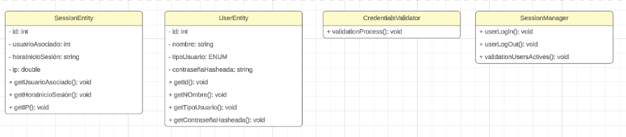

# SOLUTION SOFTWARE DESIGN 
## 4.1 Strategic-Level Domain-Driven Design 
### 4.1.1 Event Storming

#### 4.1.1.1 Candidate Context Discovery

#### 4.1.1.2 Domain Message Flows Modeling

#### 4.1.1.3 Bounded Contexts Canvases

De igual manera que los apartados anteriores diseñamos los canvas de los principales bounded contexts definidos: 

### 4.1.2 Context Mapping

Se analizó una técnica que resultó invaluable para gestionar las interacciones y límites entre diferentes contextos del dominio. Se exploró cómo mapear y definir relaciones entre contextos, lo que contribuyó a una comprensión clara de sus interconexiones. 

### 4.1.3 Software Architecture

#### 4.1.3.1 Software Architecture System Landscape Diagram 

En nuestro diagrama de landscape vamos a contemplar de manera gráfica la disposicion y organización de los elementos en un espacio exterior. Dentro de este, mismo tenemos nuestros dos tipos de segmentos objetivos: Paciente y Profesional de salud, además, de nuestro soporte técnico. Por otro lado, también tendremos nuestros servicios como el email, las notificaciones y el payment. 

#### 4.1.3.2 Software Architecture Context Level Diagrams 

En nuestro diagrama de contexto se presentan las relaciones fundamentales de DocSeeker. Esta aplicación web y móvil está conectada principalmente con dos grupos de usuarios distintos y un super usuario (soporte técnico) y dos sistemas externos, el Payment System para llevar a cabo transacciones de pago y el Email System para enviar correos electrónicos de verificación y confirmación.verificación y confirmación. 

#### 4.1.3.3 Software Architecture Container Level Diagrams 

Con este diagrama se puede observar nuestro proyecto de manera más expandida. Se muestra la aplicación web, landing page, aplicación móvil cada una realizando llamadas API a los distintos Bounded Context que vendrían a ser cuadro: Message, Medical Appointment, Temperature Notification, Profile y Authentication que interactuarán con los sistemas externos de Payment. Además, a su vez interactuarán con un broker que irá conectado a la Base de Datos. 

#### 4.1.3.4 Software Architecture Deployment Diagrams 

En nuestro Diagrama de Despliegue nos ayudará a comprender y comunicar la arquitectura física de nuestro sistema de software DocSeeker, en el cúal usaremos Azure, ya que Azure es una App Service que gestionará automáticamente el enrutamiento a las instancias de función de la configuración de la aplicación. 

## 4.2.	Tactical-Level Domain-Driven Design 

### 4.2.1	Bounded Context: Message Bounded Context 

Bounded Context que se utilizará para medir la temperatura. El Bounded Context para monitorear la temperatura corporal utiliza sensores para medir la temperatura corporal del paciente en diferentes puntos del cuerpo. Los datos de temperatura se utilizan para monitorizar el estado del paciente y diagnosticar posibles problemas de salud. 

#### 4.2.1.1	Domain Layer

<ul>
<li>MessageEntity: </li>

Propósito: Representa un mensaje en el sistema. 

Atributos: ID, contenido, fecha de creación, remitente, destinatario, etc. 
<li>TemperatureMeasurementEntity: </li>

Propósito: Representa una medición de temperatura realizada con herramientas IoT. 

Atributos: ID, valor de temperatura, unidad de medida, marca de tiempo, dispositivo IoT, etc. 
<li>MessageRepository: </li>

Propósito: Gestiona la persistencia y recuperación de mensajes y mediciones de temperatura. 

Métodos: saveMessage(), getMessageByID(), getMessagesByUser(), saveTemperatureMeasurement(), getTemperatureMeasurementsByDevice(), etc. 
</ul>

#### 4.2.1.2	Interface Layer

<ul>
<li>MessageController: </li>

Propósito: Controla las interacciones de los usuarios relacionadas con los mensajes y las mediciones de temperatura. 

Métodos: sendMessage(), viewMessage(), deleteMessage(), viewTemperatureMeasurement(), etc. 
<li>TemperatureMeasurementController: </li>

Propósito: Controla las interacciones de los usuarios relacionadas con las mediciones de temperatura IoT. 

Métodos: viewTemperatureMeasurement(), exportTemperatureData(), etc. 
</ul>

#### 4.2.1.3	Application Layer

<ul>
<li>MessageCommandHandler: </li>

Propósito: Maneja los comandos relacionados con los mensajes y las mediciones de temperatura.
<li>MessageEventHandler: </li>

Propósito: Maneja eventos relacionados con los mensajes y las mediciones de temperatura. 
<li>TemperatureMeasurementCommandHandler: </li>

Propósito: Maneja los comandos relacionados con las mediciones de temperatura, como el registro y exportación de datos. 
<li>TemperatureMeasurementEventHandler: </li>

Propósito: Maneja eventos relacionados con las mediciones de temperatura. 
</ul>

#### 4.2.1.4	Infrastructure Layer

<ul>
<li>MessageRepositoryImpl: </li>

Propósito: Implementa la interfaz del repositorio de mensajes para gestionar la persistencia de mensajes y mediciones de temperatura en una base de datos. <li>TemperatureMeasurementRepositoryImpl: </li>

Propósito: Implementa la interfaz del repositorio de mediciones de temperatura para gestionar la persistencia de las mediciones realizadas con herramientas IoT. <li>MessageEventPublisher: </li>

Propósito: Se encarga de publicar eventos relacionados con mensajes y mediciones de temperatura para que otros componentes o sistemas puedan suscribirse a ellos. 
</ul>

#### 4.2.1.5	Bounded Context Software Architecture Component Level Diagrams 

#### 4.2.1.6	Bounded Context Software Architecture Code Level Diagrams 

##### 4.2.1.6.1	Bounded Context Domain Layer Class Diagrams 

##### 4.2.1.6.2	Bounded Context Database Design Diagram 

### 4.2.2	Bounded Context: Medical Appointment Bounded Context 

Bounded context que se enfoca en las citas solicitadas. El Bounded Context de gestión de citas médicas es responsable de almacenar, gestionar y programar las citas médicas solicitadas por los pacientes. 

#### 4.2.2.1	Domain Layer

<ul>
<li>AppointmentEntity: </li>

Una entidad que representa una cita médica. Contiene atributos como ID, fecha, hora, médico, paciente, y detalles de la cita. 
<li>AppointmentRepository: </li>

Un repositorio que proporciona métodos para la persistencia y recuperación de citas médicas. 
</ul>

#### 4.2.2.2	Interface Layer

<ul>
<li>AppointmentController: </li>

Un controlador que maneja las interacciones de los usuarios relacionadas con las citas médicas. 
</ul>

#### 4.2.2.3	Application Layer

<ul>
<li>AppointmentEventHandler: </li>

Propósito: Maneja eventos relacionados con las citas médicas. 
</ul>

#### 4.2.2.4	Infrastructure Layer

<ul>
<li>AppointmentRepositoryImpl: </li>

Propósito: Implementa la interfaz del repositorio de citas médicas (AppointmentRepository) para gestionar la persistencia de citas médicas en una base de datos o sistema de almacenamiento. 
</ul>

##### 4.2.2.5	Bounded Context Software Architecture Component Level Diagrams

##### 4.2.2.6	Bounded Context Software Architecture Code Level Diagrams 
###### 4.2.2.6.1	Bounded Context Domain Layer Class Diagrams 

###### 4.2.2.6.2	Bounded Context Database Design Diagram 

#### 4.2.3	Bounded Context: Temperature Notification Bounded Context 
#### 4.2.3.1	Domain Layer

<ul>
<li>TemperatureNotificationEntity: </li>

Propósito: Representa una notificación de temperatura generada por herramientas IOT. 

Atributos: ID, valor de temperatura, unidad de medida, marca de tiempo. <li>TemperatureNotificationRepository: </li>

Propósito: Gestiona la persistencia y recuperación de notificaciones de temperatura. 

Atributos: saveNotificaction(), getNotification(), deleteNotification() 
</ul>

#### 4.2.3.2	Interface Layer

<ul>
<li>TemperatureNotificationController: </li>

Propósito: Controla las interacciones de los usuarios relaciones con las notificaciones de temperatura.  

Métodos: viewTemperatureNotification(), exportTemperatureNotification() 
</ul>

#### 4.2.3.3	Application Layer

<ul>
<li>TemperatureNotificationEventHandler: </li>

Propósito: Maneja eventos relacionados con las notificaciones de temperatura. 
</ul>

#### 4.2.3.4	Infrastructure Layer

<ul>
<li>TemperatureNotificationRepositoryImpl: </li>

Propósito: Implementa la interfaz del repositorio de notificaciones de temperatura (TemperatureNotificationRepository) para gestionar la persistencia de las notificaciones en una base de datos u otro sistema de almacenamiento. 
<li>MessageQueue: </li>

Propósito: Maneja la comunicación asincrónica entre los diferentes componentes del sistema, permitiendo la integración con herramientas IoT. 
</ul>

#### 4.2.3.5	Bounded Context Software Architecture Component Level Diagrams 

#### 4.2.3.6	Bounded Context Software Architecture Code Level Diagrams 
#### 4.2.3.6.1	Bounded Context Domain Layer Class Diagrams 

#### 4.2.3.6.2	Bounded Context Database Design Diagram 

#### 4.2.4	Bounded Context: Profile Bounded Context 
#### 4.2.4.1	Domain Layer

<ul>
<li>ProfileEntity: </li>

Propósito: Representa el perfil de un usuario en el sistema. 

Atributos: ID de usuario asociado, nombre, foto de perfil, información de contacto, etc. 
<li>ProfileRepository: </li>

Propósito: Gestiona la persistencia y recuperación de perfiles de usuario. 

Métodos: createProfile(), getProfileByID(), updateProfile(), etc. 
</ul>

#### 4.2.4.2	Interface Layer

<ul>
<li>ProfileController: </li>

Propósito: Controla las interacciones de los usuarios relacionadas con los perfiles de usuario. 

Métodos: viewProfile(), editProfile(), uploadProfilePicture() 
</ul>

#### 4.2.4.3	Application Layer

<ul>
<li>ProfileEventHandler: </li>

Propósito: Maneja eventos relacionados con los perfiles de usuario. 
</ul>

#### 4.2.4.4	Infrastructure Layer

<ul>
<li>ProfileRepositoryImpl: </li>

Propósito: Implementa la interfaz del repositorio de perfiles de usuario (ProfileRepository) para gestionar la persistencia de los perfiles en una base de datos u otro sistema de almacenamiento. 
</ul>

#### 4.2.4.5	Bounded Context Software Architecture Component Level Diagrams 

#### 4.2.4.6	Bounded Context Software Architecture Code Level Diagrams 
#### 4.2.4.6.1	Bounded Context Domain Layer Class Diagrams 

#### 4.2.4.6.2	Bounded Context Database Design Diagram 

#### 4.2.5	Bounded Context: Authentication Bounded Context 
#### 4.2.5.1	Domain Layer

<ul>
<li>RoleEntity: </li>

Propósito: Representa un rol de usuario. 

Atributos: ID, nombre del rol, descripción, etc. 
<li>UserRoleEntity: </li>

Propósito: Representa la relación entre usuarios y roles. 

Atributos: ID, UserID, RoleID, etc. 
</ul>

#### 4.2.5.2	Interface Layer

<ul>
<li>AuthenticationController: </li>

Propósito: Controla las interacciones de los usuarios relacionadas con la autenticación y autorización, como la gestión de roles y permisos. 

Métodos: assignRole(), revokeRole(), grantPermission(), etc. 
</ul>

#### 4.2.5.3	Application Layer

<ul>
<li>AuthenticationCommandHandler: </li>

Propósito: Maneja los comandos relacionados con la autenticación de usuarios, como la verificación de credenciales. 
<li>AuthorizationCommandHandler: </li>

Propósito: Maneja los comandos relacionados con la autorización de usuarios, como la asignación y revocación de roles y permisos. 
</ul>

#### 4.2.5.4	Infrastructure Layer

<ul>
<li>UserRepository: </li>

Propósito: Implementa la interfaz del repositorio de usuarios para gestionar la persistencia de datos de usuarios, como sus credenciales y detalles de perfil. 
<li>SessionRepository: </li>

Propósito: Implementa la interfaz del repositorio de sesiones para almacenar y recuperar información sobre las sesiones de usuario activas. 
<li>PasswordHasher: </li>

Propósito: Proporciona funcionalidad para el hash y verificación de contraseñas de usuarios para garantizar la seguridad de las credenciales almacenadas. <li>TokenGenerator: </li>

Propósito: Genera tokens de sesión seguros y únicos que se utilizan para autenticar a los usuarios y gestionar sus sesiones. 
</ul>

#### 4.2.5.5	Bounded Context Software Architecture Component Level Diagrams 

#### 4.2.5.6	Bounded Context Software Architecture Code Level Diagrams 
#### 4.2.5.6.1	Bounded Context Domain Layer Class Diagrams 

#### 4.2.5.6.2	Bounded Context Database Design Diagram 

