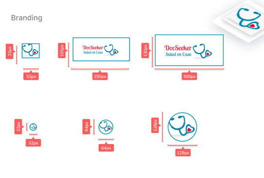

# <a name="_toc146476787"></a>**Capítulo V: SOLUTION UI/UX DESIGN**


   ## <a name="_toc146476788"></a><a name="_toc146476789"></a><a name="_toc146476790"></a><a name="_toc146476791"></a><a name="_toc146476792"></a><a name="_toc146476793"></a> 5. Style Guidelines
A continuación, se presentará un repositorio central y organizado que servirá como guía para el desarrollo enfocado y consistente de nuestra solución.

### <a name="_toc146476794"></a> 5.1. General Style Guidelines
**Brand Overview**

La necesidad de una atención integra y eficaz hacia a un familiar adulto mayor o con alguna limitación física o mental en domicilio, se hace cada vez más imprescindible en nuestra sociedad. Las teles consultas y atención por redes sociales como WhatsApp son soluciones inmediatas al presente problema, pero con ciertas inconsistencias y limitaciones de servicios.

Nuestra solución (DocSeeker), nace en la misma necesidad de atención médica a domicilio. Nuestro equipo ha identificado un efectivo producto para llevar a profesionales de la salud certificados al hogar de los limeños que requieran este tipo de servicios de forma segura y con una gran calidad.


**Brand Name**

El nombre del software identificado es DocSeeker. Originalmente surgió a partir de la necesidad identificada, pues los usuarios requieren de personal médico especializado y por ello se optó por búsqueda de doctores. Específicamente en el idioma inglés pues nos pareció más amigable y llamativo con los posibles usuarios. El equipo espera que la gente vincule a los doctores y el proceso de búsqueda cuando escuche el nombre de la solución, para que tenga una idea de que encontrara en nuestra interfaz. 

A continuación, se presenta el logo o marca de nuestra solución propuesta.


**Typography**
   
La tipografía es necesaria para estructurar y organizar el lenguaje visual de todas las plataformas que se desarrollaran para cumplir con las características principales de la aplicación. Se ha tomado en cuenta que las fuentes deben ser legibles y deben aportar a la experiencia del usuario, por ello se optó por estos tipos de letra.

**Head**

|Name|Font size|Line Height|
| - | - | - |
|Heading 1|56 px|61\.6 px|
|Heading 2|48 px|52\.8 px|
|Heading 3|40 px|44 px|
|Heading 4|32px|35\.2 px|
|Heading 5|24px|26\.4 px|
|Heading 6|20px|22 px|


**Body**

|Name|Font size|Line Height|
| - | - | - |
|**Large Text Bold**|20 px|28 px|
|Large Text Regular|20 px|28 px|
|**Medium Text Bold**|18 px|25\.2 px|
|Medium Text Regular|18 px|25\.2 px|
|**Normal Text Bold**|16 px|22\.4 px|
|Normal Text Regular|16 px|22\.4 px|
|**Small Text Bold**|14 px|19\.6 px|
|Small Text Regular|14 px|19\.6 px|

**Colors**

**Spacing**

**Tono de comunicación y lenguaje aplicado**

**Color Primario:** Representa el color del uniforme básico de los profesionales de la salud, así generamos un ambiente de confianza entre el contratante y el personal médico, pues al usar nuestra aplicación percibirá este color como amigable y cuando vea al doctor o enfermero en su domicilio le parecerá amigable también a una primera impresión. 

**Color Secundario:** Genera un efecto hipnótico sobre la vista y la mente. Es un color sustentador de la vida y este color encarna la alegría y el anhelo de volver a conectar con sus seres queridos. Entonces, este color aumenta la perspectiva del usuario en los beneficios que pueda obtener.

**Blanco:** Representa limpieza y claridad. Asimismo, se usa mucho en aplicaciones identificadas en el mismo rubro de cuidado de la salud.

**Negro:** Color serio y elegante.

Siguientemente, el lenguaje a utilizar será serio, formal, respetuoso mezclado con entusiasmo y perseverancia. Puesto que se incluirán experiencias y recomendaciones que avivarán las perspectivas del usuario. 

Se tomaron en cuenta algunos elementos de diseño para optimizar la interfaz, pensando en los usuarios finales.

### <a name="_toc146476795"></a> 5.1.2. Web, Mobile and IoT Style Guidelines
Desarrollaremos una aplicación que se adeque a cualquier dispositivo tecnológico sin la necesidad de malograr el diseño del contenido. Por ello, se tendrá que tomar en cuenta cada tipo de dispositivo para que el contenido este estructurado de la mejor manera para cada uno.
 

Emplearemos el patrón Z, pues de esta manera identificaran nuestra marca o logo que se encontrara en la esquina superior izquierda, donde comenzara la interacción del usuario. Luego, se desplazará hacia la derecha donde visualizará las diferentes opciones que ofreceremos como como About, Reserve su cita o el área de configuración.  Siguientemente, el usuario se desplazará verticalmente hacia abajo para seguir interactuando con el contenido de la aplicación. Finalmente, el usuario llegará a la esquina inferior derecha donde podrá visualizar todas nuestras redes sociales y nuestros medios de contacto. 

Siguientemente, el diseño de nuestra aplicación contara con colores que motiven al usuario a seguir interactuando con la plataforma. Asimismo, se contará con sombras y espacios que favorezcan la lectura de la información y limiten el contenido para no abrumar al navegante. 


Se emplearán algunos de los siguientes elementos: 


[https://www.figma.com/file/TJyGTgCV9lIF2z9YxlJOCi/Web-%26-Mobile-Style-Guidelines?node-id=1%3A152&t=2yc9uFV3BG287eKC-1
](https://www.figma.com/file/TJyGTgCV9lIF2z9YxlJOCi/Web-%26-Mobile-Style-Guidelines?node-id=1%3A152&t=2yc9uFV3BG287eKC-1)
## <a name="_toc146476796"></a>5.2. Information Architecture

En esta sección, definiremos la estructuración de nuestro producto para cada uno de nuestros segmentos objetivo. Abarcaremos diversos componentes que permitirán al usuario a organizar y encontrar su contenido: Organization systems, Labeling systems, SEO Tags and Meta Tags, Searching systems y Navigation systems.
### <a name="_toc146476797"></a> 5.2.1. Organization Systems
A continuación, explicaremos en qué grupos de información se aplicaron los distintos tipos de organización visual para ambos segmentos objetivo, así como también en cuales se utiliza algún tipo de categorización.

**Segmento 1: Pacientes**

**Jerárquica**: 

**Resultados médicos**: El usuario podrá acceder a los resultados médicos de sus anteriores citas. Para ello la información estará organizada en base a su prioridad, dicha prioridad estará categorizada cronológicamente desde los resultados más recientes hasta los más antiguos.

**Historial médico**: El usuario podrá acceder a su historial médico. Para ello la información estará organizada en base a su prioridad, dicha prioridad estará categorizada por tópicos (información general, alergias, patologías, etc.)

**Lista de los profesionales de la salud:** El usuario podrá elegir a su profesional de la salud ideal, para ello se mostrarán en orden y a través de una lista a los profesionales disponibles. La categorización más apropiada para la lista será por tópico de especialidad médica.

**Perfil del profesional:** El usuario podrá acceder al perfil del profesional de la salud para hacer una selección de preferencia más íntegra. Los datos del profesional estarán organizados de acuerdo con su relevancia.

**Historial de las contrataciones anteriores:** El usuario podrá revisar las anteriores contrataciones del profesional de la salud que haya realizado. Esta información se mostrará en una lista organizada en base a una categorización alfabética.

**Secuencial**: 

**Contratación del profesional de la salud:** Este proceso deberá realizarse según ciertos pasos a seguir para que el usuario realice una correcta contratación. Entre dichos pasos se incluyen la selección del profesional de la salud, elección de una de las fechas disponibles, datos de la tarjeta de crédito/débito y la espera de confirmación por la operación junto con un resumen de las elecciones realizadas. 


**Segmento 2: Profesionales de la salud**

**Jerárquica**: 

**Lista de pacientes**: El profesional podrá visualizar los pacientes que debe atender durante el día a través de una lista de ellos. Esta información estará categorizada cronológicamente (en base al horario más próximo).

**Ingresos:** El profesional podrá llevar una bitácora de sus ingresos/transacciones por parte de la plataforma. Esta información estará categorizada por tópicos (Aprobado, Pendiente, Cancelado).

**Perfil del paciente:** El profesional podrá acceder al perfil del paciente para revisar su historial clínico. Esta información estará organizada de acuerdo con su relevancia.

**Agenda de citas:** En esta sección el profesional podrá visualizar los pacientes que deba atender en ciertos días. Esta información se mostrará en una lista dónde el profesional podrá seleccionar la información de sus citas programadas.

**Secuencial**: 

**Subir receta/tratamiento:** Este proceso deberá realizarse según ciertos pasos a seguir. Entre dichos pasos se incluyen la selección del paciente, descripción de los resultados del diagnóstico, receta/tratamiento a seguir, recomendaciones y la espera de la confirmación por la información puesta junto con un resumen de esta.  

Cabe señalar que existen funcionalidades que comparten ambos públicos objetivos, entre las cuales tenemos:

**Jerárquica**: 

**Landing Page**: En esta sección se mostrará a cualquier interesado en nosotros la información necesaria de nuestro proyecto. Entre las cuales están la descripción de nuestro servicio, nuestra información de contacto, etc. Esta información estará organizada en base a su relevancia (lo más importante se mostrará primero) y de acuerdo con una categorización por tópicos.

**Reseñas:** En esta sección el usuario podrá constatar la calidad del servicio de un profesional de la salud especifico. Esta información estará organizada bajo una categorización cronológica (las reseñas más recientes se mostrarán primero).

**Matricial:**

**Menú de opciones**: Los 2 segmentos objetivo accederán a su menú principal respectivo dónde cada uno tendrá la libertad de seleccionar las funciones que deseen realiza en ese momento. Estas opciones no siguen un orden especifico, pero estarán bajo una categorización por tópicos ya que cada opción tiene una función diferente. 

**Sección de noticias**: Los 2 segmentos objetico tendrán acceso a una lista de noticias desplegada en forma de mosaicos. Estas noticias estarán bajo una categorización por tópicos (Ultimas noticias, Recomendaciones, etc.)
### <a name="_toc146476798"></a> 5.2.2. Labeling Systems
A continuación, se mostrará el sistema de etiquetado que permitirá a nuestros visitantes recibir la información que nuestra Landing page ofrece a través de una sola palabra.

Contamos con cuatro “headings” con fuente sans-serif ubicadas en la parte superior del Landing page:

**Home**: Sección seleccionada por defecto dónde los usuarios verán la información más relevante, la cual captará su atención.

**About**: Sección dónde el cliente podrá ver nuestra misión, visión, quienes somos y qué hacemos.

**Services**: Sección enfocada en listar y detallar los servicios que ofrecemos.

**Contact**: Sección dónde se detalla cuáles son nuestros canales de comunicación y nuestra ubicación.

En el caso del Web Aplication para pacientes contamos con cinco “headings” con fuente Lato ubicadas en el menú principal de la parte lateral izquierda:

**Home**: Sección seleccionada por defecto dónde se encuentran algunas noticias de gran importancia junto con las opciones principales dirigidas al paciente.

**My profile**: Sección dónde se encuentran los datos personales del paciente.

**News**: Sección dónde el paciente puede visualizar noticias relacionadas con la salud.

**Prescription**: Sección dónde el paciente puede revisar todas sus prescripciones recibidas hasta el momento.

**Configuration**: Sección dónde el paciente puede realizar cambios en la configuración por defecto de la plataforma.

En el caso del Web Aplication para profesionales de la salud contamos con cinco “headings” con fuente Lato ubicadas en el menú principal de la parte lateral izquierda:

**Home**: Sección seleccionada por defecto dónde se encuentran algunas noticias de gran importancia junto con las opciones principales dirigidas al profesional de salud.

**My profile**: Sección dónde se encuentran los datos personales del profesional de la salud.

**News**: Sección dónde el paciente puede visualizar noticias relacionadas con la salud.

**Reviews**: Sección dónde se muestran las reseñas recibidas por parte de los pacientes que el profesional ha atendido.

**Configuration**: Sección dónde el paciente puede realizar cambios en la configuración por defecto de la plataforma.

### <a name="_toc146476799"></a> 5.2.3. SEO Tags and Meta Tags
A continuación, se mostrarán los SEO Tags y Meta Tags utilizados en el Landing Page con el propósito de aumentar su visibilidad en los motores de búsqueda. 

Landing Page:


```
<head>

<meta charset="UTF-8">
<meta name="viewport" content="width=device-width, initial-scale=1"/>

<meta name="description" content="Landing page aimed at health professionals and people who cannot get around. We will inform you about who we are, what our services are and how you can contact us."/>

<meta name="keywords" content="DocSeeker, Home, About us, Services, Contact, Landing Page "/>

<meta name="author" content="MEDITECH team"/>


<title> DocSeeker the best home health care website. </title>

</head>
```

### <a name="_toc146476800"></a>5.2.4. Searching Systems
A continuación, se mostrarán los sistemas de búsqueda implementados para ayudar a nuestros usuarios a encontrar la información que están buscando.

Para el Landing Page, no se ha implementado un sistema de búsqueda, ya que la información esta segmentada y enlaza con el menú principal. Por esto mismo, podrán buscar toda la información necesaria para poder identificar lo más importante de nuestra solución, como a que nos dedicamos o cuales son nuestros servicios o principalmente podrán buscar los contactos para que puedan comunicarse con nosotros. 

Para el caso del Web Application:

**Segmento 1: Personas con dificultad para movilizarse**

- **Resultados médicos**: Esta sección le permitirá al paciente revisar sus resultados de cada chequeo médico que se haya realizado. En base a esto, si el paciente desea revisar los resultados de algún resultado médico en específico se le brindará la opción de realizar un filtro de las prescripciones tanto por fecha como por su estado (Válido y No válido). Por otro lado, posterior a la aplicación del filtro - o igualmente si no lo hizo- los resultados se mostrarán en formato lista con información breve en cada una de ellas, si el paciente desea ver la información completa de la prescripción deberá “clickear” sobre ella.


- **Lista de los profesionales de la salud:** Los pacientes podrán realizar un filtro según diferentes tópicos como la especialidad médica, genero, nombre, etc. Luego, la información filtrada se mostrará en formato lista, con algunos datos breves de los profesionales, tales como, su nombre, edad, especialidad y estrellas de puntuación (5 estrellas significan que sus pacientes le han dado la puntuación máxima por su servicio).

**Segmento 2: Profesionales de la salud**

- **Lista de pacientes:** Los profesionales podrán utilizar una barra de búsqueda para encontrar a un paciente en específico de su lista. Asimismo, contarán con un filtro de género y un calendario para filtrar a los pacientes por el día en que fueron atendidos. Luego, la información filtrada se mostrará en formato lista, con algunos datos breves de los pacientes, tales como, su nombre y edad.
- **Ingresos:** Los profesionales de la salud** contarán con un filtro para el estado de sus transacciones (Entregado, Pendiente y Cancelado), de esta forma podrán llevar un control más dinámico de sus operaciones.
- **Agenda de citas:** Los profesionales de la salud podrán filtrar a los pacientes que deben atender en un día en específico a través de un calendario. Para realizar el filtro deberá “clickear” una de las fechas del calendario. Luego, se le mostrará en formato lista los pacientes a quienes deberá atender en orden cronológico (las citas más próximas se mostrarán al inicio). Sin embargo, si el profesional desea revisar los datos de un paciente en específico desde el inicio, entonces podrá filtrar la totalidad de sus pacientes por nombre mostrando las coincidencias encontradas. Cabe señalar que el filtro por nombre tendrá la función de autocompletado para que el profesional no cometa un error al momento de redactarlo.

**Ambos segmentos**

- **Sección de noticias**: Es esta sección ambos segmentos objetivo podrán buscar la noticia de su interés a través de una barra de búsqueda dónde deberán ingresar el nombre de la noticia o algunas palabras clave. Las noticias serán filtradas en base a las palabras clave ingresadas o si se ingresó el nombre correcto de la noticia.

### <a name="_toc146476801"></a> 5.2.5. Navigation Systems
A continuación, se mostrarán los sistemas de navegación que le permitirán a nuestros usuarios moverse a través de las distintas piezas de contenido o información.

Como se mencionó anteriormente en el Labeling Systems, contamos con cuatro “headings” en el Landing Page entre los cuales tenemos a Home, About, Services y Contact. Estas secciones son ubicadas como un menú global horizontal a lo largo de la parte superior del Landing page, se dividió la información en estas cuatro secciones con la finalidad de que el cliente no estuviera recorriendo hacia abajo, a través de la barra de desplazamiento vertical, la inmensidad de información disponible. Esto le facilitaría movilizarse a través de nuestro contenido. Por supuesto, la estrategia es que revise primero el Home, dónde se encuentra la información más relevante y la que llamará más su atención, y luego viaje a través del resto del menú de izquierda a derecha. 

Por otro lado, en el caso del Web Application, se tiene una barra de navegación global-vertical-lateral dónde se encuentran las secciones principales de la interfaz del usuario. Estas secciones se navegan de la siguiente forma:

- **Home**: Sección a la cual se ingresa por defecto al momento de iniciar sesión dónde se muestran algunas noticias relevantes y opciones enfocadas a cada segmento objetivo. En el caso del paciente se tienen las opciones de **sacar cita, lista de doctores, historial médico, prescripciones y consultas**. Por el otro lado, en el caso del profesional de la salud se tienen las opciones **agregar horario de atención, agenda de citas, subir prescripciones e ingresos**.
- **My profile**: Si el usuario desea editar su perfil solo debe ingresar a esta sección que se encuentra en la barra de navegación global-vertical-lateral.
- **News**: Si el usuario desea ver una noticia relacionada a la salud solo debe ingresar a esta sección que se encuentra en la barra de navegación global-vertical-lateral y una vez dentro seleccionar la noticia de su interés. 
- **Configuration**: Si el usuario desea editar la configuración de la interfaz solo debe ingresar a esta sección que se encuentra en la barra de navegación global-vertical-lateral y ajustar los cambios correspondientes.
- **Prescription**: Si el paciente desea revisar sus recetas médicas solo debe ingresar a esta sección que se encuentra en la barra de navegación global-vertical-lateral y seleccionar la receta que estaba buscando.
- **Reviews**: Si el profesional de la salud desea revisar las reseñas que escriben sobre él solo debe ingresar a esta sección que se encuentra en la barra de navegación global-vertical-lateral.

## <a name="_toc146476802"></a>5.3.  Landing Page UI Design
Las Landing Pages son herramientas que se utilizan para convertir a los visitantes en potenciales clientes a través de diversas maneras como mensajes llamativos, información sobre tu producto entre otras cosas. Por ello se decidió hacer uso de esta herramienta, en la que diseñamos la versión preliminar para la versión del móvil y para computadoras.  

### <a name="_toc146476803"></a> 5.3.1. Landing Page Wireframe
En esta sección, se presentará base para el diseño del sitio web de nuestro software. Con bases que permitan dar una mejor idea del contenido que mostrará la plataforma y la versión móvil.

El Landing Page debe ser del tamaño adecuado para las pantallas de cada ordenador por lo que la información estará centrada en la pantalla para que sea fácilmente visible para el usuario. 

Buscamos colocar la información precisa sin abrumar para realizar este trabajo. Para esto ayudamos al usuario ofreciéndole una barra de navegación estática que lo facilitará en la navegación por la Landing Page.

**Desktop Web**


Diseño del menú del sitio web: Se presenta la base que incluirá las opciones más destacadas para la atención del usuario.**                                         


Opción que muestra datos para conocer mejor la plataforma.

Servicios para ambos segmentos:

Página de referencia para dar a conocer como contactar y la actualidad de la plataforma.

**Mobile Web**

Se observa el diseño del bloque de menú de inicio para la accesibilidad del usuario, mostrando el botón que despliega las opciones de navegación.

Se visualiza un bloque que indica opciones que incluye en la lista de herramientas del servidor, en un caso determinado, información de la aplicación.

Se visualiza los servicios para ambos segmentos objetivos.

Se muestra el bloque final de la aplicación, detallando contenido de comunicación del servicio y el usuario.

URL: <https://www.figma.com/file/Fl7bYMvKSlA8Wvbpj6DUtb/WireFrame-Landing-Page-IOT?type=design&node-id=0%3A1&mode=design&t=L3eZV7SyyOZQJK8h-1> 
### <a name="_toc146476804"></a> 5.3.2. Landing Page Mock-up
Se presenta la versión preliminar en qué consistirá nuestro sitio web, detallando el contenido que tendrá, agregándole los colores respectivos según nuestra guía de estilos y añadiendo imágenes coherentes a la información mostrada para facilitar al usuario un entendimiento más claro de las ideas que tratamos de mostrar. 

**Desktop Web Browser**

Se muestra la versión menú de la plataforma, detallando los principales contenidos, opciones que permiten conocer más nuestro sistema al usuario.

Al elegir la opción “Meet Us” de la barra de herramientas del menú principal, se muestra 3 elecciones como adquisición del usuario que tendrá libertad de elegir cuál opción es su necesidad para informarse acerca de nuestro proyecto.

Se presenta los servicios que posee el usuario a lo largo del consumo del software.

**Usuario: Familiares de los Pacientes**

**Usuario: Profesionales de Salud**

` `**Integración de iot** 

Se presenta como bloque final de la plataforma, información breve de contacto, y la opción de contactarnos y comentarnos sus dudas y/o necesidades.

**Mobile Web Browser**

Se presenta el bloque de menú principal de la Landing Page en su versión Mobile, junto con sus opciones de mayor interés para nuestro público objetivo y una breve descripción de nuestro software.

Se muestra el bloque de “Meet Us”, con información del proceso de nuestros tratamientos en base del profesional de salud asignado, consultas acerca de nuestro proceso del sistema, información de nuestra misión y de nuestras consultas.


Se muestra el bloque de servicios que se ofrecen para los pacientes y los profesionales interesados en nuestro software.


Se presenta como bloque final de la plataforma, información breve de contacto, y la opción de contactarnos y comentarnos sus dudas y/o necesidades.


## <a name="_toc146476805"></a>5.4. Applications UX/UI Design
Un diseño cuidadoso de UX/UI puede mejorar la usabilidad y la satisfacción del usuario, lo que a su vez puede llevar al éxito de la aplicación en el mercado.

### <a name="_toc146476806"></a> 5.4.1. Applications Wireframes
- Version Web

**Segmento Objetivo Pacientes**

**Segmento Objetivo profesionales de la salud**

URL: <https://www.figma.com/file/E3GznLyGX8hCczpdUo4fIu/Wireframes-Web-Design?node-id=0%3A1&t=nH5o2DX8ccnlARnb-1> 

**Version Mobile**


URL: <https://www.figma.com/file/n15JEWQuYtY5BHqyds6KxI/Mobile-Wireframe?node-id=0%3A1&t=nH5o2DX8ccnlARnb-1> 


### <a name="_toc146476807"></a> 5.4.2. Wireflow Diagrams
### Web Wireflow
**Segmento Objetivo Pacientes**

**User Goal**: Como paciente, deseo iniciar sesión para ingresar a DocSeeker

**Descripción:** 

En el presente Wireflow, se evidencia el flujo que seguirá el usuario paciente o su familiar para poder iniciar sesión. Iniciará en el login, seleccionará la opción paciente e ingresará su DNI y contraseña, para poder ingresar a DocSeeker. 

**User Goal**: Como paciente, deseo registrarme para ingresar a DocSeeker

**Descripción:** 

En el presente Wireflow, se evidencia el flujo que seguirá el usuario paciente o su familiar para poder registrarse. Iniciará en el login, seleccionará la opción paciente y luego seleccionará la opción Sign Up e ingresará sus datos necesarios para poder registrarse exitosamente.


**User Goal:** Como paciente deseo cambiar mi contraseña

Al momento de iniciar sesión, se presentará una opción de olvide mi contraseña, cuando le de click, redireccionará al usuario a una nueva pantalla donde ingresará su email y su nueva contraseña.

**User Goal**: Como paciente deseo visualizar mi historial médico.

**Descripción:** 

En el presente Wireflow, se presenta el camino que deberá seguir el usuario paciente para poder visualizar su historial médico dentro de la plataforma. Se comenzará desde la pantalla de inicio, donde se seleccionará el perfil del usuario, finalmente se elegirá la opción de “Medical History” para poder obtener su historial médico presente en DocSeeker. 

**User Goal**: Como paciente deseo subir mi historial médico.

**Descripción:** 

En el presente Wireflow, se presenta el camino que deberá seguir el usuario paciente para poder subir su historial médico dentro de la plataforma. Se empezará desde la pantalla de inicio, luego se dirigirá al perfil de usuario e ingresará a “Medical History”; por último, se subirá el archivo en PDF. Después de ello, se podrá visualizar el historial adjuntado en DocSeeker.


**User Goal**: Como paciente deseo visualizar el perfil de un profesional de la salud

**Descripción:** 

En el presente Wireflow, se presenta el camino que deberá seguir el usuario paciente para poder visualizar el perfil de un doctor. Se empezará desde la pantalla de inicio, luego se dirigirá a la sección de profesionales de la salud y, con ello, se mostrarán los distintos médicos disponibles, se seleccionará el de su preferencia para ver su perfil de DocSeeker.

**User Goal**: Como paciente deseo ver las reseñas de un profesional de la salud

**Descripción:** 

En el presente Wireflow, se presenta el camino que deberá seguir el usuario paciente para poder visualizar las reseñas de un profesional de la salud. Se empezará desde la pantalla inicial, luego selecciona a un médico desde la sección de profesionales de la salud. Después, se ingresa al perfil del doctor seleccionado y se entrará al apartado de reseñas desde la opción “See Reviews”.


**User Goal**: Como paciente deseo publicar una nueva reseña a un profesional de la salud

**Descripción:** 

En el presente Wireflow, se presenta el camino que deberá seguir el usuario paciente para poder escribir una reseña a un profesional de la salud. Se empezará desde la pantalla inicial, después se ingresará al perfil del médico a reseñar. Luego, se entrará a través de “See reviews” al apartado de reseñas, en donde se seleccionará “Publish Review” para comenzar a escribir la reseña. Por último, se presionará “Publish” para publicarla y se brindará un mensaje de confirmación.


**User Goal**: Como paciente, deseo ver las fechas disponibles en las que puedo atenderme con un doctor para agendar una cita.

**Descripción:** 

En el presente Wireflow, nos encontramos en la vista “Available Dates”. Aquí, vemos un calendario, donde las fechas pintadas de un color más oscuro significan que están disponibles. Al hacer click a una de ellas, me muestra, todas las horas disponibles de citas para ese día.

**User Goal:** Como paciente deseo revisar mi perfil.

En este Wireflow, se visualiza el proceso que debe realizar el usuario paciente para poder visualizar correctamente su información de perfil. Para la cual solamente deberá dar click a su foto de perfil.

**User Goal:** Como paciente deseo editar mi información de perfil.

En este Wireflow, se visualiza el proceso que debe realizar el usuario paciente para poder acceder a la opción de edición de perfil. Para la cual deberá dar click a la foto de perfil para acceder a la información de usuario, y para editar esta información deberá dar click al botón “Personal Information”, una vez conforme con los cambios realizados el usuario deberá dar click a “Save” para guardar los cambios.

**User Goal:** Como paciente deseo revisar mi receta médica.

En el presente Wireflow, el proceso comienza en la sección principal de la plataforma para luego ingresar a la sección de prescripciones, dentro de la cual se realizan los filtros necesarios de ser el caso, y luego se selecciona la prescripción de interés, lo cual despliega su información en detalle. 

**User Goal:** Como paciente deseo ver noticias relacionadas con la salud. 

En los presentes Wireflows se muestran las dos diferentes formas para realizar este User Goal.

En el primero, el proceso comienza en la sección principal de la plataforma para luego ingresar a la sección de noticias, dentro de la cual se realizan los filtros necesarios de ser el caso, y luego se selecciona la noticia que se desea leer. Finalmente, la noticia seleccionada se despliega y muestra toda la información disponible.

En el segundo, el proceso comienza en la sección de Inicio de sesión para luego rellenar los datos de ingreso y ser llevado a la sección principal de la plataforma dentro de la cual se selecciona una de las noticias destacadas. Esto lleva al usuario a la noticia completa dónde se detalla toda la información.

**User Goal**: Como paciente, deseo pagar una cita escogida previamente para poder llevar a cabo el encuentro con el medico

**Descripción:** 

En el presente Wireflow, nos encontramos en la vista “Book your appointment”. Aquí, vemos distintas opciones con doctores y precios para solicitar una cita. Una vez escogida una, al hacer click en el botón “Go to payment” nos dirigimos a la vista “Make the payment”, en esta sección llenaremos los datos de la tarjeta con la que se realizara el pago. Una vez rellenada la información si se hace click en confirmar pago, se mostrará una ventana informando que el pago fue realizado correctamente.

**User Goal :** Como paciente deseo tener un registro de mi temperatura y pulso para ver en qué estado me encuentro.

**Descripción:** 

El usuario comienza abriendo la aplicación de registro de salud en su dispositivo. Luego, registra su temperatura corporal y su pulso actual en la aplicación, que se almacenan en su historial personal. Posteriormente, el usuario puede acceder al historial en cualquier momento para visualizar sus mediciones previas y así evaluar su estado de salud a lo largo del tiempo.

**Segmento Objetivo profesionales de la salud**

**User Goal**: Como profesional de la salud, deseo iniciar sesión para ingresar a DocSeeker

**Descripción:** 

En el presente Wireflow, se evidencia el flujo que seguirá el usuario profesional de la salud para poder iniciar sesión. Iniciará en el login, seleccionará la opción paciente e ingresará su DNI y contraseña, para poder ingresar a DocSeeker. 

**User Goal**: Como profesional de la salud deseo registrarme para ingresar a DocSeeker

**Descripción:** 

En el presente Wireflow, se evidencia el flujo que seguirá el usuario profesional de la salud para poder registrarse. Iniciará en el login, seleccionará la opción profesional de la salud y luego seleccionará la opción Sign Up e ingresará sus datos necesarios para poder registrarse exitosamente.

**User Goal:** Como profesional de la salud deseo cambiar mi contraseña

Al momento de iniciar sesión, se presentará una opción de olvide mi contraseña, cuando le de click, redireccionará al usuario a una nueva pantalla donde ingresará su email y su nueva contraseña.


**User Goal**: Como profesional de la salud, deseo ver todas las ofertas de citas médicas que me han llegado para aceptar o rechazarlas.

**Descripción:**

En el presente Wireflow, nos encontramos en la vista “My appointments”, donde se muestra todas las citas médicas que han sido solicitadas al médico. Al dar click a una de ellas, el sistema lleva al médico a la vista detallada de la cita médica, dónde podrá ver la razón de la cita, archivos adjuntos, entre otros. 

**User Goal**: Como profesional de la salud, deseo agregar un nuevo registro al historial de mi paciente después de haberlo atendido para que la cita se quede registrada en su historial médico.

**Descripción:**

En el presente Wireflow, nos encontramos en la vista del Historial Médico de Dario Hernandez, un paciente en la aplicación web. Podemos visualizar sus datos personales, así como, todos los registros que han sido guardados cuándo se ha atendido con nosotros. A la derecha de los datos personales, se encuentra un ícono del signo más (+). Al dar click a este ícono, se abrirá una nueva vista para crear un nuevo registro. Después de llenar todos los datos explicando el problema y de qué trató la cita médica, se da click al botón “Save” para guardar el registro en el historial. Inmediatamente, el sistema muestra la vista del “Historial Médico”, con el nuevo ha sido añadido al inicio.

Imagen

**User Goal:** Como profesional deseo revisar mi perfil.

En este Wireflow, se visualiza el proceso que debe realizar el usuario profesional para poder visualizar correctamente su información de perfil. Para la cual solamente deberá dar click a su foto de perfil.


**User Goal:** Como profesional deseo revisar mi perfil.

En este Wireflow, se visualiza el proceso que debe realizar el usuario profesional para poder acceder a la opción de edición de perfil. Para la cual deberá dar click a la foto de perfil para acceder a la información de usuario, y para editar esta información deberá dar click al botón “Edit”, una vez conforme con los cambios realizados el usuario deberá dar click a “Save” para guardar los cambios.

**User Goal:** Como profesional de la salud deseo revisar mis ingresos de la plataforma.

En el presente Wireflow, el proceso comienza en la sección principal de la plataforma para luego ingresar a la sección de ingresos, dentro de la cual se realizan los filtros necesarios de ser el caso, para luego visualizar un cuadro estadístico de sus ingresos y el historial de las transacciones. 


URL: https://lucid.app/lucidspark/587ceaf6-87a8-4ada-9d27-11b6501079c9/edit?viewport\_loc=-7324%2C-3408%2C15705%2C7849%2C0\_0&invitationId=inv\_fa50f490-aa9e-4fba-9616-175c7053898a   

- Versión Mobile


Segmento Objetivo Pacientes 

1\.- User Goal: Como paciente, deseo iniciar sesión 

En el presente Wireflow, se evidencia el flujo que seguirá el usuario paciente para poder iniciar sesión. Iniciará en el login, seleccionará la opción paciente e ingresará su DNI y contraseña correctamente, para poder ingresar a DocSeeker, de lo contrario se mostrarán mensajes de alerta.  

2\.- User Goal: Como paciente deseo registrarme para ingresar a DocSeeker 

Al momento de iniciar el registro, el usuario deberá ingresar todos los datos que se le solicita como su DNI, nombre, apellidos, email, y su respectiva contraseña. Si ingresa caracteres no permitidos o datos que no sean válidos, se mostraran textos de alerta, de los puntos a corregir. Si ingresa todos sus datos correctamente, se mostrará una nueva pantalla con su registro exitoso y podrá iniciar sesión.  


3\.- User Goal: Como paciente deseo visualizar mi historial médico 

Descripción:  

En el presente UserFlow, se presenta el camino que deberá seguir el usuario paciente para poder visualizar su historial médico dentro de la plataforma. Se comenzará desde la pantalla de inicio, donde se seleccionará el perfil del usuario, finalmente se elegirá la opción de “Medical History”. A este punto se presentan dos posibles escenarios. El primero, cuando ya se ha subido el historial y este se mostrará. El segundo, donde aún no se ha adjuntado el historial y se presentará la opción de subirlo. Esta última acción puede resultar con éxito o no dependiendo del tipo de archivo cargado por el usuario, si este es PDF la operación será correcta, de otro modo saldrá un mensaje de error.

4\.- User Goal: Como paciente, deseo ver las fechas disponibles en las que puedo atenderme con mi doctor para agendarla 

Descripción:

En el presente UserFlow, nos encontramos en la vista “Citas”. Nos aparecerá un calendario para elegir la fecha y hora. Una vez seleccionada la fecha, ya estaría lista la reserva. 


5\.- User Goal: Como paciente deseo ver mi perfil de usuario a detalle 

Descripción: 

En este UserFlow, se visualiza el proceso que debe realizar el usuario paciente para poder acceder a la información de perfil a detalle. Para la cual deberá la opción de “Perfil” situada en el menú inferior, una vez ingresado, el usuario puede visualizar toda la información a detalle registrada, y en caso desee editar esta información deberá seleccionar el lápiz para guardar los cambios, caso contrario solamente deberá seleccionar al botón de retroceso para salir de la información de perfil sin guardar ningún cambio.

6\.- User Goal : Como usuario deseo tener un registro de mi temperatura y pulso para ver en qué estado me encuentro.

Descripción: 

El usuario comienza abriendo la aplicación de registro de salud en su dispositivo. Luego, registra su temperatura corporal y su pulso actual en la aplicación, que se almacenan en su historial personal. Posteriormente, el usuario puede acceder al historial en cualquier momento para visualizar sus mediciones previas y así evaluar su estado de salud a lo largo del tiempo.


7\.- User Goal: Como usuario deseo poder configurar a que cambios de temperatura y pulso poder hacer el envío de la alerta.

Descripción: 

El proceso comienza cuando el usuario abre la aplicación de configuración de alertas. Dentro de esta aplicación, el usuario tiene la capacidad de definir umbrales específicos para la temperatura corporal y la frecuencia cardíaca, lo que le permite recibir alertas cuando estos valores superan los umbrales configurados. Esto puede ser particularmente útil si el usuario desea estar al tanto de cambios críticos en su estado de salud.


8\.- User Goal: Como usuario deseo que se me notifique a mi dispositivo de mi temperatura actual.

Descripción: 

El flujo comienza con el usuario abriendo la aplicación correspondiente en su dispositivo. La característica principal de esta aplicación es proporcionar al usuario notificaciones en tiempo real de su temperatura corporal actual. Esto permite al usuario estar al tanto de su estado de salud en el momento y tomar medidas adecuadas en función de la información proporcionada.

Segmento Objetivo profesional de Salud

1\.- User Goal: Como profesionales de la salud, deseo iniciar sesión 

En el presente Wireflow, se evidencia el flujo que seguirá el usuario profesional de la salud para poder iniciar sesión. Iniciará en el login, seleccionará la opción profesional de la salud e ingresará su correo electronico y contraseña correctamente, para poder ingresar a DocSeeker, de lo contrario se mostrarán mensajes de alerta.  

2\.- User Goal: Como profesionales de la salud deseo registrarme para ingresar a DocSeeker 

Al momento de iniciar el registro, el profesional de la salud deberá ingresar todos los datos que se le solicita como su DNI, nombre, apellidos, email, y su respectiva contraseña. Si ingresa caracteres no permitidos o datos que no sean válidos, se mostraran textos de alerta, de los puntos a corregir. Si ingresa todos sus datos correctamente, se mostrará una nueva pantalla con su registro exitoso y podrá iniciar sesión.  

3\.- User Goal: Como profesional de salud, deseo visualizar el historial médico de mi paciente con sus datos incluyendo su estado de temperatura y pulso.

Descripción:

El profesional de salud inicia sesión en la plataforma médica y selecciona al paciente específico cuyo historial desea revisar. Una vez dentro del historial médico del paciente, el profesional puede acceder a una variedad de datos relevantes, como diagnósticos previos, tratamientos, medicamentos recetados y resultados de exámenes médicos. Además, este objetivo implica la visualización de información específica sobre la temperatura corporal y la frecuencia cardíaca registrada, lo que permite al profesional tener una visión completa de la evolución de la salud del paciente a lo largo del tiempo y tomar decisiones clínicas informadas en función de esta información histórica. Además, se podrá verificar la última actualización de los datos del paciente.


4\.- User Goal: Como profesional de la salud, deseo agregar un nuevo registro al historial de mi paciente después de haberlo atendido para que la cita se quede registrada en su historial médico. 

En el presente Wireflow, nos encontramos en la vista del Historial Médico de un paciente. A la derecha de los datos personales, se encuentra un ícono del signo más (+). Al seleccionar este ícono, se abrirá una nueva vista para crear un nuevo registro. Después de llenar todos los datos y seleccionar al botón “Finalizar”, se guardará el registro en el historial. Inmediatamente, el sistema muestra la vista del “Historial Médico”, con el nuevo ha sido añadido al inicio. Si no se completa todos los campos y se da seleccionar al botón “Finalizar”, se mostrará una advertencia y se le mostrará el registro en edición de nuevo.

5\.- User Goal: Como profesional deseo editar mi información de perfil 

En este UserFlow, se visualiza el proceso que debe realizar el usuario profesional para poder acceder a la información de perfil y editarla si es que se desea. Para la cual deberá seleccionar la opcion perfil para acceder a la información de usuario, y para ver y/o editar esta información a detalle deberá seleccionar al botón “Editar”, una vez ingresado, el usuario puede visualizar toda la información a detalle registrada, y en caso desee editar esta información deberá darle al botón “Actualizar” para guardar los cambios, caso contrario solamente deberá seleccionar al botón de retroceso para salir de la información de perfil sin guardar ningún cambio.


### <a name="_toc146476808"></a> 5.4.3. Applications Mock-ups

- Versión Web

**Segmento Objetivo pacientes**

Link: <https://www.figma.com/file/vw5U3k1RrZNwLDbCj77Woy/Mockup-Web-Design?node-id=0%3A1&t=06XmpO8E5TvHVIro-1>


**Segmento Objetivo profesionales de la salud**


Link: <https://www.figma.com/file/vw5U3k1RrZNwLDbCj77Woy/Mockup-Web-Design?node-id=1%3A7467&t=06XmpO8E5TvHVIro-1>


- Version Mobile

**Segmento Objetivo pacientes**


**Segmento Objetivo profesionales de la salud**


### <a name="_toc146476809"></a> 5.4.4. Applications User Flow Diagrams
- Versión Web

**Segmento Objetivo Pacientes**

**User Goal:** Como paciente, deseo iniciar sesión

En el presente Wireflow, se evidencia el flujo que seguirá el usuario paciente para poder iniciar sesión. Iniciará en el login, seleccionará la opción paciente e ingresará su DNI y contraseña correctamente, para poder ingresar a DocSeeker, de lo contrario se mostrarán mensajes de alerta. 

**User Goal:** Como paciente deseo registrarme para ingresar a DocSeeker

Al momento de iniciar el registro, el usuario deberá ingresar todos los datos que se le solicita como su DNI, nombre, apellidos, email, y su respectiva contraseña. Si ingresa caracteres no permitidos o datos que no sean válidos, se mostraran textos de alerta, de los puntos a corregir. Si ingresa todos sus datos correctamente, se mostrará una nueva pantalla con su registro exitoso y podrá iniciar sesión. 


User Goal: Como paciente, deseo ver las fechas disponibles en las que puedo atenderme con un doctor para agendar una cita.

Descripción:

En el presente Wireflow, nos encontramos en la vista “Available Dates”. Aquí, vemos un calendario, donde las fechas pintadas de un color más oscuro significan que están disponibles. Al hacer click a una de ellas, me muestra, todas las horas disponibles de citas para ese día. Si el usuario da click a una fecha que no está disponible, el sistema le mostrará un mensaje de advertencia, diciéndole que esa fecha no se encuentra disponible.

**User Goal**: Como paciente deseo visualizar mi historial médico

**Descripción:** 

En el presente UserFlow, se presenta el camino que deberá seguir el usuario paciente para poder visualizar su historial médico dentro de la plataforma. Se comenzará desde la pantalla de inicio, donde se seleccionará el perfil del usuario, finalmente se elegirá la opción de “Medical History”. A este punto se presentan dos posibles escenarios. El primero, cuando ya se ha subido el historial y este se mostrará. El segundo, donde aún no se ha adjuntado el historial y se presentará la opción de subirlo. Esta última acción puede resultar con éxito o no dependiendo del tipo de archivo cargado por el usuario, si este es PDF la operación será correcta, de otro modo saldrá un mensaje de error.
**


**User Goal**: Como paciente, deseo ver las fechas disponibles en las que puedo atenderme con un doctor para agendarla

**Descripción:**

En el presente UserFlow, nos encontramos en la vista “Book your appointment”. Aquí, vemos distintas opciones con doctores y precios para solicitar una cita. Una vez escogida una, al hacer click en el botón “Go to payment” nos dirigimos a la vista “Make the payment”, en esta sección llenaremos los datos de la tarjeta con la que se realizara el pago. Una vez rellenada la información si se hace click en confirmar pago, si no hay problemas con el pago, se mostrara una ventana informando que el pago fue realizado correctamente, en caso contrario, se mostrara una ventana indicando que hubo un error.
**


**User Goal**: Como paciente deseo publicar una reseña a un profesional de la salud

**Descripción:** 

En el presente UserFlow, se presenta el camino que deberá seguir el usuario paciente para poder añadir una reseña a un profesional de la salud. Se empezará desde la pantalla inicial, donde se dirigirá al perfil del doctor. Al momento de entrar al apartado de reseñas mediante “See Reviews”, se presentarán dos posibles escenarios, uno en el que el médico cuenta con reseñas previas y se presentarán en una lista, y otro en el que no presenta aún ni una reseña y saldrá un mensaje que indica este hecho. En ambos casos, se presentará la opción de publicar una nueva con lo que saldrá el formulario de reseñas. Una vez se selecciona publicar la reseña saldrá un mensaje de confirmación.

**User Goal:** Como paciente deseo ver mi perfil de usuario a detalle

En este UserFlow, se visualiza el proceso que debe realizar el usuario paciente para poder acceder a la información de perfil a detalle. Para la cual deberá dar click a la foto de perfil para acceder a la información de usuario, y para ver y/o editar esta información deberá dar click al botón “Personal Information”, una vez ingresado, el usuario puede visualizar toda la información a detalle registrada, y en caso desee editar esta información deberá darle al botón “Save” para guardar los cambios, caso contrario solamente deberá dar click al botón de retroceso para salir de la información de perfil sin guardar ningún cambio.

**User Goal:** Como paciente deseo revisar mi receta médica.

En el presente User Flow, el proceso comienza en la sección principal de la plataforma para luego ingresar a la sección de prescripciones, dentro de la cual se realizan los filtros necesarios de ser el caso, y luego se selecciona la prescripción de interés, lo cual despliega su información en detalle. Sin embargo, se puede dar el caso de que aún no se haya realizado la primera prescripción dentro de nuestra plataforma, en ese caso se le mostrará un mensaje al usuario de que aún no hay prescripciones disponibles.

User Goal : Como usuario deseo tener un registro de mi temperatura y pulso para ver en qué estado me encuentro.

Descripción: 

El usuario comienza abriendo la aplicación de registro de salud en su dispositivo. Luego, registra su temperatura corporal y su pulso actual en la aplicación, que se almacenan en su historial personal. Posteriormente, el usuario puede acceder al historial en cualquier momento para visualizar sus mediciones previas y así evaluar su estado de salud a lo largo del tiempo.

**Segmento Objetivo profesionales de la salud**

**User Goal:** Como profesionales de la salud, deseo iniciar sesión

En el presente Wireflow, se evidencia el flujo que seguirá el usuario profesionales de la salud para poder iniciar sesión. Iniciará en el login, seleccionará la opción paciente e ingresará su DNI y contraseña correctamente, para poder ingresar a DocSeeker, de lo contrario se mostrarán mensajes de alerta. 

**User Goal:** Como profesionales de la salud deseo registrarme para ingresar a DocSeeker

Al momento de iniciar el registro, el usuario deberá ingresar todos los datos que se le solicita como su DNI, nombre, apellidos, email, y su respectiva contraseña. Si ingresa caracteres no permitidos o datos que no sean válidos, se mostraran textos de alerta, de los puntos a corregir. Si ingresa todos sus datos correctamente, se mostrará una nueva pantalla con su registro exitoso y podrá iniciar sesión. 


**


**User Goal:** Como profesional de la salud, deseo agregar un nuevo registro al historial de mi paciente después de haberlo atendido para que la cita se quede registrada en su historial médico.

**Descripción**

En el presente Wireflow, nos encontramos en la vista del Historial Médico de un paciente. A la derecha de los datos personales, se encuentra un ícono del signo más (+). Al dar click a este ícono, se abrirá una nueva vista para crear un nuevo registro. Después de llenar todos los datos y dar click al botón “Save”, se guardará el registro en el historial. Inmediatamente, el sistema muestra la vista del “Historial Médico”, con el nuevo ha sido añadido al inicio. Si no se completa todos los campos y se da click al botón “Save”, se mostrará una advertencia y se le mostrará el registro en edición de nuevo.

**User Goal:** Como profesional deseo editar mi información de perfil

En este UserFlow, se visualiza el proceso que debe realizar el usuario profesional para poder acceder a la información de perfil y editarla si es que se desea. Para la cual deberá dar click a la foto de perfil para acceder a la información de usuario, y para ver y/o editar esta información a detalle deberá dar click al botón “Edit”, una vez ingresado, el usuario puede visualizar toda la información a detalle registrada, y en caso desee editar esta información deberá darle al botón “Save” para guardar los cambios, caso contrario solamente deberá dar click al botón de retroceso para salir de la información de perfil sin guardar ningún cambio.

**User Goal:** Como profesional deseo visualizar mis reseñas

En este UserFlow, se visualiza el proceso que debe realizar el usuario profesional para poder acceder a las reseñas que ha recibido por su servicio. Para la cual deberá dar click a la foto de perfil para acceder a la información de usuario, y desde esta vista se puede visualizar las reseñas recientes, pero en caso se deseen visualizar todas a más detalle el usuario deberá dar click al botón “More”, en caso el usuario aún no tenga ninguna reseña se mostrará una ventana con un mensaje notificándolo, caso contrario se visualizarán todas las reseñas disponibles realizadas.

**User Goal:** Como profesional de la salud deseo revisar mis ingresos de la plataforma.

En el presente Wireflow, el proceso comienza en la sección principal de la plataforma para luego ingresar a la sección de ingresos, dentro de la cual se realizan los filtros necesarios de ser el caso, para luego visualizar un cuadro estadístico de sus ingresos y el historial de las transacciones. Sin embargo, si aún no han recibido ninguna transacción entonces el cuadro estadístico no mostrará ninguna medición y el historial estará vacío.

User Goal : Como usuario deseo tener un registro de mi temperatura y pulso para ver en qué estado me encuentro.

Descripción: 

El usuario comienza abriendo la aplicación de registro de salud en su dispositivo. Luego, registra su temperatura corporal y su pulso actual en la aplicación, que se almacenan en su historial personal. Posteriormente, el usuario puede acceder al historial en cualquier momento para visualizar sus mediciones previas y así evaluar su estado de salud a lo largo del tiempo.


Link: <https://lucid.app/lucidspark/6ad6cde8-3b52-4568-a875-363f1c082e24/edit?viewport_loc=-10887%2C-5365%2C23653%2C11820%2C0_0&invitationId=inv_fa5798b1-94ea-4e80-a88b-92c55dc10da8>


- Versión Mobile

Segmento Objetivo pacientes 

1\.- User Goal: Como paciente, deseo iniciar sesión 

En el presente Wireflow, se evidencia el flujo que seguirá el usuario paciente para poder iniciar sesión. Iniciará en el login, seleccionará la opción paciente e ingresará su DNI y contraseña correctamente, para poder ingresar a DocSeeker, de lo contrario se mostrarán mensajes de alerta.  

2\.- User Goal: Como paciente deseo registrarme para ingresar a DocSeeker 

Al momento de iniciar el registro, el usuario deberá ingresar todos los datos que se le solicita como su DNI, nombre, apellidos, email, y su respectiva contraseña. Si ingresa caracteres no permitidos o datos que no sean válidos, se mostraran textos de alerta, de los puntos a corregir. Si ingresa todos sus datos correctamente, se mostrará una nueva pantalla con su registro exitoso y podrá iniciar sesión.  


3\.- User Goal: Como paciente deseo visualizar mi historial médico 

Descripción:  

En el presente UserFlow, se presenta el camino que deberá seguir el usuario paciente para poder visualizar su historial médico dentro de la plataforma. Se comenzará desde la pantalla de inicio, donde se seleccionará el perfil del usuario, finalmente se elegirá la opción de “Medical History”. A este punto se presentan dos posibles escenarios. El primero, cuando ya se ha subido el historial y este se mostrará. El segundo, donde aún no se ha adjuntado el historial y se presentará la opción de subirlo. Esta última acción puede resultar con éxito o no dependiendo del tipo de archivo cargado por el usuario, si este es PDF la operación será correcta, de otro modo saldrá un mensaje de error.

4\.- User Goal: Como paciente, deseo ver las fechas disponibles en las que puedo atenderme con mi doctor para agendarla 

Descripción:

En el presente UserFlow, nos encontramos en la vista “Citas”. Nos aparecerá un calendario para elegir la fecha y hora. Una vez seleccionada la fecha, ya estaría lista la reserva. 


5\.- User Goal: Como paciente deseo ver mi perfil de usuario a detalle 

Descripción: 

En este UserFlow, se visualiza el proceso que debe realizar el usuario paciente para poder acceder a la información de perfil a detalle. Para la cual deberá la opción de “Perfil” situada en el menú inferior, una vez ingresado, el usuario puede visualizar toda la información a detalle registrada, y en caso desee editar esta información deberá seleccionar el lápiz para guardar los cambios, caso contrario solamente deberá seleccionar al botón de retroceso para salir de la información de perfil sin guardar ningún cambio.

6\.- User Goal : Como usuario deseo tener un registro de mi temperatura y pulso para ver en qué estado me encuentro.

Descripción: 

El usuario comienza abriendo la aplicación de registro de salud en su dispositivo. Luego, registra su temperatura corporal y su pulso actual en la aplicación, que se almacenan en su historial personal. Posteriormente, el usuario puede acceder al historial en cualquier momento para visualizar sus mediciones previas y así evaluar su estado de salud a lo largo del tiempo.


7\.- User Goal: Como usuario deseo poder configurar a que cambios de temperatura y pulso poder hacer el envío de la alerta.

Descripción: 

El proceso comienza cuando el usuario abre la aplicación de configuración de alertas. Dentro de esta aplicación, el usuario tiene la capacidad de definir umbrales específicos para la temperatura corporal y la frecuencia cardíaca, lo que le permite recibir alertas cuando estos valores superan los umbrales configurados. Esto puede ser particularmente útil si el usuario desea estar al tanto de cambios críticos en su estado de salud.


8\.- User Goal: Como usuario deseo que se me notifique a mi dispositivo de mi temperatura actual.

Descripción: 

El flujo comienza con el usuario abriendo la aplicación correspondiente en su dispositivo. La característica principal de esta aplicación es proporcionar al usuario notificaciones en tiempo real de su temperatura corporal actual. Esto permite al usuario estar al tanto de su estado de salud en el momento y tomar medidas adecuadas en función de la información proporcionada.

Segmento Objetivo profesional de Salud

1\.- User Goal: Como profesionales de la salud, deseo iniciar sesión 

En el presente Wireflow, se evidencia el flujo que seguirá el usuario profesional de la salud para poder iniciar sesión. Iniciará en el login, seleccionará la opción profesional de la salud e ingresará su correo electronico y contraseña correctamente, para poder ingresar a DocSeeker, de lo contrario se mostrarán mensajes de alerta.  

2\.- User Goal: Como profesionales de la salud deseo registrarme para ingresar a DocSeeker 

Al momento de iniciar el registro, el profesional de la salud deberá ingresar todos los datos que se le solicita como su DNI, nombre, apellidos, email, y su respectiva contraseña. Si ingresa caracteres no permitidos o datos que no sean válidos, se mostraran textos de alerta, de los puntos a corregir. Si ingresa todos sus datos correctamente, se mostrará una nueva pantalla con su registro exitoso y podrá iniciar sesión.  

3\.- User Goal: Como profesional de salud, deseo visualizar el historial médico de mi paciente con sus datos incluyendo su estado de temperatura y pulso.

Descripción:

El profesional de salud inicia sesión en la plataforma médica y selecciona al paciente específico cuyo historial desea revisar. Una vez dentro del historial médico del paciente, el profesional puede acceder a una variedad de datos relevantes, como diagnósticos previos, tratamientos, medicamentos recetados y resultados de exámenes médicos. Además, este objetivo implica la visualización de información específica sobre la temperatura corporal y la frecuencia cardíaca registrada, lo que permite al profesional tener una visión completa de la evolución de la salud del paciente a lo largo del tiempo y tomar decisiones clínicas informadas en función de esta información histórica. Además, se podrá verificar la última actualización de los datos del paciente.


4\.- User Goal: Como profesional de la salud, deseo agregar un nuevo registro al historial de mi paciente después de haberlo atendido para que la cita se quede registrada en su historial médico. 

En el presente Wireflow, nos encontramos en la vista del Historial Médico de un paciente. A la derecha de los datos personales, se encuentra un ícono del signo más (+). Al seleccionar este ícono, se abrirá una nueva vista para crear un nuevo registro. Después de llenar todos los datos y seleccionar al botón “Finalizar”, se guardará el registro en el historial. Inmediatamente, el sistema muestra la vista del “Historial Médico”, con el nuevo ha sido añadido al inicio. Si no se completa todos los campos y se da seleccionar al botón “Finalizar”, se mostrará una advertencia y se le mostrará el registro en edición de nuevo.

5\.- User Goal: Como profesional deseo editar mi información de perfil 

En este UserFlow, se visualiza el proceso que debe realizar el usuario profesional para poder acceder a la información de perfil y editarla si es que se desea. Para la cual deberá seleccionar la opcion perfil para acceder a la información de usuario, y para ver y/o editar esta información a detalle deberá seleccionar al botón “Editar”, una vez ingresado, el usuario puede visualizar toda la información a detalle registrada, y en caso desee editar esta información deberá darle al botón “Actualizar” para guardar los cambios, caso contrario solamente deberá seleccionar al botón de retroceso para salir de la información de perfil sin guardar ningún cambio.


## <a name="_toc146476810"></a> 5.5. Applications Prototyping

Debido que nuestra aplicación se centra en la experiencia de usuario que brindamos, se ha decidido que la interacción que se va a desarrollar en esta aplicación movil será en base una barra de navegación, la cual muestre las secciones que posee nuestra aplicación, esta les permitirá a nuestros usuarios poder interactuar con la aplicación de manera fluida y siempre tener la capacidad de poder informarse acerca de en qué sección se encuentran.


