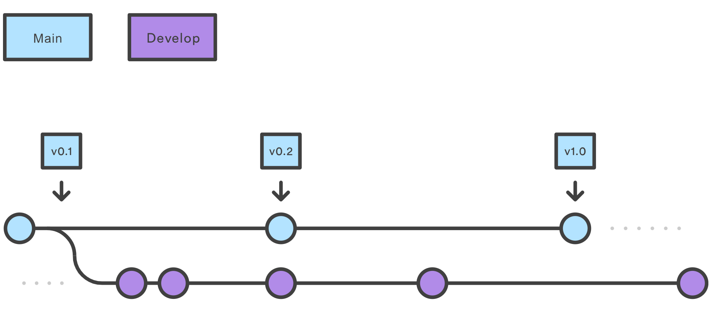
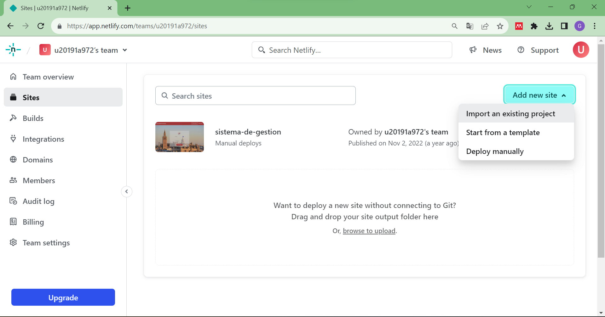
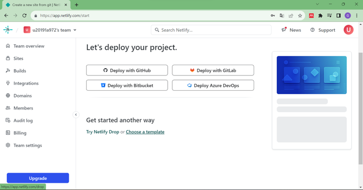
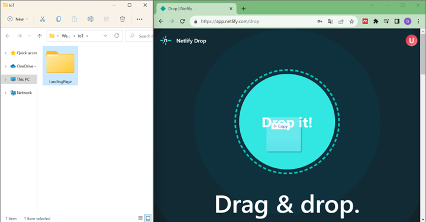

# Product Implementation, Validation & Deployment

## Software Configuration Management
A continuación, se presentará un repositorio central y organizado que servirá como guía para el desarrollo enfocado y consistente de nuestra solución.

### Software Development Environment Configuration
En esta sección se incluyen los enlaces de los productos de software utilizados durante el ciclo de vida del proyecto. 

**Project Management**

La gestión de proyectos es un proceso que consiste en encaminar a un equipo a cumplir todos los objetivos de un trabajo respetando las fechas límites y las restricciones. Para organizar a nuestro equipo, se utilizó la herramienta de Trello.

- Trello: Es una plataforma que permite crear tableros para gestionar proyectos y flujos de trabajo haciendo uso de tarjetas y listas. En el presente proyecto, se utilizó un tablero en Trello para definir y asignar las tareas a diferentes miembros de grupo. El tablero se encuentra en el siguiente enlace: https://trello.com/invite/b/8huvmr1r/ATTI8c11388bb671105d58e8fd8d5bbed5cf0C5A3627/desarrollo-de-soluciones-iot

**Product UX/UI Design**

Estas herramientas permiten desarrollar la experiencia de usuario que se desea brindar a los usuarios, así como, el diseño de interfaz de las aplicaciones que se utilizan como el landing page o la aplicación móvil.

- **Uxpressia**: es una herramienta en línea para el mapeo de la trayectoria del cliente que crea mapas de impacto y personas. Sus herramientas nos permitieron establecer las bases del modelado de User Persona, Empathy Map y Journey Map. https://uxpressia.com

- **MIRO**: es una pizarra digital colaborativa en línea, que puede ser usada para la investigación, la ideación, la creación de lluvias de ideas, mapas mentales y una variedad de otras actividades colaborativas. https://miro.com/app/dashboard/

- **Figma**: es una herramienta de prototipo web y editor de gráficos vectorial, que, a diferencia de las otras herramientas, se aloja en la web, permitiendo establecer los modelos para nuestra aplicación. https://www.figma.com/design

- **Lucid Chart**: es una herramienta de diagramación basada en la web, que permite a los usuarios colaborar y trabajar juntos en tiempo real, creando diseños UML, mapas mentales, prototipos de software y muchos otros tipos de diagrama. https://lucid.app/documents#/dashboard 

**Software Development**

Es una estructura aplicada al desarrollo de un producto de software. Se utiliza para el establecimiento de un proceso para el desarrollo de software, cada uno de los cuales describe un enfoque diferente para diferentes actividades que tienen lugar durante el proceso.

- **Github**: Es un repositorio comunitario cuya función es almacenar los avances de un proyecto elaborado por un grupo de personas. https://github.com/Desarrollo-de-Soluciones-IoT
- **IntelliJ IDEA**: es un entorno de desarrollo integrado para el desarrollo de programas informáticos en el lenguaje de programación de Java. En el presente proyecto, este software será utilizado para programar el Backend. https://www.jetbrains.com/idea/
- **WebStorm**: es un entorno de desarrollo integrado para el desarrollo de programas con JavaScript y tecnologías relacionadas. https://www.jetbrains.com/es-es/webstorm/
- **Visual Studio Code**: Es un editor de código que brinda extensiones que nos permiten personalizar y agregar funcionalidades que ayudan a los desarrolladores a programar de manera más eficiente. https://code.visualstudio.com/
- **Java**: Es un lenguaje de programación ampliamente utilizado para programar aplicaciones web.
- **Spring Boot**: es una herramienta que facilita el desarrollo de aplicaciones web y microservicios con Spring framework. https://spring.io/projects/spring-boot
- **Git**: sistema de control de versiones descentralizado para registrar cada cambio que realicemos en el código. 

**Software Testing**

Para realizar las pruebas, se utilizó la herramienta de desarrollo guiado por comportamiento, Cucumber, haciendo uso del lenguaje Gherkin.

- **Lenguaje Gherkin**: Es un Lenguaje Específico de Dominio (Domain-Specific Languaje), es decir, un lenguaje que está creado para resolver un problema. Además de ser interpretado en código, se puede agregar los users stories del programa con sus respectivas partes: Feature, Scenario, Example, Scenario Outline, Given, When, Then y And.

**Software Deployment**

- **Github pages**: es un servicio de alojamiento de sitios estáticos proporcionado por Github. Esta herramienta se utilizará para deployar la landing page del proyecto. https://pages.github.com/
- **Azure Spring Apps**: Es un servicio de Azure administrado para aplicaciones realizadas en Spring Boot. Azure Spring Apps – Spring Boot Application Dev | Microsoft Azure
- **Netlify**: Es una plataforma utilizada para automatizar proyectos webs estáticos. https://www.netlify.com/

**Software Documentation**

Es un tipo de texto escrito o ilustración que acompaña al software de computadora o está incrustado en el código fuente. La documentación explica cómo funciona el software o cómo usarlo.

- **OpenAPI Specification y Swagger**: Es una especificación para archivos de interfaz legibles por máquina para describir, producir y visualizar servicios web RESTful. https://swagger.io/specification 

### Source Code Management 

A continuación, se presenta la gestión del código fuente o como es conocido por sus siglas en ingles SCM (Source Code Management). Su función principal es realizar un seguimiento de las modificaciones que el equipo realizara a lo largo del desarrollo de sus proyectos en los repositorios. Se empleará como un sistema de control de versiones que permite dar seguimiento a los cambios que cada integrante o desarrollador realice en el proyecto. Asimismo, cabe resaltar que para el sistema de control de versiones emplearemos GitHub.

- URL de la organización: https://github.com/Desarrollo-de-Soluciones-IoT
- URL del repositorio del Landing Page: https://github.com/Desarrollo-de-Soluciones-IoT/LandingPage
- URL del repositorio de los diagramas C4: https://github.com/Desarrollo-de-Soluciones-IoT/Diagrams 

**Gitflow**

Es el modelo alternativo de creación de ramas en Git que en los últimos años se ha vuelto una herramienta indispensable para muchos desarrolladores. Este flujo de trabajo de control de versiones utiliza ramas y fue publicado y popularizado por Vincent Driessen. Su principal función es ayudar en la organización de la versión de un código, permitiendo la creación de nuevos Features y Hotfixes de manera organizada.



GitFlow trabaja con diferentes ramas las cuales tienen funciones específicas. A continuación, se muestran las ramas que se emplearan en el flujo de trabajo de nuestro proyecto. 

- **Main Branches**
    - **main**: es la rama principal, a partir de ella se recorrerán todas las ramas y contendrá la última versión y las anteriores creadas por los desarrolladores. Almacenara el historial de publicación oficial. 
    - **develop**: Esta rama puede ser creada a partir de la master Branch, contara con todos los Features estables. Esto significa que a través de esta rama el equipo podrá integrar las funciones. 

- **Support Branches**

    A diferencia de las ramas principales, estas branches tienen un tiempo de vida limitado, ya que son eliminadas después de realizar el merge con sus ramas primarias.  
  - Feature:
    - Se ramifica de la rama _develop_ 
    - Debe fusionarse con la rama _develop_

    Se emplean para desarrollar las nuevas funciones que se integraran en una versión siguiente. Cabe resaltar, que esta rama existe mientras este en proceso de desarrollo. Sin embargo, cuando el desarrollador culmine con esa función, se fusionará nuevamente a develop. 
  - Release:
    - Se ramifica de la rama develop 
    - Debe fusionarse de nuevo en las ramas develop / main
    
    Son aquellas que admiten la preparación de una nueva versión de producción. A través de esta rama, se permite corregir errores menores que surgieron en la etapa de desarrollo y preparar metadatos para su lanzamiento. Esto último genera que la develop Branch se autoriza para recibir nuevas funciones para la próxima versión, pues se generara cuando se acerque una fecha de publicación determinada. 
- **Hotfix**
    - Se ramifica de la rama main. 
    - Debe fusionarse de nuevo en las ramas develop y master.

    Estas ramas son muy similares a las branches del release, ya que se ramifican de master en vez de develop. Son llamadas como ramas de mantenimiento, corrección o hotfix. Su principal función, es reparar rápidamente las entregas de producción. Al terminar la corrección, debe fusionarse con master y esta debe etiquetarse con un nuevo número de versión. 

### Source Code Style Guide & Conventions

**Convenciones para nombrar los Features, release y hotfix branches**

* **Feature Branch**: feature/name

  Ejemplos:
  * feature/doctors
  * feature/patients
  * feature/medical-history
    
**Semantic Versioning Specification**

El Versionamiento Semántico es una especificación que brinda pautas a los desarrolladores para enumerar las versiones de un proyecto de código.

El proyecto inicia su desarrollo con la versión 0.y.z, luego pasara a ser 1.0.0 cuando se defina la API pública. Luego, se seguirán los criterios mostrados a continuación para incrementar la versión. 

**Patch version (Z)**, debe incrementarse si solo se introducen correcciones de errores compatibles con versiones anteriores.

**Minor version (Y)**, debe incrementarse si:
* Se integra una nueva funcionalidad compatible con versiones anteriores en la API pública.
* Si alguna funcionalidad es obsoleta o si se introducen nuevas funcionalidades en el código privado.

**Major version (X)**, debe incrementarse si se generan cambios deslindados a versiones anteriores en la API pública. 

**Conventional Commits**

El commit debe estructurarse de la siguiente manera:
```
<type> [optional scope]: <description> 

[optional body]

[optional footer(s)]
```
Cabe recalcar que debe estar en “lower case”.

**Type**
* **feat**: cuando se agrega un nuevo feature.
* **fix**: cuando corriges un error.
* **build**: cuando afectan los componentes de compilación como la herramienta de compilación, las dependencias o la version del proyecto.
* **chore**: modificaciones privadas del código.
* **docs**: commits que afectan solo a la documentación.
* **refractor**: commits que reescriben o reestructura el código, pero no cambia el comportamiento.
* **perf**: commits especiales que mejoran el rendimiento.
* **style**: commits que no afectan el programa. (espacios en blanco, formato, puntos o comas faltantes).
* **test**: commits que agregan prueba
  
**Scope**

Proporciona información contextual adicional, si bien es opcional, es bueno colocarlo para que el desarrollador lea un commit más específico.

Ejemplos:
- `feat(api): <description>`
- `feat(lang): <description>` 

**Description**

Es una parte obligatoria del formato de los commits. Debe ser escrito de manera imperativa y en minúsculas.

**Optional body**

Debe incluirse la motivación para el cambio y contrastarse con el comportamiento anterior. Es opcional y si lo usa debe usar el imperativo y es ideal para mencionar los identificadores de problemas y sus relaciones.

**Optional Footer**

Cualquier información sobre cambios importantes. Es opcional, puede incluir referencia al problema por su id y en esta sección se incluyen los BREAKING CHANGES: seguido de un espacio o dos saltos de línea. 

Ejemplos:

1. `feat(welcome): add welcome section`
2. `build(release): bump version to 1.0.0`
3. `style: remove empty line`
4. `feat(sign up): add the button to sign up`
5. `feat!: send an email to the customer when product is shipped`
```
feat: remove ticket list endpoint refers to JIRA-1337 

BREAKING CHANGES: ticket endpoints no longer supports list all entities
```

### Software Deployment Configuration 

**Deployment del Landing Page**

1. Dirigirse a _Team Overview_, > _Add New Site_ > _Import an existing project_

2. Seleccionar la opción _“Try Netlify Drop”_

3. Arrastra y soltar la carpeta con los archivos del Landing Page

4. Esperar aproximadamente 15 minutos para que la página web termine de deployarse. Luego, se podrá acceder al Landing Page a través del enlace proporcionado por Netlify.