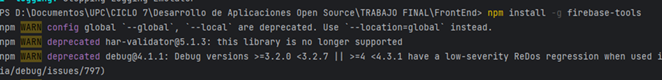
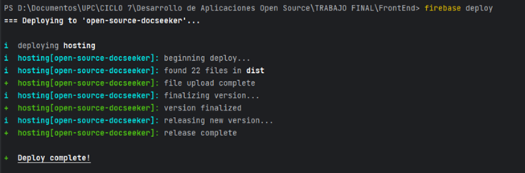
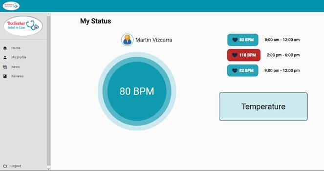
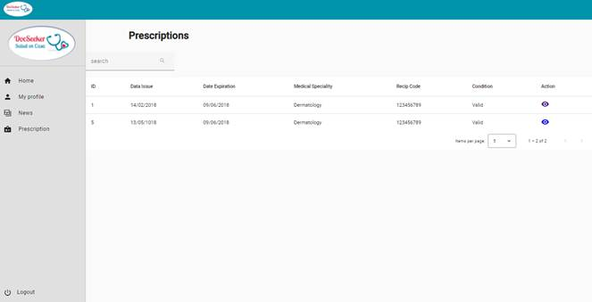
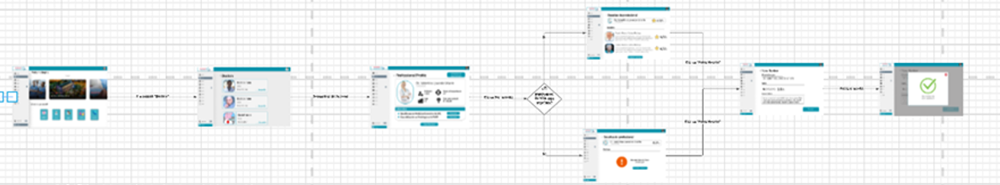

# Product Implementation, Validation & Deployment

## Software Configuration Management

A continuación, se presentará un repositorio central y organizado que servirá como guía para el desarrollo enfocado y consistente de nuestra solución.

### Software Development Environment Configuration

En esta sección se incluyen los enlaces de los productos de software utilizados durante el ciclo de vida del proyecto.

**Project Management**

La gestión de proyectos es un proceso que consiste en encaminar a un equipo a cumplir todos los objetivos de un trabajo respetando las fechas límites y las restricciones. Para organizar a nuestro equipo, se utilizó la herramienta de Trello.

- Trello: Es una plataforma que permite crear tableros para gestionar proyectos y flujos de trabajo haciendo uso de tarjetas y listas. En el presente proyecto, se utilizó un tablero en Trello para definir y asignar las tareas a diferentes miembros de grupo. El tablero se encuentra en el siguiente enlace: https://trello.com/invite/b/8huvmr1r/ATTI8c11388bb671105d58e8fd8d5bbed5cf0C5A3627/desarrollo-de-soluciones-iot

**Product UX/UI Design**

Estas herramientas permiten desarrollar la experiencia de usuario que se desea brindar a los usuarios, así como, el diseño de interfaz de las aplicaciones que se utilizan como el landing page o la aplicación móvil.

- **Uxpressia**: es una herramienta en línea para el mapeo de la trayectoria del cliente que crea mapas de impacto y personas. Sus herramientas nos permitieron establecer las bases del modelado de User Persona, Empathy Map y Journey Map. https://uxpressia.com

- **MIRO**: es una pizarra digital colaborativa en línea, que puede ser usada para la investigación, la ideación, la creación de lluvias de ideas, mapas mentales y una variedad de otras actividades colaborativas. https://miro.com/app/dashboard/

- **Figma**: es una herramienta de prototipo web y editor de gráficos vectorial, que, a diferencia de las otras herramientas, se aloja en la web, permitiendo establecer los modelos para nuestra aplicación. https://www.figma.com/design

- **Lucid Chart**: es una herramienta de diagramación basada en la web, que permite a los usuarios colaborar y trabajar juntos en tiempo real, creando diseños UML, mapas mentales, prototipos de software y muchos otros tipos de diagrama. https://lucid.app/documents#/dashboard

**Software Development**

Es una estructura aplicada al desarrollo de un producto de software. Se utiliza para el establecimiento de un proceso para el desarrollo de software, cada uno de los cuales describe un enfoque diferente para diferentes actividades que tienen lugar durante el proceso.

- **Github**: Es un repositorio comunitario cuya función es almacenar los avances de un proyecto elaborado por un grupo de personas. https://github.com/Desarrollo-de-Soluciones-IoT
- **IntelliJ IDEA**: es un entorno de desarrollo integrado para el desarrollo de programas informáticos en el lenguaje de programación de Java. En el presente proyecto, este software será utilizado para programar el Backend. https://www.jetbrains.com/idea/
- **WebStorm**: es un entorno de desarrollo integrado para el desarrollo de programas con JavaScript y tecnologías relacionadas. https://www.jetbrains.com/es-es/webstorm/
- **Visual Studio Code**: Es un editor de código que brinda extensiones que nos permiten personalizar y agregar funcionalidades que ayudan a los desarrolladores a programar de manera más eficiente. https://code.visualstudio.com/
- **Java**: Es un lenguaje de programación ampliamente utilizado para programar aplicaciones web.
- **Spring Boot**: es una herramienta que facilita el desarrollo de aplicaciones web y microservicios con Spring framework. https://spring.io/projects/spring-boot
- **Git**: sistema de control de versiones descentralizado para registrar cada cambio que realicemos en el código.

**Software Testing**

Para realizar las pruebas, se utilizó la herramienta de desarrollo guiado por comportamiento, Cucumber, haciendo uso del lenguaje Gherkin.

- **Lenguaje Gherkin**: Es un Lenguaje Específico de Dominio (Domain-Specific Languaje), es decir, un lenguaje que está creado para resolver un problema. Además de ser interpretado en código, se puede agregar los users stories del programa con sus respectivas partes: Feature, Scenario, Example, Scenario Outline, Given, When, Then y And.

**Software Deployment**

- **Github pages**: es un servicio de alojamiento de sitios estáticos proporcionado por Github. Esta herramienta se utilizará para deployar la landing page del proyecto. https://pages.github.com/
- **Azure Spring Apps**: Es un servicio de Azure administrado para aplicaciones realizadas en Spring Boot. Azure Spring Apps – Spring Boot Application Dev | Microsoft Azure
- **Netlify**: Es una plataforma utilizada para automatizar proyectos webs estáticos. https://www.netlify.com/

**Software Documentation**

Es un tipo de texto escrito o ilustración que acompaña al software de computadora o está incrustado en el código fuente. La documentación explica cómo funciona el software o cómo usarlo.

- **OpenAPI Specification y Swagger**: Es una especificación para archivos de interfaz legibles por máquina para describir, producir y visualizar servicios web RESTful. https://swagger.io/specification

### Source Code Management

A continuación, se presenta la gestión del código fuente o como es conocido por sus siglas en ingles SCM (Source Code Management). Su función principal es realizar un seguimiento de las modificaciones que el equipo realizara a lo largo del desarrollo de sus proyectos en los repositorios. Se empleará como un sistema de control de versiones que permite dar seguimiento a los cambios que cada integrante o desarrollador realice en el proyecto. Asimismo, cabe resaltar que para el sistema de control de versiones emplearemos GitHub.

- URL de la organización: https://github.com/Desarrollo-de-Soluciones-IoT
- URL del repositorio del Landing Page: https://github.com/Desarrollo-de-Soluciones-IoT/LandingPage
- URL del repositorio de los diagramas C4: https://github.com/Desarrollo-de-Soluciones-IoT/Diagrams

**Gitflow**

Es el modelo alternativo de creación de ramas en Git que en los últimos años se ha vuelto una herramienta indispensable para muchos desarrolladores. Este flujo de trabajo de control de versiones utiliza ramas y fue publicado y popularizado por Vincent Driessen. Su principal función es ayudar en la organización de la versión de un código, permitiendo la creación de nuevos Features y Hotfixes de manera organizada.


GitFlow trabaja con diferentes ramas las cuales tienen funciones específicas. A continuación, se muestran las ramas que se emplearan en el flujo de trabajo de nuestro proyecto.

- **Main Branches**

  - **main**: es la rama principal, a partir de ella se recorrerán todas las ramas y contendrá la última versión y las anteriores creadas por los desarrolladores. Almacenara el historial de publicación oficial.
  - **develop**: Esta rama puede ser creada a partir de la master Branch, contara con todos los Features estables. Esto significa que a través de esta rama el equipo podrá integrar las funciones.

- **Support Branches**

  A diferencia de las ramas principales, estas branches tienen un tiempo de vida limitado, ya que son eliminadas después de realizar el merge con sus ramas primarias.

  - Feature:

    - Se ramifica de la rama _develop_
    - Debe fusionarse con la rama _develop_

    Se emplean para desarrollar las nuevas funciones que se integraran en una versión siguiente. Cabe resaltar, que esta rama existe mientras este en proceso de desarrollo. Sin embargo, cuando el desarrollador culmine con esa función, se fusionará nuevamente a develop.

  - Release:

    - Se ramifica de la rama develop
    - Debe fusionarse de nuevo en las ramas develop / main

    Son aquellas que admiten la preparación de una nueva versión de producción. A través de esta rama, se permite corregir errores menores que surgieron en la etapa de desarrollo y preparar metadatos para su lanzamiento. Esto último genera que la develop Branch se autoriza para recibir nuevas funciones para la próxima versión, pues se generara cuando se acerque una fecha de publicación determinada.

- **Hotfix**

  - Se ramifica de la rama main.
  - Debe fusionarse de nuevo en las ramas develop y master.

  Estas ramas son muy similares a las branches del release, ya que se ramifican de master en vez de develop. Son llamadas como ramas de mantenimiento, corrección o hotfix. Su principal función, es reparar rápidamente las entregas de producción. Al terminar la corrección, debe fusionarse con master y esta debe etiquetarse con un nuevo número de versión.

### Source Code Style Guide & Conventions

**Convenciones para nombrar los Features, release y hotfix branches**

- **Feature Branch**: feature/name

  Ejemplos:

  - feature/doctors
  - feature/patients
  - feature/medical-history

**Semantic Versioning Specification**

El Versionamiento Semántico es una especificación que brinda pautas a los desarrolladores para enumerar las versiones de un proyecto de código.

El proyecto inicia su desarrollo con la versión 0.y.z, luego pasara a ser 1.0.0 cuando se defina la API pública. Luego, se seguirán los criterios mostrados a continuación para incrementar la versión.

**Patch version (Z)**, debe incrementarse si solo se introducen correcciones de errores compatibles con versiones anteriores.

**Minor version (Y)**, debe incrementarse si:

- Se integra una nueva funcionalidad compatible con versiones anteriores en la API pública.
- Si alguna funcionalidad es obsoleta o si se introducen nuevas funcionalidades en el código privado.

**Major version (X)**, debe incrementarse si se generan cambios deslindados a versiones anteriores en la API pública.

**Conventional Commits**

El commit debe estructurarse de la siguiente manera:

```
<type> [optional scope]: <description>

[optional body]

[optional footer(s)]
```

Cabe recalcar que debe estar en “lower case”.

**Type**

- **feat**: cuando se agrega un nuevo feature.
- **fix**: cuando corriges un error.
- **build**: cuando afectan los componentes de compilación como la herramienta de compilación, las dependencias o la version del proyecto.
- **chore**: modificaciones privadas del código.
- **docs**: commits que afectan solo a la documentación.
- **refractor**: commits que reescriben o reestructura el código, pero no cambia el comportamiento.
- **perf**: commits especiales que mejoran el rendimiento.
- **style**: commits que no afectan el programa. (espacios en blanco, formato, puntos o comas faltantes).
- **test**: commits que agregan prueba

**Scope**

Proporciona información contextual adicional, si bien es opcional, es bueno colocarlo para que el desarrollador lea un commit más específico.

Ejemplos:

- `feat(api): <description>`
- `feat(lang): <description>`

**Description**

Es una parte obligatoria del formato de los commits. Debe ser escrito de manera imperativa y en minúsculas.

**Optional body**

Debe incluirse la motivación para el cambio y contrastarse con el comportamiento anterior. Es opcional y si lo usa debe usar el imperativo y es ideal para mencionar los identificadores de problemas y sus relaciones.

**Optional Footer**

Cualquier información sobre cambios importantes. Es opcional, puede incluir referencia al problema por su id y en esta sección se incluyen los BREAKING CHANGES: seguido de un espacio o dos saltos de línea.

Ejemplos:

1. `feat(welcome): add welcome section`
2. `build(release): bump version to 1.0.0`
3. `style: remove empty line`
4. `feat(sign up): add the button to sign up`
5. `feat!: send an email to the customer when product is shipped`

```
feat: remove ticket list endpoint refers to JIRA-1337

BREAKING CHANGES: ticket endpoints no longer supports list all entities
```

### Software Deployment Configuration

**Deployment del Landing Page**

1. Dirigirse a _Team Overview_, > _Add New Site_ > _Import an existing project_
   
2. Seleccionar la opción _“Try Netlify Drop”_
   
3. Arrastra y soltar la carpeta con los archivos del Landing Page
   
4. Esperar aproximadamente 15 minutos para que la página web termine de deployarse. Luego, se podrá acceder al Landing Page a través del enlace proporcionado por Netlify.

## Landing Page, Services & Applications

La implementación de Landing Page y servicios de aplicaciones es esencial para presentar información relevante de manera efectiva y brindar acceso a los servicios ofrecidos. Esto impulsa la interacción con los usuarios y facilita la utilización de las aplicaciones.

### Sprint 1

#### Sprint planning


Trello: https://trello.com/invite/b/8huvmr1r/ATTI040473fcfbdd32874981325385fb039246657C62/desarrollo-de-soluciones-iot

#### Sprint Backlog 1

En esta primera iteración, tuvimos como objetivo implementar el diseño de nuestro Landing Page mediante la utilización de WebStorm. Es decir, todas las secciones deben estar terminadas al finalizar el Sprint, ya sea inicio, conócenos, servicios o contáctanos. A continuación, se presentan fotos que evidencian nuestro manejo de Trello.

<table border="1">
  <tr>
    <th>ID</th>
    <th>Título</th>
    <th>Descripción</th>
    <th>Estimación (Horas)</th>
    <th>Asignado A</th>
    <th>Estado (To-do/In-Process/To-Review/Done)</th>
  </tr>
  <tr>
    <td>#182062223</td>
    <td>HU30: Visualización de Landing Page</td>
    <td>TA01 - Agregar sección de descarga - Se creará un botón que dirija a la descarga de la aplicación en el inicio; asimismo, debe incluir un párrafo llamativo que acompañe a la opción.</td>
    <td>2</td>
    <td>Jasmin</td>
    <td>To-Do</td>
  </tr>
  <tr>
    <td></td>
    <td></td>
    <td>TA02 - Añadir tarjetas de información - Para la sección de ‘conócenos’, se añadirá un listado de tarjetas (imágenes con texto) que muestren los beneficios que ofrece la app.</td>
    <td>4</td>
    <td>Jasmin</td>
    <td>To-Do</td>
  </tr>
  <tr>
    <td></td>
    <td></td>
    <td>TA03 - Añadir tarjetas de servicios para pacientes - Para la sección de ‘servicios para pacientes’, se añadirá un listado de tarjetas (imágenes con texto) que muestren los servicios que ofrece la app.</td>
    <td>4</td>
    <td>Ludwin</td>
    <td>To-Do</td>
  </tr>
  <tr>
    <td></td>
    <td></td>
    <td>TA04 - Añadir tarjetas de servicios para doctores - Para la sección de ‘servicios para doctores’, se añadirá un listado de tarjetas (imágenes con texto) que muestren los servicios que ofrece la app.</td>
    <td>4</td>
    <td>Diego</td>
    <td>To-Do</td>
  </tr>
  <tr>
    <td></td>
    <td></td>
    <td>TA05 - Añadir datos resaltantes - Agregar una sección que cuente con los datos numéricos y/o estadísticos más sorprendentes de DocSeeker.</td>
    <td>2</td>
    <td>Kendall</td>
    <td>To-Do</td>
  </tr>
  <tr>
    <td></td>
    <td></td>
    <td>TA06 - Agregar encabezados de secciones - Colocar un encabezado que indique en qué sección se encuentra el usuario.</td>
    <td>1</td>
    <td>Diego</td>
    <td>To-Do</td>
  </tr>
  <tr>
    <td>#182062235</td>
    <td>HU31: Contacto con la Empresa</td>
    <td>TA01 - Añadir sección ‘contáctanos’ - Se creará una sección al final del Landing Page que esté dedicada totalmente al contacto con la empresa.</td>
    <td>2</td>
    <td>Gonzalo</td>
    <td>To-Do</td>
  </tr>
  <tr>
    <td>#182267507</td>
    <td>HU32: Traslación en el Landing Page</td>
    <td>TA01 - Crear encabezado del Landing Page - Se añadirá un encabezado que contenga el logo de DocSeeker al inicio de la página.</td>
    <td>1</td>
    <td>Ludwin</td>
    <td>To-Do</td>
  </tr>
  <tr>
    <td></td>
    <td></td>
    <td>TA02 - Programar botones de secciones en el encabezado - Se crearán botones en el inicio que te lleven a distintas secciones de la página.</td>
    <td>3</td>
    <td>Kendall</td>
    <td>To-Do</td>
  </tr>
  <tr>
    <td>#182267516</td>
    <td>HU33: Acceso a redes sociales</td>
    <td>TA01 - Añadir botones de redes sociales - Se añadirán botones que te lleven a las distintas redes sociales de la página en el footer.</td>
    <td>3</td>
    <td>Gonzalo</td>
    <td>To-Do</td>
  </tr>
</table>

#### Development Evidence for Sprint Review

<table border="1">
  <tr>
    <th>Repository</th>
    <th>Branch</th>
    <th>Commit Id</th>
    <th>Commit Message</th>
    <th>Committed on (Date)</th>
  </tr>
  <tr>
    <td rowspan="6">https://github.com/Desarrollo-de-Soluciones-IoT/LandingPage</td>
    <td rowspan="6">develop</td>
    <td>45c3bb1882f0c39160e9caf82906d7e4a8fe0af3</td>
    <td>Initial commit</td>
    <td>09/26/2023</td>
  </tr>
  <tr>
    <td>e5b27c7383f7cd53d4f58413c00ec9b3a9535159</td>
    <td>Add footer</td>
    <td>09/26/2023</td>
  </tr>
  <tr>
    <td>9a1ba3dd9c6f5030a55af6da29c93496ea1f349b</td>
    <td>Add new section</td>
    <td>09/26/2023</td>
  </tr>
  <tr>
    <td>17c2d6c2449eeb4fc8df170929d44ac381784dfd</td>
    <td>Refactor style of cards</td>
    <td>09/26/2023</td>
  </tr>
  <tr>
    <td>e247399bae12f29f95ed8303797533f53e5bab14</td>
    <td>Update README.md</td>
    <td>09/26/2023</td>
  </tr>
  <tr>
    <td>6a81518df24d40b082a0b49bd98e5457930b998c</td>
    <td>feat: Added IoT section</td>
    <td>09/26/2023</td>
  </tr>
</table>

#### Testing Suite Evidence for Sprint Review

No se desarrolló en este sprint, pues en esta parte se presentarán los Unit Tests, Integration Tests y Acceptance Tests automatizados, para Web Services

#### Execution Evidence for Sprint Review

**Landing Page**


Link de Landing Page desplegado: https://docseekerr.netlify.app

#### Services Documentation Evidence for Sprint Review


#### Team Collaboration Insights during Sprint


|     |
| :-- |

### <a name="_toc151313381"></a>6.2.2. Sprint 2

#### <a name="_toc151313382"></a>6.2.2.1. Sprint Planning 2.


Trello : https://trello.com/invite/b/8huvmr1r/ATTI040473fcfbdd32874981325385fb039246657C62/desarrollo-de-soluciones-iot

#### <a name="_toc151313383"></a>6.2.2.2.Sprint Backlog 2.

En esta primera iteración, tuvimos como objetivo implementar el diseño de nuestro Landing Page mediante la utilización de WebStorm.

<table><tr><th colspan="1" valign="bottom">Sprint # </th><th colspan="7">Sprint 2</th></tr>
<tr><td colspan="2">User Story </td><td colspan="6">Work-item/Task </td></tr>
<tr><td colspan="1">Id </td><td colspan="1">Tittle </td><td colspan="1">Id </td><td colspan="1">Tittle </td><td colspan="1">Description </td><td colspan="1">Estimation (Hours) </td><td colspan="1">Assigned To </td><td colspan="1">Status (To-do /In-Process /To-Review /Done) </td></tr>
<tr><td colspan="1" rowspan="5">#183148483</td><td colspan="1" rowspan="5">HU35: Como developer, deseo poder almacenar un nuevo usuario dentro de la base de datos para registrar su cuenta.</td><td colspan="1">TA01 </td><td colspan="1">Definir la estructura del backend para el registro de un usuario doctor.  </td><td colspan="1">Creamos unas carpetas base para iniciar la codificación</td><td colspan="1">2</td><td colspan="1">Gonzalo</td><td colspan="1">Done </td></tr>
<tr><td colspan="1">TA02 </td><td colspan="1">Añadir servicios</td><td colspan="1">Creamos una carpeta de servicios donde escribiremos el codigo de los endpoints </td><td colspan="1">2</td><td colspan="1">Gonzalo</td><td colspan="1">Done </td></tr>
<tr><td colspan="1">TA03 </td><td colspan="1">Agregar variables que almacenen los valores que el usuario escribe</td><td colspan="1">Creamos variables que almacenarán los datos escritos en los inputs fields</td><td colspan="1">2</td><td colspan="1">Kendall</td><td colspan="1">Done </td></tr>
<tr><td colspan="1">TA04</td><td colspan="1">Añadir servidor</td><td colspan="1">Crear archivos routes.json</td><td colspan="1">2</td><td colspan="1">Kendall</td><td colspan="1">Done</td></tr>
<tr><td colspan="1">TA05 </td><td colspan="1">Añadir funciones que envíen el request al endpoint </td><td colspan="1">Crear métodos que creen un objeto usuario y lo envíe por medio de un request Post</td><td colspan="1">5 </td><td colspan="1">Jasmin</td><td colspan="1">Done </td></tr>
<tr><td colspan="1" rowspan="2">#182061047</td><td colspan="1" rowspan="2">HU02: Como usuario, deseo ingresar con mi cuenta ya creada para tener mis datos ya guardados </td><td colspan="1">TA01 </td><td colspan="1">Obtener datos</td><td colspan="1">Se obtienen los datos ingresados para el logeo</td><td colspan="1">1 </td><td colspan="1">Diego</td><td colspan="1">Done </td></tr>
<tr><td colspan="1">TA02 </td><td colspan="1">Guardar datos en el storage </td><td colspan="1">Los datos ingresados para el logeo se guardan en el storage. </td><td colspan="1">1 </td><td colspan="1">Diego </td><td colspan="1">Done </td></tr>
<tr><td colspan="1"><p> </p><p>#182061062</p><p> </p></td><td colspan="1"><p> </p><p>HU03: Como usuario, deseo cerrar sesión para que esta no se quede aberta en el buscador </p></td><td colspan="1">TA01 </td><td colspan="1">Desarrollar path para el direccionamiento de salida.</td><td colspan="1">Se desarrolló el path que direcciona fuera de la sesión cuando se le da click al botón log out. </td><td colspan="1">1 </td><td colspan="1">ludwin</td><td colspan="1">Done </td></tr>
<tr><td colspan="1" rowspan="3"><p> </p><p>#182061254</p></td><td colspan="1" rowspan="3"><p> </p><p>HU18: Como profesional de la salud, deseo establecer mi precio inicial por consulta para que los clientes sepan cuánto cobro </p><p> </p></td><td colspan="1">TA01 </td><td colspan="1">Creación de la vista para el usuario doctor </td><td colspan="1">Se crea la vista del precio que se cobrará el doctor </td><td colspan="1">2 </td><td colspan="1">ludwin</td><td colspan="1">Done </td></tr>
<tr><td colspan="1">TA02 </td><td colspan="1">Agregar input fields para digitar los datos </td><td colspan="1">Se crearán diferentes cuadros de texto, donde el doctor puede ingresar sus precios </td><td colspan="1">2 </td><td colspan="1">Jasmindo</td><td colspan="1">Done </td></tr>
<tr><td colspan="1">TA03 </td><td colspan="1">Se agrega un botón para subir el precio actual</td><td colspan="1">Se agrega un botón para subir el precio del doctor</td><td colspan="1">1</td><td colspan="1">Diego </td><td colspan="1">Done </td></tr>
<tr><td colspan="1" rowspan="4">#182061310</td><td colspan="1" rowspan="4">HU23: Como profesional de la salud, deseo visualizar análisis antiguos y actuales</td><td colspan="1">TA01</td><td colspan="1">Se añadió la vista de historial médico</td><td colspan="1">Se añadió view para subir historial médico</td><td colspan="1">2</td><td colspan="1">Diego </td><td colspan="1">Done</td></tr>
<tr><td colspan="1">TA02</td><td colspan="1">Agregar input fields para digitar los datos</td><td colspan="1">Se crearán diferentes cuadros de texto, donde el doctor pueda agregar los datos de la receta médica</td><td colspan="1">2</td><td colspan="1">Kendall</td><td colspan="1">Done</td></tr>
<tr><td colspan="1">TA03</td><td colspan="1">Utilizar los inputs fields en un formulario</td><td colspan="1">En la parte del HTML, se revisará que estemos utilizando las etiquetas y clases correctas.</td><td colspan="1">4</td><td colspan="1">Diego </td><td colspan="1">Done</td></tr>
<tr><td colspan="1">TA04</td><td colspan="1">Agregar un botón que envié los datos</td><td colspan="1">Se añadirá un botón que tendrá un evento que llamará a una función para almacenar la receta.</td><td colspan="1">5</td><td colspan="1">Kendall</td><td colspan="1">Done</td></tr>
<tr><td colspan="1">#183148385</td><td colspan="1">HU30: Como administrador, deseo que se visualice lo que ofrece la plataforma al momento de ingresar a ella para que las personas la utilicen.</td><td colspan="1">TA01</td><td colspan="1">Actualización del Landing Page</td><td colspan="1">Se actualizó el Landing Page</td><td colspan="1">1</td><td colspan="1">Diego</td><td colspan="1">Done</td></tr>
<tr><td colspan="1" rowspan="6">#183148482</td><td colspan="1" rowspan="6">HU34: Como developer, deseo poder recuperar las credenciales del usuario desde la base de datos para autenticar el inicio de sesión.</td><td colspan="1">TA01</td><td colspan="1">Validación del inicio de sesión</td><td colspan="1">Se validó el inicio de sesión con la base de datos</td><td colspan="1">2</td><td colspan="1">Gonzalo</td><td colspan="1">Done</td></tr>
<tr><td colspan="1">TA02</td><td colspan="1">Agregar entidades Usuario, Paciente y Doctor</td><td colspan="1">Se agregó la entidad general usuarios y las entidades particulares de Paciente y Doctor</td><td colspan="1">5</td><td colspan="1">Gonzalo</td><td colspan="1">Done</td></tr>
<tr><td colspan="1">TA03</td><td colspan="1">Agregar servicios para Usuario, Paciente y Doctor</td><td colspan="1">Se agregó el servicio general para usuarios y los servicios particulares de Paciente y Doctor</td><td colspan="1">5</td><td colspan="1">Gonzalo</td><td colspan="1">Done</td></tr>
<tr><td colspan="1">TA04</td><td colspan="1">Agregar repositorios para Usuario, Paciente y Doctor</td><td colspan="1">Se agregó el repositorio general para usuarios y los repositorios particulares de Paciente y Doctor</td><td colspan="1">5</td><td colspan="1">Kendall</td><td colspan="1">Done</td></tr>
<tr><td colspan="1">TA05</td><td colspan="1">Agregar Mapping para usuario, Paciente y Doctor</td><td colspan="1">Se agregó el Mapping general para usuarios y los Mapping particulares de Paciente y Doctor</td><td colspan="1">5</td><td colspan="1">Diego</td><td colspan="1">Done</td></tr>
<tr><td colspan="1">TA06</td><td colspan="1">Agregar Controladora para Usuario, Paciente y Doctor</td><td colspan="1">Se agregó la controladora general para usuarios y los controladores particulares de Paciente y Doctor</td><td colspan="1">5</td><td colspan="1">Gonzalo</td><td colspan="1">Done</td></tr>
<tr><td colspan="1" rowspan="7">#182267516</td><td colspan="1" rowspan="7">HU42: Como developer, deseo poder obtener los datos personales del usuario desde la base de datos para que presentar en su perfil.</td><td colspan="1">TA01</td><td colspan="1">Importar dependencias</td><td colspan="1">Ejecutar los comandos pm install desde el terminal para instalar los módulos necesarios</td><td colspan="1">1</td><td colspan="1">Diego</td><td colspan="1">Done</td></tr>
<tr><td colspan="1">TA02</td><td colspan="1">Crear URL base</td><td colspan="1">Crear en archivo http-comon.js y añadir la base URL con el método create.</td><td colspan="1">3</td><td colspan="1">Kendall</td><td colspan="1">Done</td></tr>
<tr><td colspan="1">TA03</td><td colspan="1">Crear un endpoint GET</td><td colspan="1">En el archivo servicios, crear un endpoint GET que reciba un id para identificar al usuario</td><td colspan="1">3</td><td colspan="1">Jasmin</td><td colspan="1">Done</td></tr>
<tr><td colspan="1">TA04</td><td colspan="1">Añadir un botón que permita traer los datos</td><td colspan="1">En el componente deseado, debemos añadir un evento que llame al endpoint cuando sea seleccionado</td><td colspan="1">2</td><td colspan="1">Gonzalo</td><td colspan="1">Done</td></tr>
<tr><td colspan="1">TA05</td><td colspan="1">Obtener y mostrar datos</td><td colspan="1">Cuando el endpoint nos devuelve la respuesta, guardarlo en variables y mostrarlo en la seccion Profile</td><td colspan="1">2</td><td colspan="1">Gonzalo</td><td colspan="1">Done</td></tr>
<tr><td colspan="1">TA06</td><td colspan="1">Configurar servicios base en shared</td><td colspan="1">Se configuraron los servicios base en shared</td><td colspan="1">3</td><td colspan="1">Kendall</td><td colspan="1">Done</td></tr>
<tr><td colspan="1">TA07</td><td colspan="1">Creacion de tablas en Schema</td><td colspan="1">Se crearon las tablas en Schema</td><td colspan="1">3</td><td colspan="1">Jasmin</td><td colspan="1">Done</td></tr>
</table>

#### <a name="_toc151313384"></a>6.2.2.3.Development Evidence for Sprint Review.

<table><tr><th colspan="1" valign="top"><b>Repository</b></th><th colspan="1" valign="top"><b>Branch</b></th><th colspan="1" valign="top"><b>Commit Id</b></th><th colspan="1" valign="top"><b>CommitMessage</b></th><th colspan="1" valign="top"><b>Commited on (Date)</b></th></tr>
<tr><td colspan="1" rowspan="2" valign="top">[https://github.com/<br>Desarrollo-de-Soluciones-<br>IoT/DocSeeker-Web-Application/commits/<br>feature/loginDoctors](https://github.com/Desarrollo-de-Soluciones-IoT/DocSeeker-Web-Application/commits/feature/loginDoctors) </td><td colspan="1" rowspan="2" valign="top">login<br>zDoctors</td><td colspan="1" valign="top"><p>d7ce9e7e89e2a3400a</p><p>b9cd4388ea3c6954d42352</p></td><td colspan="1" valign="top">add doc interface that matches what's expected to be retrieved …</td><td colspan="1" valign="top">11/02/2023</td></tr>
<tr><td colspan="1" valign="top"><p>ac27979bcf46f92f92b4020</p><p>e0277178632c8142a</p></td><td colspan="1" valign="top">add form and login method</td><td colspan="1" valign="top">11/02/2023</td></tr>
<tr><td colspan="1" rowspan="3" valign="top">[https://github.com/<br>Desarrollo-de-Soluciones-IoT/Backend/commits/<br>feature/doctorLogIn](https://github.com/Desarrollo-de-Soluciones-IoT/Backend/commits/feature/doctorLogIn) </td><td colspan="1" rowspan="3" valign="top">login<br>zDoctors</td><td colspan="1" valign="top"><p>6627536649e5699b1d915b</p><p>ec94bac92e35113b18</p></td><td colspan="1" valign="top">Add doctor login resource</td><td colspan="1" valign="top">11/02/2023</td></tr>
<tr><td colspan="1" valign="top"><p>99cf78ca548464ab48a2ff7</p><p>3b273afdc845d0e49</p></td><td colspan="1" valign="top">Retrieve doctor by their dni and password</td><td colspan="1" valign="top">11/02/2023</td></tr>
<tr><td colspan="1" valign="top"><p>3e3abecf04749fbed0a14b</p><p>0cf4f82db761c2fe51</p></td><td colspan="1" valign="top">Add cross-origin policy</td><td colspan="1" valign="top">11/02/2023</td></tr>
</table>

#### <a name="_toc151313385"></a>6.2.2.4.Testing Suite Evidence for Sprint Review.

El equipo ha desarrollado algunos Gherkin acceptance tests, para poder realizar pruebas al momento de cumplir necesidades de los usuarios en la app.

Evidencias:

|                          **Repository**                          | **Branch** |              **Commit Id**               |   **Commit Message**   |    ` `**Commit Message Body**    | ` `**Commited on** |
| :--------------------------------------------------------------: | :--------: | :--------------------------------------: | :--------------------: | :------------------------------: | :----------------: |
| https://github.com/Desarrollo-de-Soluciones-IoT/Acceptance-Tests |    main    | fdbd5cb1a32c7aee900895178240c19c8552ec5a | added acceptance tests | Se agregaron los acceptance test |     03/11/2023     |

Link de repositorio: https://github.com/Desarrollo-de-Soluciones-IoT/Acceptance-Tests

#### <a name="_toc151313386"></a>6.2.2.5.Execution Evidence for Sprint Review.

Landing Page


` `Link de Landing Page desplegado : [https://docseekerr.netlify.app ](https://docseekerr.netlify.app)

Dashboard para usuarios Profesional de salud


My Profile para usuario Profesional de salud


Edit Profile para usuario Profesional de salud

My Reviews para usuario Profesional de salud


My Appointments para usuario Profesional de salud

Information Patient para usuario Profesional de salud


#### <a name="_toc151313387"></a>6.2.2.6.Services Documentation Evidence for Sprint Review.

| **Endpoint** | **Verbo HTTP** |                  **Enlace**                  | **Parámetros** |                                                                                                                                                                                                                                     **Response**                                                                                                                                                                                                                                     |                                   **Explicación**                                    |
| :----------: | :------------: | :------------------------------------------: | :------------: | :----------------------------------------------------------------------------------------------------------------------------------------------------------------------------------------------------------------------------------------------------------------------------------------------------------------------------------------------------------------------------------------------------------------------------------------------------------------------------------: | :----------------------------------------------------------------------------------: |
|   patients   |      Get       |   <http://localhost>: 8080/api/v1/patient    |                |                                                                     <p>[<br>` `{</p><p>“id”: 0,</p><p>“DNI”: 0,</p><p>“name”: “string”,</p><p>“genre”: </p><p>[</p><p>{</p><p>“name”: “string”,</p><p>“code”: “string”</p><p>}</p><p>],</p><p>“birthday”: 0,</p><p>“email”: “string”,</p><p>“cell1”: “string”,</p><p>“cell2”: “string”,</p><p>“password”: “string”,</p><p>“photo”: “string”</p><p>}<br>` `]</p>                                                                      |            Se retorna un array con la información de todos los pacientes.            |
|   patients   |      Get       | <http://localhost>: 8080/api/v1/patient/{id} |       Id       |                                                                     <p>[<br>` `{</p><p>“id”: 0,</p><p>“DNI”: 0,</p><p>“name”: “string”,</p><p>“genre”: </p><p>[</p><p>{</p><p>“name”: “string”,</p><p>“code”: “string”</p><p>}</p><p>],</p><p>“birthday”: 0,</p><p>“email”: “string”,</p><p>“cell1”: “string”,</p><p>“cell2”: “string”,</p><p>“password”: “string”,</p><p>“photo”: “string”</p><p>}<br>` `]</p>                                                                      |    Se retorna la información del paciente del que se hace la consulta con el Id.     |
|   patients   |      Post      |   <http://localhost>: 8080/api/v1/patient    |                |                                                                     <p>[<br>` `{</p><p>“id”: 0,</p><p>“DNI”: 0,</p><p>“name”: “string”,</p><p>“genre”: </p><p>[</p><p>{</p><p>“name”: “string”,</p><p>“code”: “string”</p><p>}</p><p>],</p><p>“birthday”: 0,</p><p>“email”: “string”,</p><p>“cell1”: “string”,</p><p>“cell2”: “string”,</p><p>“password”: “string”,</p><p>“photo”: “string”</p><p>}<br>` `]</p>                                                                      |        Este método sirve para guardar un nuevo paciente en la base de datos.         |
|   patients   |      Put       | <http://localhost>: 8080/api/v1/patient/{id} |       Id       |                                                                             <p>{</p><p>“id”: 0,</p><p>“DNI”: 0,</p><p>“name”: “string”,</p><p>“genre”: </p><p>[</p><p>{</p><p>“name”: “string”,</p><p>“code”: “string”</p><p>}</p><p>],</p><p>“birthday”: 0,</p><p>“email”: “string”,</p><p>“cell1”: “string”,</p><p>“cell2”: “string”,</p><p>“password”: “string”,</p><p>“photo”: “string”</p><p>}</p>                                                                              | Se actualiza la información del paciente mediante el Id especificado por parámetro.  |
|   patients   |     Delete     | <http://localhost>: 8080/api/v1/patient/{id} |       Id       |                                                                             <p>{</p><p>“id”: 0,</p><p>“DNI”: 0,</p><p>“name”: “string”,</p><p>“genre”: </p><p>[</p><p>{</p><p>“name”: “string”,</p><p>“code”: “string”</p><p>}</p><p>],</p><p>“birthday”: 0,</p><p>“email”: “string”,</p><p>“cell1”: “string”,</p><p>“cell2”: “string”,</p><p>“password”: “string”,</p><p>“photo”: “string”</p><p>}</p>                                                                              |                  Se elimina el paciente especificado mediante el Id                  |
|   doctors    |      Get       |    <http://localhost>: 8080/api/v1/doctor    |                | <p>[<br>` `{</p><p>“id”: 0,</p><p>“DNI”: 0,</p><p>“password”: “string”,</p><p>“name”: “string”,</p><p>“area”: “string”,</p><p>“description”: “string”,</p><p>“patients”: 0,</p><p>“years”: 0,</p><p>“age”: 0,</p><p>“cost”: 0,</p><p>“photo”: “string”,</p><p>“education”:</p><p>[</p><p>{</p><p>“id”: 0,</p><p>“name”: “string”</p><p>}</p><p>],</p><p>“hoursAvailable”:</p><p>[</p><p>{</p><p>“id”: 0,</p><p>“hours”: 0,</p><p>“booked”: false</p><p>}</p><p>]</p><p>}<br>` `]</p> |            Se retorna un array con la información de todos los doctores.             |
|   doctors    |      Get       | <http://localhost>: 8080/api/v1/doctor/{id}  |       Id       | <p>[<br>` `{</p><p>“id”: 0,</p><p>“DNI”: 0,</p><p>“password”: “string”,</p><p>“name”: “string”,</p><p>“area”: “string”,</p><p>“description”: “string”,</p><p>“patients”: 0,</p><p>“years”: 0,</p><p>“age”: 0,</p><p>“cost”: 0,</p><p>“photo”: “string”,</p><p>“education”:</p><p>[</p><p>{</p><p>“id”: 0,</p><p>“name”: “string”</p><p>}</p><p>],</p><p>“hoursAvailable”:</p><p>[</p><p>{</p><p>“id”: 0,</p><p>“hours”: 0,</p><p>“booked”: false</p><p>}</p><p>]</p><p>}<br>` `]</p> |     Se retorna la información del doctor del que se hace la consulta con el Id.      |
|   doctors    |      Post      |    <http://localhost>: 8080/api/v1/doctor    |                | <p>[<br>` `{</p><p>“id”: 0,</p><p>“DNI”: 0,</p><p>“password”: “string”,</p><p>“name”: “string”,</p><p>“area”: “string”,</p><p>“description”: “string”,</p><p>“patients”: 0,</p><p>“years”: 0,</p><p>“age”: 0,</p><p>“cost”: 0,</p><p>“photo”: “string”,</p><p>“education”:</p><p>[</p><p>{</p><p>“id”: 0,</p><p>“name”: “string”</p><p>}</p><p>],</p><p>“hoursAvailable”:</p><p>[</p><p>{</p><p>“id”: 0,</p><p>“hours”: 0,</p><p>“booked”: false</p><p>}</p><p>]</p><p>}<br>` `]</p> |         Este método sirve para guardar un nuevo doctor en la base de datos.          |
|   doctors    |      Put       | <http://localhost>: 8080/api/v1/doctor/{id}  |       Id       | <p>[<br>` `{</p><p>“id”: 0,</p><p>“DNI”: 0,</p><p>“password”: “string”,</p><p>“name”: “string”,</p><p>“area”: “string”,</p><p>“description”: “string”,</p><p>“patients”: 0,</p><p>“years”: 0,</p><p>“age”: 0,</p><p>“cost”: 0,</p><p>“photo”: “string”,</p><p>“education”:</p><p>[</p><p>{</p><p>“id”: 0,</p><p>“name”: “string”</p><p>}</p><p>],</p><p>“hoursAvailable”:</p><p>[</p><p>{</p><p>“id”: 0,</p><p>“hours”: 0,</p><p>“booked”: false</p><p>}</p><p>]</p><p>}<br>` `]</p> |  Se actualiza la información del doctor mediante el Id especificado por parámetro.   |
|   doctors    |     Delete     | <http://localhost>: 8080/api/v1/doctor/{id}  |       Id       |           <p>[<br>` `{</p><p>“id”: 0,</p><p>“DNI”: 0,</p><p>“password”: “string”,</p><p>“name”: “string”,</p><p>“area”: “string”,</p><p>“description”: “string”,</p><p>“patients”: 0,</p><p>“years”: 0,</p><p>“age”: 0,</p><p>“cost”: 0,</p><p>“photo”: “string”,</p><p>“education”:</p><p>[</p><p>{</p><p>“id”: 0,</p><p>“name”: “string”</p><p>}</p><p>],</p><p>“hoursAvailable”:</p><p>[</p><p>{</p><p>“id”: 0,</p><p>“hours”: 0,</p><p>“booked”: false</p><p>}]}]</p>            |                   Se elimina el doctor especificado mediante el Id                   |
|     news     |      Get       |     <http://localhost>: 8080/api/v1/new      |                |                                                                                                                                                         <p>[<br>` `{</p><p>"id”: 0,</p><p>"image”: “string”,</p><p>"title”: “string”,</p><p>"description”: “string”,</p><p>"info”: “string”,</p><p>"views”: 0,</p><p>}]</p>                                                                                                                                                          |            Se retorna un array con la información de todas las noticias.             |
|     news     |      Get       |   <http://localhost>: 8080/api/v1/new/{id}   |       Id       |                                                                                                                                                         <p>[<br>` `{</p><p>"id”: 0,</p><p>"image”: “string”,</p><p>"title”: “string”,</p><p>"description”: “string”,</p><p>"info”: “string”,</p><p>"views”: 0,</p><p>}]</p>                                                                                                                                                          |   Se retorna la información de la noticia de la que se hace la consulta con el Id.   |
|     news     |      Post      |     <http://localhost>: 8080/api/v1/new      |                |                                                                                                                                                         <p>[<br>` `{</p><p>"id”: 0,</p><p>"image”: “string”,</p><p>"title”: “string”,</p><p>"description”: “string”,</p><p>"info”: “string”,</p><p>"views”: 0,</p><p>}]</p>                                                                                                                                                          |        Este método sirve para guardar una nueva noticia en la base de datos.         |
|     news     |      Put       |   <http://localhost>: 8080/api/v1/new/{id}   |       Id       |                                                                                                                                                              <p>{</p><p>"id”: 0,</p><p>"image”: “string”,</p><p>"title”: “string”,</p><p>"description”: “string”,</p><p>"info”: “string”,</p><p>"views”: 0,</p><p>}</p>                                                                                                                                                              | Se actualiza la información de la noticia mediante el Id especificado por parámetro. |
|     news     |     Delete     |   <http://localhost>: 8080/api/v1/new/{id}   |       Id       |                                                                                                                                                              <p>{</p><p>"id”: 0,</p><p>"image”: “string”,</p><p>"title”: “string”,</p><p>"description”: “string”,</p><p>"info”: “string”,</p><p>"views”: 0,</p><p>}</p>                                                                                                                                                              |                  Se elimina la noticia especificada mediante el Id                   |
|    dates     |      Get       |     <http://localhost>: 8080/api/v1/date     |                |                                                                                                                                                                         <p>[<br>` `{</p><p>“id”: 0,</p><p>“idPatient”: 0,</p><p>“doctorId”: 0,</p><p>“date”: “string”,</p><p>“hourId”: 0</p><p>}<br>` `]</p>                                                                                                                                                                         |             Se retorna un array con la información de todas las fechas.              |
|    dates     |      Get       |  <http://localhost>: 8080/api/v1/date/{id}   |       Id       |                                                                                                                                                                         <p>[<br>` `{</p><p>“id”: 0,</p><p>“idPatient”: 0,</p><p>“doctorId”: 0,</p><p>“date”: “string”,</p><p>“hourId”: 0</p><p>}<br>` `]</p>                                                                                                                                                                         |    Se retorna la información del URL order del que se hace la consulta con el Id.    |
|    dates     |      Post      |     <http://localhost>: 8080/api/v1/date     |                |                                                                                                                                                                         <p>[<br>` `{</p><p>“id”: 0,</p><p>“idPatient”: 0,</p><p>“doctorId”: 0,</p><p>“date”: “string”,</p><p>“hourId”: 0</p><p>}<br>` `]</p>                                                                                                                                                                         |         Este método sirve para guardar una nueva fecha en la base de datos.          |
|    dates     |      Put       |  <http://localhost>: 7263/api/v1/date/{id}   |       Id       |                                                                                                                                                                                 <p>{</p><p>“id”: 0,</p><p>“idPatient”: 0,</p><p>“doctorId”: 0,</p><p>“date”: “string”,</p><p>“hourId”: 0</p><p>}</p>                                                                                                                                                                                 |  Se actualiza la información de la fecha mediante el Id especificado por parámetro.  |
|    dates     |     Delete     |  <http://localhost>: 8080/api/v1/date/{id}   |       Id       |                                                                                                                                                                                 <p>{</p><p>“id”: 0,</p><p>“idPatient”: 0,</p><p>“doctorId”: 0,</p><p>“date”: “string”,</p><p>“hourId”: 0</p><p>}</p>                                                                                                                                                                                 |                   Se elimina la fecha especificada mediante el Id                    |

#### <a name="_toc151313388"></a>6.2.2.7.Software Deployment Evidence for Sprint Review.

Se utilizará Firebase para la publicación y despliegue del Web Application FrontEnd. Cada sección del Web Application que se ha creado deberá aparecer en el siguiente vínculo:

[https://open-source-docseeker.web.app](https://open-source-docseeker.web.app/)

El despliegue del Web Application de DocSeeker se consiguió de forma satisfactoria usando las siguientes tecnologías:

- Firebase: Herramienta donde se realiza el hosting y deploy de nuestro profucto de negocio, DocSeeker.


- WebStorm: IDE utilizado en lo largo del desarrollo de la aplicación y su contenido FrontEnd para el sprint actual.


- Git Flow: Nos permitió visualizar y controlar el avance de cada integrante al realizar sus respectivos cambios en una rama distinta para no afectar el orden de código del programa.

Los pasos realizados para el correcto deploy del proyecto fueron los siguientes:

- Instalar el Firebase CLI

En la terminal ubicado en la ruta del proyecto utilizamos el comando **npm install -g firebase-tools** para la instalación del CLI de Firebase, adicionalmente a este se usa el comando **firebase login** para iniciar sesión a tu cuenta de Firebase 



Lo siguiente es darle **firebase init** para iniciar con la configuración de firebase en nuestro proyecto.


Elegiremos el uso al que se le dará el firebase, en nuestro caso como hosting 


Luego añadiremos el proyecto que hemos creado en Firebase


Luego para terminar el setup ponemos las siguientes configuraciones: 


Luego corremos el código **ng build** ra crear la carpeta dist 


Finalmente pondremos el código **firebase deploy** para subir los cambios a nuestro proyecto Firebase y tener la versión deployada más reciente 


[https://open-source-docseeker.web.app](https://open-source-docseeker.web.app/)

**Evidencia de Deploy:**

Se visualiza en la abrra de búsqueda que se encuentra el link donde está deployado la aplicación web


Despliegue de la landing page


Link de Landing Page desplegado : https://docseekerr.netlify.app

#### <a name="_toc151313389"></a>6.2.2.8.Team Collaboration Insights during Sprint.


1. ### <a name="_toc151313390"></a><a name="_toc151313391"></a>Sprint 3

1. #### <a name="_toc151313392"></a>Sprint Planning 3


Trello : https://trello.com/invite/b/8huvmr1r/ATTI040473fcfbdd32874981325385fb039246657C62/desarrollo-de-soluciones-iot

1. #### <a name="_toc151313393"></a>Sprint Backlog 3

En esta primera iteración, tuvimos como objetivo finalizar con las aplicaciones de web y móvil con las conexiones del backend mediante la utilización de VScode e Intellij.

| www.DocSeeker.com |
| :---------------: |

<table><tr><th colspan="1" valign="bottom">Sprint 3</th><th colspan="7">Sprint 3</th></tr>
<tr><td colspan="2">User Story </td><td colspan="6">Work-item/Task </td></tr>
<tr><td colspan="1">Id </td><td colspan="1">Tittle </td><td colspan="1">Id </td><td colspan="1">Tittle </td><td colspan="1">Description </td><td colspan="1">Estimation (Hours) </td><td colspan="1">Assigned To </td><td colspan="1">Status (To-do /In-Process /To-Review /Done) </td></tr>
<tr><td colspan="1" rowspan="2">#182061047</td><td colspan="1" rowspan="2">HU 22 :  Como familiar de una persona discapacitada, deseo acceder a un historial de citas hechas a mi familiar para tener una visualización de todas de sus consultas con sus recetas.</td><td colspan="1">TA01 </td><td colspan="1">Añadir servicios</td><td colspan="1">Añadir servicios de citas en el backend</td><td colspan="1">2</td><td colspan="1"></td><td colspan="1">Done </td></tr>
<tr><td colspan="1">TA02 </td><td colspan="1">Mejorar endpoints</td><td colspan="1">Mejorar endpoint de filtrado de citas por familiar</td><td colspan="1">2</td><td colspan="1">Kendall</td><td colspan="1">Done </td></tr>
<tr><td colspan="1" valign="top"></td><td colspan="1" valign="top"></td><td colspan="1">TA03</td><td colspan="1">Actualizar el front web</td><td colspan="1">Implementar vistas en el front de Web</td><td colspan="1">3</td><td colspan="1">Diego</td><td colspan="1">Done</td></tr>
<tr><td colspan="1" valign="top"></td><td colspan="1" valign="top"></td><td colspan="1">TA04</td><td colspan="1">Agregar vistas en aplicación móvil</td><td colspan="1">Implementar vistas en el front de Móvil</td><td colspan="1">3</td><td colspan="1"></td><td colspan="1"></td></tr>
<tr><td colspan="1" rowspan="3"><p> </p><p>#182061254</p></td><td colspan="1" rowspan="3"><p> </p><p>` `HU46: Como usuario, deseo tener un historial de temperatura para poder tener un registro de cada una de ellas.</p></td><td colspan="1">TA01 </td><td colspan="1">Diseño de la Interfaz del Historial de Temperatura</td><td colspan="1">Crear la interfaz de usuario que mostrará el historial de temperaturas de manera clara y accesible.</td><td colspan="1">8</td><td colspan="1">Gonzalo</td><td colspan="1">Done </td></tr>
<tr><td colspan="1">TA02 </td><td colspan="1">Implementación de la Funcionalidad de Registro de Temperatura</td><td colspan="1">Desarrollar la lógica y backend necesario para registrar y almacenar las temperaturas en la base de datos.</td><td colspan="1">10</td><td colspan="1">Jasmin</td><td colspan="1">Done </td></tr>
<tr><td colspan="1">TA03 </td><td colspan="1">Integración de Historial de Temperatura en la Plataforma</td><td colspan="1">Integrar la nueva funcionalidad en la plataforma existente para garantizar una experiencia de usuario fluida.</td><td colspan="1">6</td><td colspan="1">Ludwin</td><td colspan="1">Done </td></tr>
<tr><td colspan="1" rowspan="4">#182061310</td><td colspan="1" rowspan="4">HU33: Como usuario, deseo contar con accesos rápidos a las redes de la plataforma para entrar en contacto con ella.</td><td colspan="1">TA01</td><td colspan="1">Diseño de Accesos Rápidos en la Interfaz</td><td colspan="1">Diseñar la disposición y apariencia de los accesos rápidos en la interfaz de usuario.</td><td colspan="1">7</td><td colspan="1">Kendall</td><td colspan="1">Done</td></tr>
<tr><td colspan="1">TA02</td><td colspan="1">Implementación de Enlaces Directos a las Redes</td><td colspan="1">Desarrollar la funcionalidad para proporcionar enlaces directos a las redes relevantes desde la plataforma.</td><td colspan="1">9</td><td colspan="1">Diego</td><td colspan="1">Done</td></tr>
<tr><td colspan="1">TA03</td><td colspan="1">Pruebas y Ajustes de Accesos Rápidos</td><td colspan="1">Realizar pruebas exhaustivas para garantizar la efectividad de los accesos rápidos y realizar ajustes según sea necesario.</td><td colspan="1">4</td><td colspan="1">Kendall</td><td colspan="1">Done</td></tr>
<tr><td colspan="1">TA04</td><td colspan="1">Documentación de Accesos Rápidos para Usuarios</td><td colspan="1">Crear documentación clara y accesible para que los usuarios comprendan y utilicen los accesos rápidos.</td><td colspan="1">5</td><td colspan="1">Gonzalo</td><td colspan="1">Done</td></tr>
<tr><td colspan="1" rowspan="2">#183148385</td><td colspan="1" rowspan="2">HU26: Como familiar de una persona con discapacidad, deseo enviar recomendaciones de manera privada al profesional que contraté para que este mejore su servicio.</td><td colspan="1">TA01</td><td colspan="1">Desarrollo de la Funcionalidad de Envío Privado</td><td colspan="1">Desarrollar la capacidad de enviar recomendaciones de manera privada desde el perfil del familiar al profesional.</td><td colspan="1">6</td><td colspan="1">Jasmin</td><td colspan="1">Done</td></tr>
<tr><td colspan="1">TA02</td><td colspan="1">Integración de Recomendaciones en la Plataforma</td><td colspan="1">Integrar la nueva función en la interfaz de usuario y la lógica de la plataforma.</td><td colspan="1">4</td><td colspan="1">Ludwin</td><td colspan="1">Done</td></tr>
<tr><td colspan="1" rowspan="7">#183146525</td><td colspan="1" rowspan="7">HU23: Como profesional de la salud, deseo visualizar análisis antiguos y actuales del paciente para realizar comparaciones.</td><td colspan="1">TA01</td><td colspan="1">Diseño de la Interfaz de Visualización de Análisis</td><td colspan="1">Crear un diseño de interfaz intuitivo y fácil de usar para la visualización de análisis antiguos y actuales del paciente.</td><td colspan="1">8</td><td colspan="1">Kendall</td><td colspan="1">Done</td></tr>
<tr><td colspan="1">TA02</td><td colspan="1">Desarrollo de la Funcionalidad de Carga de Análisis Antiguos</td><td colspan="1">Implementar la capacidad de cargar y mostrar análisis antiguos del paciente en la interfaz.</td><td colspan="1">10</td><td colspan="1">Kendall</td><td colspan="1">Done</td></tr>
<tr><td colspan="1">TA03</td><td colspan="1">Implementación de la Funcionalidad de Registro de Análisis Actual</td><td colspan="1">Desarrollar la lógica y backend necesario para registrar y almacenar los análisis actuales del paciente.</td><td colspan="1">8</td><td colspan="1">Gonzalo</td><td colspan="1">Done</td></tr>
<tr><td colspan="1">TA04</td><td colspan="1">Integración de Análisis Antiguos en la Plataforma</td><td colspan="1">Integrar la visualización de análisis antiguos en la interfaz principal de la plataforma.</td><td colspan="1">6</td><td colspan="1">Gonzalo</td><td colspan="1">Done</td></tr>
<tr><td colspan="1">TA05</td><td colspan="1">Integración de Análisis Actuales en la Plataforma:</td><td colspan="1">Integrar la visualización de análisis actuales en la interfaz principal de la plataforma.</td><td colspan="1">6</td><td colspan="1">Diego</td><td colspan="1">Done</td></tr>
<tr><td colspan="1">TA06</td><td colspan="1">Desarrollo de Funcionalidad de Comparación de Análisis</td><td colspan="1">Implementar la capacidad de comparar análisis antiguos y actuales de manera efectiva.</td><td colspan="1">6</td><td colspan="1"></td><td colspan="1">Done</td></tr>
<tr><td colspan="1">TA07</td><td colspan="1">Pruebas y Ajustes de la Visualización de Análisis</td><td colspan="1">Realizar pruebas exhaustivas para garantizar la precisión y la usabilidad de la visualización de análisis, y realizar ajustes según sea necesario.</td><td colspan="1">4</td><td colspan="1">Diego</td><td colspan="1">Done</td></tr>
</table>

1. #### <a name="_toc151313394"></a>Development Evidence for Sprint Review

<table><tr><th colspan="1" valign="top"><b>Repository</b></th><th colspan="1" valign="top"><b>Branch</b></th><th colspan="1" valign="top"><b>Commit Id</b></th><th colspan="1" valign="top"><b>CommitMessage</b></th><th colspan="1" valign="top"><b>Commited on (Date)</b></th></tr>
<tr><td colspan="1" rowspan="4" valign="top">https://github.com/Desarrollo-de-Soluciones-IoT/DocSeeker-Web-Application  <https://github.com/Desarrollo-de-Soluciones-IoT/DocSeeker-Web-Application> </td><td colspan="1" rowspan="4" valign="top">master</td><td colspan="1" valign="top"><p>692dd25b248173ca0266bcb</p><p>9f439e0af1dc5d14f</p></td><td colspan="1" valign="top">improve functions</td><td colspan="1" valign="top">Nov 19, 2023</td></tr>
<tr><td colspan="1" valign="top"><p>13c40a0ebaf435e17ba23</p><p>fdba7537067963f982f</p></td><td colspan="1" valign="top">test</td><td colspan="1" valign="top">Nov 19, 2023</td></tr>
<tr><td colspan="1" valign="top">95618e54895abaa97d101<br>ae4098473ed088f64ae</td><td colspan="1" valign="top">to deploy</td><td colspan="1" valign="top">Nov 19, 2023</td></tr>
<tr><td colspan="1" valign="top"><p>aec320db60390cf725b15</p><p>4f2f5ed1cc74869d351</p></td><td colspan="1" valign="top">Register patient</td><td colspan="1" valign="top">Nov 18, 2023</td></tr>
<tr><td colspan="1" rowspan="4" valign="top">https://github.com/Desarrollo-de-Soluciones-IoT/Backend <https://github.com/Desarrollo-de-Soluciones-IoT/Backend> </td><td colspan="1" rowspan="4" valign="top">main</td><td colspan="1" valign="top"><p>a7bc748c211d9b21a80d0c</p><p>4820749be5d92cf5e6</p></td><td colspan="1" valign="top"><p>Add cors origin policy</p><p></p></td><td colspan="1" valign="top">Nov 18, 2023</td></tr>
<tr><td colspan="1" valign="top"><p>db3ee4a6a530751c1b784</p><p>e5e1fb8c90fc7328c9e</p></td><td colspan="1" valign="top">Change return type to a single Patient object</td><td colspan="1" valign="top">Nov 18, 2023</td></tr>
<tr><td colspan="1" valign="top"><p>6e85a203cbc6b25d6ab0</p><p>890b38d1d8207741ba64</p></td><td colspan="1" valign="top">Add unique columns and comment out reviews association</td><td colspan="1" valign="top">Nov 18, 2023</td></tr>
<tr><td colspan="1" valign="top"><p>a7bc748c211d9b21a80d</p><p>0c4820749be5d92cf5e6</p></td><td colspan="1" valign="top">Add cors origin policy</td><td colspan="1" valign="top">Nov 18, 2023</td></tr>
<tr><td colspan="1" rowspan="2">https://github.com/Desarrollo-de-Soluciones-IoT/Mobile-Aplication </td><td colspan="1" rowspan="2">` `develop </td><td colspan="1" valign="top"><p>5d929f7abeb2749ca32c</p><p>55db8d2f3f3dff7e8b28</p></td><td colspan="1" valign="top">added view pulse and temperature</td><td colspan="1" valign="top">Nov 2, 2023</td></tr>
<tr><td colspan="1" valign="top"><p>5bb61f187ff8cc914652</p><p>e725b6a56bdda0e3d7</p></td><td colspan="1" valign="top">Merge branch 'develop' into IOTViews</td><td colspan="1" valign="top">Nov 3, 2023</td></tr>
</table>

####

1. #### <a name="_toc151313395"></a>Testing Suite Evidence for Sprint Review

El equipo ha desarrollado algunos Gherkin acceptance tests, para poder realizar pruebas al momento de cumplir necesidades de los usuarios en la app.

Evidencias:

|                          **Repository**                          | **Branch** |              **Commit Id**               |   **Commit Message**   |    ` `**Commit Message Body**    | ` `**Commited on** |
| :--------------------------------------------------------------: | :--------: | :--------------------------------------: | :--------------------: | :------------------------------: | :----------------: |
| https://github.com/Desarrollo-de-Soluciones-IoT/Acceptance-Tests |    main    | fdbd5cb1a32c7aee900895178240c19c8552ec5a | added acceptance tests | Se agregaron los acceptance test |     03/11/2023     |

Link de repositorio: https://github.com/Desarrollo-de-Soluciones-IoT/Acceptance-Tests

#### <a name="_toc151313396"></a>6.2.3.5.Execution Evidence for Sprint Review.

Landing Page


` `Link de Landing Page desplegado : [https://docseekerr.netlify.app ](https://docseekerr.netlify.app)

Dashboard para usuarios Profesional de salud


My Profile para usuario Profesional de salud


Edit Profile para usuario Profesional de salud


My Reviews para usuario Profesional de salud


My Appointments para usuario Profesional de salud


Information Patient para usuario Profesional de salud


Service para usuario Profesional de Salud:


Detalles de paciente (Temperatura) :


Detalles de paciente (Pulso):


Dashboard para usuario paciente:


My Profile para usuario paciente


Prescriptions para usuario paciente


Medical History de paciente:


Editar Personal Information de paciente:


Doctors para usuario paciente


Detalles de paciente (Temperatura) :


Detalles de paciente (Pulso):


#### <a name="_toc151313397"></a>6.2.3.6.Services Documentation Evidence for Sprint Review.

| **Endpoint** | **Verbo HTTP** |                  **Enlace**                  | **Parámetros** |                                                                                                                                                                                                                                                                                                                                                                                                                                                                                                                                                                                                                                                                                                                                                                                                                                                             **Response**                                                                                                                                                                                                                                                                                                                                                                                                                                                                                                                                                                                                                                                                                                                                                                                                                                                              |                                   **Explicación**                                    |
| :----------: | :------------: | :------------------------------------------: | :------------: | :-----------------------------------------------------------------------------------------------------------------------------------------------------------------------------------------------------------------------------------------------------------------------------------------------------------------------------------------------------------------------------------------------------------------------------------------------------------------------------------------------------------------------------------------------------------------------------------------------------------------------------------------------------------------------------------------------------------------------------------------------------------------------------------------------------------------------------------------------------------------------------------------------------------------------------------------------------------------------------------------------------------------------------------------------------------------------------------------------------------------------------------------------------------------------------------------------------------------------------------------------------------------------------------------------------------------------------------------------------------------------------------------------------------------------------------------------------------------------------------------------------------------------------------------------------------------------------------------------------------------------------------------------------------------------------------------------------------------------------------: | :----------------------------------------------------------------------------------: |
|   patients   |      Get       |   <http://localhost>: 8080/api/v1/patient    |                | <p>[<br>` `{</p><p>`    `"id": 1,</p><p>`    `"name": "Jeno",</p><p>`    `"userType": "PATIENT",</p><p>`    `"email": "patient\_jeno@gmail.com",</p><p>`    `"password": "ilikecats",</p><p>`    `"dni": "32145571E",</p><p>`    `"age": 27,</p><p>`    `"height": 173,</p><p>`    `"weight": 70,</p><p>`    `"bmi": 23.388687,</p><p>`    `"birthDate": "1994-03-01",</p><p>`    `"phoneNumber": "991372341",</p><p>`    `"reviews": [</p><p>` `{</p><p>` `"id": 1,</p><p>` `"description": "Great doctor. Totally recommend him!",</p><p>` `"rating": 5</p><p>` `},</p><p>` `{</p><p>` `"id": 2,</p><p>` `"description": "Great doctor. Totally recommend him!",</p><p>` `"rating": 5</p><p>` `},</p><p>` `{</p><p>` `"id": 3,</p><p>` `"description": "Great doctor. Totally recommend him!",</p><p>` `"rating": 5</p><p>` `},</p><p>` `{</p><p>` `"id": 4,</p><p>` `"description": "Great doctor. Totally recommend him!",</p><p>` `"rating": 5</p><p>` `},</p><p>` `{</p><p>` `"id": 5,</p><p>` `"description": "Great doctor. Totally recommend him!",</p><p>` `"rating": 5</p><p>` `},</p><p>` `{</p><p>` `"id": 6,</p><p>` `"description": "Great doctor. Totally recommend him!",</p><p>` `"rating": 5</p><p>` `},</p><p>` `{</p><p>` `"id": 7,</p><p>` `"description": "Great doctor. Totally recommend him!",</p><p>` `"rating": 5</p><p>` `},</p><p>` `{</p><p>` `"id": 8,</p><p>` `"description": "Great doctor. Totally recommend him!",</p><p>` `"rating": 5</p><p>` `},</p><p>` `{</p><p>` `"id": 9,</p><p>` `"description": "Great doctor. Totally recommend him!",</p><p>` `"rating": 5</p><p>` `}</p><p>` `],</p><p>`    `"allergies": [</p><p>` `"Pollen",</p><p>` `"Dust"</p><p>` `]</p><p>`  `},</p><p>` `]</p> |            Se retorna un array con la información de todos los pacientes.            |
|   patients   |      Get       | <http://localhost>: 8080/api/v1/patient/{id} |       Id       |                                                                                                                                                                                                                                                                                                                                                                                                                                                                                                                                                                                                                                                                                              <p>[<br>` `{</p><p>“id”: 0,</p><p>“DNI”: 0,</p><p>“name”: “string”,</p><p>“genre”: </p><p>[</p><p>{</p><p>“name”: “string”,</p><p>“code”: “string”</p><p>}</p><p>],</p><p>“birthday”: 0,</p><p>“email”: “string”,</p><p>“cell1”: “string”,</p><p>“cell2”: “string”,</p><p>“password”: “string”,</p><p>“photo”: “string”</p><p>}<br>` `]</p>                                                                                                                                                                                                                                                                                                                                                                                                                                                                                                                                                                                                                                                                                              |    Se retorna la información del paciente del que se hace la consulta con el Id.     |
|   patients   |      Post      |   <http://localhost>: 8080/api/v1/patient    |                |                                                                                                                                                                                                                                                                                                                                                                                                                                                                                                                                                                                                                                                                                              <p>[<br>` `{</p><p>“id”: 0,</p><p>“DNI”: 0,</p><p>“name”: “string”,</p><p>“genre”: </p><p>[</p><p>{</p><p>“name”: “string”,</p><p>“code”: “string”</p><p>}</p><p>],</p><p>“birthday”: 0,</p><p>“email”: “string”,</p><p>“cell1”: “string”,</p><p>“cell2”: “string”,</p><p>“password”: “string”,</p><p>“photo”: “string”</p><p>}<br>` `]</p>                                                                                                                                                                                                                                                                                                                                                                                                                                                                                                                                                                                                                                                                                              |        Este método sirve para guardar un nuevo paciente en la base de datos.         |
|   patients   |      Put       | <http://localhost>: 8080/api/v1/patient/{id} |       Id       |                                                                                                                                                                                                                                                                                                                                                                                                                                                                                                                                                                                                                                                                                                      <p>{</p><p>“id”: 0,</p><p>“DNI”: 0,</p><p>“name”: “string”,</p><p>“genre”: </p><p>[</p><p>{</p><p>“name”: “string”,</p><p>“code”: “string”</p><p>}</p><p>],</p><p>“birthday”: 0,</p><p>“email”: “string”,</p><p>“cell1”: “string”,</p><p>“cell2”: “string”,</p><p>“password”: “string”,</p><p>“photo”: “string”</p><p>}</p>                                                                                                                                                                                                                                                                                                                                                                                                                                                                                                                                                                                                                                                                                                      | Se actualiza la información del paciente mediante el Id especificado por parámetro.  |
|   patients   |     Delete     | <http://localhost>: 8080/api/v1/patient/{id} |       Id       |                                                                                                                                                                                                                                                                                                                                                                                                                                                                                                                                                                                                                                                                                                      <p>{</p><p>“id”: 0,</p><p>“DNI”: 0,</p><p>“name”: “string”,</p><p>“genre”: </p><p>[</p><p>{</p><p>“name”: “string”,</p><p>“code”: “string”</p><p>}</p><p>],</p><p>“birthday”: 0,</p><p>“email”: “string”,</p><p>“cell1”: “string”,</p><p>“cell2”: “string”,</p><p>“password”: “string”,</p><p>“photo”: “string”</p><p>}</p>                                                                                                                                                                                                                                                                                                                                                                                                                                                                                                                                                                                                                                                                                                      |                  Se elimina el paciente especificado mediante el Id                  |
|   doctors    |      Get       |    <http://localhost>: 8080/api/v1/doctor    |                |                                                                                                                                                                                                                                                                                                                                                                                                                                                                                                                                                                                                                         <p>[<br>` `{</p><p>“id”: 0,</p><p>“DNI”: 0,</p><p>“password”: “string”,</p><p>“name”: “string”,</p><p>“area”: “string”,</p><p>“description”: “string”,</p><p>“patients”: 0,</p><p>“years”: 0,</p><p>“age”: 0,</p><p>“cost”: 0,</p><p>“photo”: “string”,</p><p>“education”:</p><p>[</p><p>{</p><p>“id”: 0,</p><p>“name”: “string”</p><p>}</p><p>],</p><p>“hoursAvailable”:</p><p>[</p><p>{</p><p>“id”: 0,</p><p>“hours”: 0,</p><p>“booked”: false</p><p>}</p><p>]</p><p>}<br>` `]</p>                                                                                                                                                                                                                                                                                                                                                                                                                                                                                                                                                                                                                          |            Se retorna un array con la información de todos los doctores.             |
|   doctors    |      Get       | <http://localhost>: 8080/api/v1/doctor/{id}  |       Id       |                                                                                                                                                                                                                                                                                                                                                                                                                                                                                                                                                                                                                         <p>[<br>` `{</p><p>“id”: 0,</p><p>“DNI”: 0,</p><p>“password”: “string”,</p><p>“name”: “string”,</p><p>“area”: “string”,</p><p>“description”: “string”,</p><p>“patients”: 0,</p><p>“years”: 0,</p><p>“age”: 0,</p><p>“cost”: 0,</p><p>“photo”: “string”,</p><p>“education”:</p><p>[</p><p>{</p><p>“id”: 0,</p><p>“name”: “string”</p><p>}</p><p>],</p><p>“hoursAvailable”:</p><p>[</p><p>{</p><p>“id”: 0,</p><p>“hours”: 0,</p><p>“booked”: false</p><p>}</p><p>]</p><p>}<br>` `]</p>                                                                                                                                                                                                                                                                                                                                                                                                                                                                                                                                                                                                                          |     Se retorna la información del doctor del que se hace la consulta con el Id.      |
|   doctors    |      Post      |    <http://localhost>: 8080/api/v1/doctor    |                |                                                                                                                                                                                                                                                                                                                                                                                                                                                                                                                                                                                                                         <p>[<br>` `{</p><p>“id”: 0,</p><p>“DNI”: 0,</p><p>“password”: “string”,</p><p>“name”: “string”,</p><p>“area”: “string”,</p><p>“description”: “string”,</p><p>“patients”: 0,</p><p>“years”: 0,</p><p>“age”: 0,</p><p>“cost”: 0,</p><p>“photo”: “string”,</p><p>“education”:</p><p>[</p><p>{</p><p>“id”: 0,</p><p>“name”: “string”</p><p>}</p><p>],</p><p>“hoursAvailable”:</p><p>[</p><p>{</p><p>“id”: 0,</p><p>“hours”: 0,</p><p>“booked”: false</p><p>}</p><p>]</p><p>}<br>` `]</p>                                                                                                                                                                                                                                                                                                                                                                                                                                                                                                                                                                                                                          |         Este método sirve para guardar un nuevo doctor en la base de datos.          |
|   doctors    |      Put       | <http://localhost>: 8080/api/v1/doctor/{id}  |       Id       |                                                                                                                                                                                                                                                                                                                                                                                                                                                                                                                                                                                                                         <p>[<br>` `{</p><p>“id”: 0,</p><p>“DNI”: 0,</p><p>“password”: “string”,</p><p>“name”: “string”,</p><p>“area”: “string”,</p><p>“description”: “string”,</p><p>“patients”: 0,</p><p>“years”: 0,</p><p>“age”: 0,</p><p>“cost”: 0,</p><p>“photo”: “string”,</p><p>“education”:</p><p>[</p><p>{</p><p>“id”: 0,</p><p>“name”: “string”</p><p>}</p><p>],</p><p>“hoursAvailable”:</p><p>[</p><p>{</p><p>“id”: 0,</p><p>“hours”: 0,</p><p>“booked”: false</p><p>}</p><p>]</p><p>}<br>` `]</p>                                                                                                                                                                                                                                                                                                                                                                                                                                                                                                                                                                                                                          |  Se actualiza la información del doctor mediante el Id especificado por parámetro.   |
|   doctors    |     Delete     | <http://localhost>: 8080/api/v1/doctor/{id}  |       Id       |                                                                                                                                                                                                                                                                                                                                                                                                                                                                                                                                                                                                                                    <p>[<br>` `{</p><p>“id”: 0,</p><p>“DNI”: 0,</p><p>“password”: “string”,</p><p>“name”: “string”,</p><p>“area”: “string”,</p><p>“description”: “string”,</p><p>“patients”: 0,</p><p>“years”: 0,</p><p>“age”: 0,</p><p>“cost”: 0,</p><p>“photo”: “string”,</p><p>“education”:</p><p>[</p><p>{</p><p>“id”: 0,</p><p>“name”: “string”</p><p>}</p><p>],</p><p>“hoursAvailable”:</p><p>[</p><p>{</p><p>“id”: 0,</p><p>“hours”: 0,</p><p>“booked”: false</p><p>}]}]</p>                                                                                                                                                                                                                                                                                                                                                                                                                                                                                                                                                                                                                                    |                   Se elimina el doctor especificado mediante el Id                   |
|     news     |      Get       |     <http://localhost>: 8080/api/v1/new      |                |                                                                                                                                                                                                                                                                                                                                                                                                                                                                                                                                                                                                                                                                                                                                                                                  <p>[<br>` `{</p><p>"id”: 0,</p><p>"image”: “string”,</p><p>"title”: “string”,</p><p>"description”: “string”,</p><p>"info”: “string”,</p><p>"views”: 0,</p><p>}]</p>                                                                                                                                                                                                                                                                                                                                                                                                                                                                                                                                                                                                                                                                                                                                                                                  |            Se retorna un array con la información de todas las noticias.             |
|     news     |      Get       |   <http://localhost>: 8080/api/v1/new/{id}   |       Id       |                                                                                                                                                                                                                                                                                                                                                                                                                                                                                                                                                                                                                                                                                                                                                                                  <p>[<br>` `{</p><p>"id”: 0,</p><p>"image”: “string”,</p><p>"title”: “string”,</p><p>"description”: “string”,</p><p>"info”: “string”,</p><p>"views”: 0,</p><p>}]</p>                                                                                                                                                                                                                                                                                                                                                                                                                                                                                                                                                                                                                                                                                                                                                                                  |   Se retorna la información de la noticia de la que se hace la consulta con el Id.   |
|     news     |      Post      |     <http://localhost>: 8080/api/v1/new      |                |                                                                                                                                                                                                                                                                                                                                                                                                                                                                                                                                                                                                                                                                                                                                                                                  <p>[<br>` `{</p><p>"id”: 0,</p><p>"image”: “string”,</p><p>"title”: “string”,</p><p>"description”: “string”,</p><p>"info”: “string”,</p><p>"views”: 0,</p><p>}]</p>                                                                                                                                                                                                                                                                                                                                                                                                                                                                                                                                                                                                                                                                                                                                                                                  |        Este método sirve para guardar una nueva noticia en la base de datos.         |
|     news     |      Put       |   <http://localhost>: 8080/api/v1/new/{id}   |       Id       |                                                                                                                                                                                                                                                                                                                                                                                                                                                                                                                                                                                                                                                                                                                                                                                      <p>{</p><p>"id”: 0,</p><p>"image”: “string”,</p><p>"title”: “string”,</p><p>"description”: “string”,</p><p>"info”: “string”,</p><p>"views”: 0,</p><p>}</p>                                                                                                                                                                                                                                                                                                                                                                                                                                                                                                                                                                                                                                                                                                                                                                                       | Se actualiza la información de la noticia mediante el Id especificado por parámetro. |
|     news     |     Delete     |   <http://localhost>: 8080/api/v1/new/{id}   |       Id       |                                                                                                                                                                                                                                                                                                                                                                                                                                                                                                                                                                                                                                                                                                                                                                                      <p>{</p><p>"id”: 0,</p><p>"image”: “string”,</p><p>"title”: “string”,</p><p>"description”: “string”,</p><p>"info”: “string”,</p><p>"views”: 0,</p><p>}</p>                                                                                                                                                                                                                                                                                                                                                                                                                                                                                                                                                                                                                                                                                                                                                                                       |                  Se elimina la noticia especificada mediante el Id                   |
|    dates     |      Get       |     <http://localhost>: 8080/api/v1/date     |                |                                                                                                                                                                                                                                                                                                                                                                                                                                                                                                                                                                                                                                                                                                                                                                                                 <p>[<br>` `{</p><p>“id”: 0,</p><p>“idPatient”: 0,</p><p>“doctorId”: 0,</p><p>“date”: “string”,</p><p>“hourId”: 0</p><p>}<br>` `]</p>                                                                                                                                                                                                                                                                                                                                                                                                                                                                                                                                                                                                                                                                                                                                                                                                  |             Se retorna un array con la información de todas las fechas.              |
|    dates     |      Get       |  <http://localhost>: 8080/api/v1/date/{id}   |       Id       |                                                                                                                                                                                                                                                                                                                                                                                                                                                                                                                                                                                                                                                                                                                                                                                                 <p>[<br>` `{</p><p>“id”: 0,</p><p>“idPatient”: 0,</p><p>“doctorId”: 0,</p><p>“date”: “string”,</p><p>“hourId”: 0</p><p>}<br>` `]</p>                                                                                                                                                                                                                                                                                                                                                                                                                                                                                                                                                                                                                                                                                                                                                                                                  |    Se retorna la información del URL order del que se hace la consulta con el Id.    |
|    dates     |      Post      |     <http://localhost>: 8080/api/v1/date     |                |                                                                                                                                                                                                                                                                                                                                                                                                                                                                                                                                                                                                                                                                                                                                                                                                 <p>[<br>` `{</p><p>“id”: 0,</p><p>“idPatient”: 0,</p><p>“doctorId”: 0,</p><p>“date”: “string”,</p><p>“hourId”: 0</p><p>}<br>` `]</p>                                                                                                                                                                                                                                                                                                                                                                                                                                                                                                                                                                                                                                                                                                                                                                                                  |         Este método sirve para guardar una nueva fecha en la base de datos.          |
|    dates     |      Put       |  <http://localhost>: 7263/api/v1/date/{id}   |       Id       |                                                                                                                                                                                                                                                                                                                                                                                                                                                                                                                                                                                                                                                                                                                                                                                                         <p>{</p><p>“id”: 0,</p><p>“idPatient”: 0,</p><p>“doctorId”: 0,</p><p>“date”: “string”,</p><p>“hourId”: 0</p><p>}</p>                                                                                                                                                                                                                                                                                                                                                                                                                                                                                                                                                                                                                                                                                                                                                                                                          |  Se actualiza la información de la fecha mediante el Id especificado por parámetro.  |
|    dates     |     Delete     |  <http://localhost>: 8080/api/v1/date/{id}   |       Id       |                                                                                                                                                                                                                                                                                                                                                                                                                                                                                                                                                                                                                                                                                                                                                                                                         <p>{</p><p>“id”: 0,</p><p>“idPatient”: 0,</p><p>“doctorId”: 0,</p><p>“date”: “string”,</p><p>“hourId”: 0</p><p>}</p>                                                                                                                                                                                                                                                                                                                                                                                                                                                                                                                                                                                                                                                                                                                                                                                                          |                   Se elimina la fecha especificada mediante el Id                    |

#### <a name="_toc151313398"></a>6.2.3.7.Software Deployment Evidence for Sprint Review.

Se utilizará Firebase para la publicación y despliegue del Web Application FrontEnd. Cada sección del Web Application que se ha creado deberá aparecer en el siguiente vínculo:

[https://open-source-docseeker.web.app](https://open-source-docseeker.web.app/)

El despliegue del Web Application de DocSeeker se consiguió de forma satisfactoria usando las siguientes tecnologías:

- Firebase: Herramienta donde se realiza el hosting y deploy de nuestro profucto de negocio, DocSeeker.

- WebStorm: IDE utilizado en lo largo del desarrollo de la aplicación y su contenido FrontEnd para el sprint actual.

- Git Flow: Nos permitió visualizar y controlar el avance de cada integrante al realizar sus respectivos cambios en una rama distinta para no afectar el orden de código del programa.

Los pasos realizados para el correcto deploy del proyecto fueron los siguientes:

- Instalar el Firebase CLI

En la terminal ubicado en la ruta del proyecto utilizamos el comando **npm install -g firebase-tools** para la instalación del CLI de Firebase, adicionalmente a este se usa el comando **firebase login** para iniciar sesión a tu cuenta de Firebase


Lo siguiente es darle **firebase init** para iniciar con la configuración de firebase en nuestro proyecto.


Elegiremos el uso al que se le dará el firebase, en nuestro caso como hosting


Luego añadiremos el proyecto que hemos creado en Firebase


Luego para terminar el setup ponemos las siguientes configuraciones:


Luego corremos el código **ng build** ra crear la carpeta dist


Finalmente pondremos el código **firebase deploy** para subir los cambios a nuestro proyecto Firebase y tener la versión deployada más reciente


[https://open-source-docseeker.web.app](https://open-source-docseeker.web.app/)

**Evidencia de Deploy:**

Se visualiza en la abrra de búsqueda que se encuentra el link donde está deployado la aplicación web


Despliegue de la landing page


Link de Landing Page desplegado : https://docseekerr.netlify.app

#### <a name="_toc151313399"></a>6.2.3.8.Team Collaboration Insights during Sprint.

Web Aplication:


Backend:


Mobile Aplication:


Lading Page:


## <a name="_toc151313400"></a>6.3. Validation Interviews.

### <a name="_toc151313401"></a>6.3.1. Diseño de Entrevistas.

A continuación, se mostrarán los user flows que se utilizaron para las entrevistas de validación por cada segmento objetivo.

**Segmento 1: Personas con dificultad para movilizarse o sus familiares**

**User Goal:** Como paciente, deseo iniciar sesión

Flujo que seguirá el usuario paciente para poder iniciar sesión. Iniciará en el login, seleccionará la opción paciente e ingresará su DNI y contraseña correctamente, para poder ingresar a DocSeeker, de lo contrario se mostrarán mensajes de alerta.


**User Goal**: Como paciente, deseo ver las fechas disponibles en las que puedo atenderme con un doctor para agendar una cita.

Descripción:

En el presente Wireflow, nos encontramos en la vista “Available Dates”. Aquí, vemos un calendario, donde las fechas pintadas de un color más oscuro significan que están disponibles. Al hacer click a una de ellas, me muestra, todas las horas disponibles de citas para ese día. Si el usuario da click a una fecha que no está disponible, el sistema le mostrará un mensaje de advertencia, diciéndole que esa fecha no se encuentra disponible.


**User Goal**: Como paciente deseo visualizar mi historial médico

**Descripción:**

En el presente UserFlow, se presenta el camino que deberá seguir el usuario paciente para poder visualizar su historial médico dentro de la plataforma. Se comenzará desde la pantalla de inicio, donde se seleccionará el perfil del usuario, finalmente se elegirá la opción de “Medical History”. A este punto se presentan dos posibles escenarios. El primero, cuando ya se ha subido el historial y este se mostrará. El segundo, donde aún no se ha adjuntado el historial y se presentará la opción de subirlo. Esta última acción puede resultar con éxito o no dependiendo del tipo de archivo cargado por el usuario, si este es PDF la operación será correcta, de otro modo saldrá un mensaje de error. 
\*\*


**User Goal**: Como paciente, deseo ver las fechas disponibles en las que puedo atenderme con un doctor para agendarla

**Descripción:**

En el presente UserFlow, nos encontramos en la vista “Book your appointment”. Aquí, vemos distintas opciones con doctores y precios para solicitar una cita. Una vez escogida una, al hacer click en el botón “Go to payment” nos dirigimos a la vista “Make the payment”, en esta sección llenaremos los datos de la tarjeta con la que se realizara el pago. Una vez rellenada la información si se hace click en confirmar pago, si no hay problemas con el pago, se mostrara una ventana informando que el pago fue realizado correctamente, en caso contrario, se mostrara una ventana indicando que hubo un error. 
\*\*


**User Goal**: Como paciente deseo publicar una reseña a un profesional de la salud

**Descripción:**

Se empezará desde la pantalla inicial, donde se dirigirá al perfil del doctor. Al momento de entrar al apartado de reseñas mediante “See Reviews”, se presentarán dos posibles escenarios, uno en el que el médico cuenta con reseñas previas y se presentarán en una lista, y otro en el que no presenta aún ni una reseña y saldrá un mensaje que indica este hecho. En ambos casos, se presentará la opción de publicar una nueva con lo que saldrá el formulario de reseñas. Una vez se selecciona publicar la reseña saldrá un mensaje de confirmación.



**User Goal:** Como paciente deseo ver mi perfil de usuario a detalle

Se deberá dar click a la foto de perfil para acceder a la información de usuario, y para ver y/o editar esta información deberá dar click al botón “Personal Information”, una vez ingresado, el usuario puede visualizar toda la información a detalle registrada, y en caso desee editar esta información deberá darle al botón “Save” para guardar los cambios, caso contrario solamente deberá dar click al botón de retroceso para salir de la información de perfil sin guardar ningún cambio.


**User Goal:** Como paciente deseo revisar mi receta médica.

El proceso comienza en la sección principal de la plataforma para luego ingresar a la sección de prescripciones, dentro de la cual se realizan los filtros necesarios de ser el caso, y luego se selecciona la prescripción de interés, lo cual despliega su información en detalle. Sin embargo, se puede dar el caso de que aún no se haya realizado la primera prescripción dentro de nuestra plataforma, en ese caso se le mostrará un mensaje al usuario de que aún no hay prescripciones disponibles.


**Preguntas generales:**

●       ¿Cuál es su nombre completo?

●       ¿Qué edad tiene?

**Preguntas para ambos segmentos usuarios de la aplicación:**

●       ¿Qué te parece el diseño de landing page y si le motiva a registrarse en la aplicación?

●       ¿Desde su punto de vista la aplicación le muestra una interfaz fácil de utilizar?

o   Si su respuesta es sí: ¿Por qué considera que es fácil de usar?

o   Si su respuesta es no: ¿Qué funcionalidad añadiría o quitaría de la aplicación para tener mayor razón para usarlo?

●      ¿Qué opina de la información de la prevención de errores y el control de la aplicación?

o   Es decir, le ayuda a entender el posible error o es incómodo para usted como usuario

### <a name="_toc151313402"></a>6.3.2. Registro de Entrevistas.

###### SEGMENTO PACIENTE:

<a name="_hlk149921632"></a>➢ Entrevistado 1: Paciente


• Nombres y Apellidos: Jhan Antonio

• Edad: 23 años

• Distrito: San Juan de Lurigancho

• Evidencia de la reunión:

• Timing y duración:

• Resumen sobre la entrevista:

Durante la entrevista, se presentó una aplicación para médicos que les permite acceder a la información de sus pacientes. Al pedirle su opinión y posibles mejoras para la aplicación, el entrevistado elogió la interfaz existente por ser amigable, sencilla y de fácil acceso. Sin embargo, señaló que le gustaría ver algunas mejoras, como la actualización automática de datos como la edad del paciente, sugiriendo que la aplicación pueda actualizar automáticamente la edad cuando sea el cumpleaños del paciente y agregar un chat más personalizado. Por último, expresó el deseo de incluir una función de búsqueda en el apartado de pacientes, permitiendo buscar por código, nombre o motivo de la cita.

• URL de stream: [entrevista jhan.mp4](https://upcedupe-my.sharepoint.com/:v:/g/personal/u20201c339_upc_edu_pe/EaQGq7OQ69NNlZn4eTV-j3wBd3SyJTr4JBYuvCBsoTxTfw?nav=eyJyZWZlcnJhbEluZm8iOnsicmVmZXJyYWxBcHAiOiJTdHJlYW1XZWJBcHAiLCJyZWZlcnJhbFZpZXciOiJTaGFyZURpYWxvZyIsInJlZmVycmFsQXBwUGxhdGZvcm0iOiJXZWIiLCJyZWZlcnJhbE1vZGUiOiJ2aWV3In19&e=c3rKqo)

**➢ Entrevistado 2: Paciente**


• Nombres y Apellidos: Valeria Sabrina

• Edad: 20 años

• Distrito: San Miguel

• Evidencia de la reunión:

• Timing y duración: 1:48 s

• Resumen sobre la entrevista:

Durante la entrevista, Valeria utilizó la aplicación web por su cuenta y luego, dio u opinión sobre cómo le había parecido. Sus comentarios fueron positivos. Ella recalcó que le pareció fácil de usar y no tuvo problemas para entender el flujo de la aplicación. Además, cree que también será fácil de usar para personas mayores y le gustó que tanto los pacientes como los doctores pueden ver los perfiles, ya que esto permite que cada uno sepa cómo el doctor atiende a sus pacientes y los doctores pueden conocer el historial médico de las personas rápidamente.

SEGMENTO DOCTOR:


➢ Entrevistado 1: Doctor

• Nombres y Apellidos: Marcelo Chagray Barrera

• Edad: 24 años

• Distrito: Chorrillos

• Evidencia de la reunión: https://youtu.be/rBXsS3PuzvA

• Timing y duración: 5:28

• Resumen sobre la entrevista:

En la entrevista, tuve la oportunidad de hablar con Marcelo. Empecé la conversación preguntándole su nombre, edad y ocupación. Marcelo se presentó como un practicante de medicina de 24 años. También indagué sobre sus pasatiempos, y mencionó que le gusta dibujar y hacer deporte.

Luego, procedí a presentar la aplicación que mi grupo y yo habíamos desarrollado. Esta aplicación se enfoca en la reserva de citas médicas y tiene planes de integrar funciones de IoT para medir y controlar la temperatura. Marcelo expresó su interés en la propuesta y destacó que le agradaba el diseño de la aplicación en general, pero sugirió que podríamos optimizar el tamaño de las letras para que coincidiera mejor con las imágenes y mantener una estética más equilibrada.

Marcelo consideró que la aplicación tenía una interfaz fácil de usar, lo que es fundamental para su adopción. Además, señaló que podría ser muy útil para organizar a los pacientes, incluyendo a los que él atiende en su práctica médica. Le pregunté si veía dificultades en el uso de la aplicación, a lo que respondió que no tenía ninguna, ya que todo estaba bien organizado y los botones estaban en el lugar correcto.

Marcelo también mostró interés en la incorporación de IoT en la aplicación. Le expliqué cómo la aplicación se vincularía con un sensor para medir la temperatura y cómo todos los datos se mostrarían a través de una aplicación web. Marcelo asintió y expresó su aprobación. Luego le mostré la página de inicio (landing page) que presentaba esta integración de IoT y Marcelo la encontró muy atractiva, destacando la combinación de colores y el diseño en general.

La entrevista concluyó con agradecimientos por el tiempo que Marcelo me dedicó y con su apoyo a nuestra iniciativa.

➢ Entrevistado 2: Doctor


• Nombres y Apellidos: Luis Ramón Li Tang

• Edad: 21 años

• Distrito: San Borja

• Evidencia de la reunión: https://youtu.be/CKW0Z7aK9XE

• Timing y duración: 16:40

• Resumen sobre la entrevista: En la entrevista tenemos a Luis estudiante de medicina de 21 años que reside en San Borja. Considera que es una persona muy perceptiva. Y nos comenta que es muy ingeniosa la idea de proporcionar herramientas facilitadoras de personal médico de esta manera poder agilizar los trámites y mejor gestion por parte de ellos.

### <a name="_toc151313403"></a>6.3.3. Evaluaciones según heurísticas.

Visibilidad del estatus del sistema:

El usuario observa que cada sección anda bien delimitada y se mantiene al tanto de lo que realiza la pantalla en la que se encuentra.

Alineación entre el sistema y el mundo real:

El usuario entiende lo que realiza cada sección ya que ve visualmente secciones que le indican cosas similares a otras aplicaciones.

Control y libertad para el usuario:

El usuario sentía la libertad de hacer lo que desease dentro de la aplicación.

Consistencia y estándares:

El usuario comprende lo que realiza cada componente porque tiene funcionalidades parecidas entre ellas.

Prevención de errores:

El usuario observa que el control de errores es mínimo ya que se ha validado dentro de la app.

Reconocimiento antes que reacción:

El usuario fue capaz de intuir las funcionalidades de cada botón mediante símbolos y patrones.

Flexibilidad y eficiencia de uso:

El usuario no se vio limitado ya que todas las funcionalidades son visibles.

## <a name="_toc151313404"></a>6.4. Video About-the-Product.

Evidencia:


URL: <https://upcedupe-my.sharepoint.com/personal/u20181f759_upc_edu_pe/_layouts/15/stream.aspx?id=%2Fpersonal%2Fu20181f759_upc_edu_pe%2FDocuments%2F2023-11-03%2020-23-16%2Emp4&referrer=StreamWebApp%2EWeb&referrerScenario=AddressBarCopied%2Eview>

## <a name="_toc151313405"></a>Conclusiones

1. Existe una gran cantidad de personas que tienen alguna condición que limita su traslado a centros de salud y necesitan atención médica constante, ya sea por su edad o una condición médica.
1. La mayoría de las aplicaciones dirigidas a este público presentan deficiencias, como la falta de opción para seleccionar al profesional de salud preferido.
1. El trabajo nos permitió entender la necesidad de comunicación de un sector de personas, en este caso las personas con limitaciones físicas y sus tratamientos, viendo sus requerimientos que eran indispensables para cubrir sus necesidades.
1. La necesidad de crear un software hizo que se entablara una correcta comunicación entre todo el equipo, así fomentando el trabajo mutuo para llegar a un acuerdo de la creación, contenido y base del sistema de la aplicación para el público objetivo.
1. Nuestro equipo concluye que las entrevistas son esenciales para identificar las principales preocupaciones de nuestros segmentos objetivos y comprender sus necesidades, lo que nos permite crear un producto adaptado para satisfacerlas.
1. Con el desarrollo del Sprint 2, se integró el framework Angular el cual se utilizó para el desarrollo del Front End y se utilizó Firebase, el cual es una buena herramienta de hosting para deployar la aplicación web.

## <a name="_toc151313406"></a>Referencias Bibliográficas

## <a name="_toc151313407"></a>Anexos

**Anexo B: Videos de Exposiciones.**

| Entrega | Características                                              | Entrega del video                                                                                                                                               |
| ------- | ------------------------------------------------------------ | --------------------------------------------------------------------------------------------------------------------------------------------------------------- |
| TP      | _upc-pre-202302-si572sw72-ESolutions-expo-tp1_               | <https://www.canva.com/design/DAFvneksS-A/UiTjMIte5WRpovb9ASP_3Q/edit?utm_content=DAFvneksS-A&utm_campaign=designshare&utm_medium=link2&utm_source=sharebutton> |
| TB2     | <p>_upc-pre-202302-si572sw72-ESolutions-expo-tb2_</p><p></p> | <https://www.canva.com/design/DAFzJRSBA3c/tJS6h6SuOjb5FGmXlQ_Smw/edit?utm_content=DAFzJRSBA3c&utm_campaign=designshare&utm_medium=link2&utm_source=sharebutton> |
